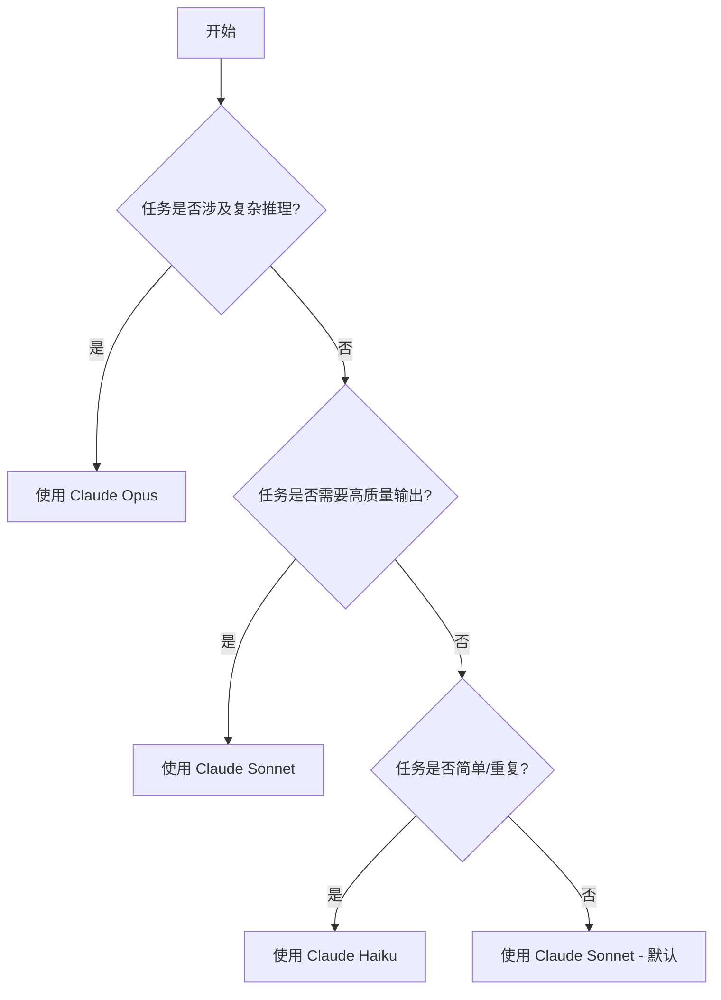
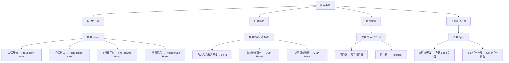

# 附录 B：功能决策树

本附录提供使用 Claude Code 时的功能选择指南，帮助您在不同场景下选择合适的功能和配置。

## B.1 模型选择决策树



## B.2 功能选择决策树



## B.3 工作流选择指南

| 场景 | 推荐工作流 | 关键配置 |
|------|-----------|---------|
| 新功能开发 | Spec 驱动 | 创建 spec.md |
| Bug 修复 | 直接对话 | 提供错误信息 |
| 代码审查 | 批量处理 | 使用 @目录 引用 |
| 重构 | 分步执行 | 使用 Hooks 验证 |
| 文档生成 | 模板驱动 | 使用 Skills |
| 测试编写 | TDD 工作流 | 先生成测试 |

## B.4 权限配置决策

```
安全需求级别
  │
  ├─ 高（生产环境）
  │     │
  │     ├─ 禁用 Bash 工具
  │     ├─ 限制文件访问路径
  │     └─ 启用审计日志
  │
  ├─ 中（开发环境）
  │     │
  │     ├─ 允许常用工具
  │     ├─ 排除敏感目录
  │     └─ 保持默认权限
  │
  └─ 低（个人实验）
        │
        └─ 可使用 --dangerously-skip-permissions
```

## B.5 成本优化决策

```
成本敏感度
  │
  ├─ 高
  │     │
  │     ├─ 优先使用 Haiku
  │     ├─ 启用响应缓存
  │     ├─ 精简上下文
  │     └─ 批量处理请求
  │
  ├─ 中
  │     │
  │     ├─ 默认使用 Sonnet
  │     ├─ 复杂任务用 Opus
  │     └─ 监控使用量
  │
  └─ 低
        │
        └─ 根据任务需要选择模型
```
