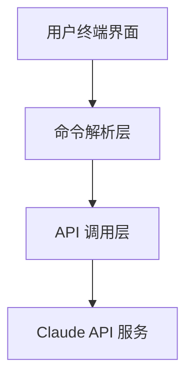
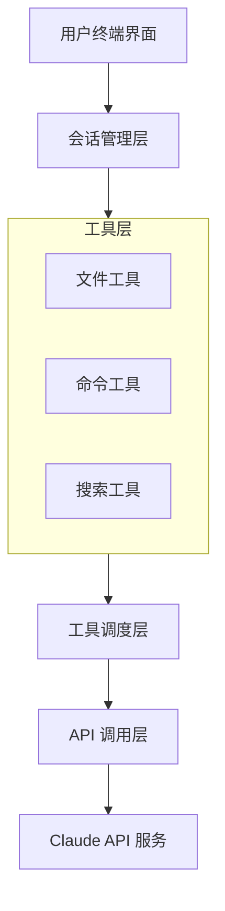
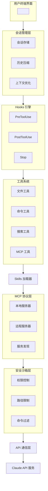

# 第2章：发展历程与技术演进

## 2.1 Anthropic 公司与 Claude 模型

### 2.1.1 Anthropic 的创立背景

Anthropic 成立于 2021 年，由 Dario Amodei 和 Daniela Amodei 兄妹联合创立。两位创始人此前均在 OpenAI 担任要职，Dario 曾任 OpenAI 研究副总裁。Anthropic 的创立源于对 AI 安全性的深度关注，公司的核心使命是开发可靠、可解释、可控制的 AI 系统。

**公司发展里程碑**：

| 时间 | 事件 |
|------|------|
| 2021年 | 公司成立，获得首轮融资 |
| 2023年 | 发布 Claude 1.0，获得 Google 投资 |
| 2024年 | 发布 Claude 3 系列，成为行业领先者之一 |
| 2025年 | 发布 Claude 4 和 4.5 系列，完成 F 轮融资 |

**2025年11月最新动态**：
- 完成 **130 亿美元 F 轮融资**，估值达 **1830 亿美元**
- 宣布投资 **500 亿美元**用于美国 AI 基础设施建设
- 与 **Microsoft**、**NVIDIA** 达成战略合作
- Claude 入驻 Microsoft Foundry 和 Microsoft 365 Copilot
- 在巴黎和慕尼黑开设新办公室，扩展欧洲业务

Anthropic 在 AI 安全研究领域提出了多项重要概念：

**Constitutional AI（宪法 AI）**：一种训练方法，通过让 AI 根据一组原则进行自我批评和修正，减少有害输出，而非完全依赖人类反馈。

**Interpretability（可解释性）**：致力于理解大语言模型内部的工作机制，使 AI 的决策过程更加透明。

**Scalable Oversight（可扩展监督）**：研究如何在 AI 能力不断增强的情况下，保持人类对 AI 的有效监督。

### 2.1.2 Claude 模型的发展历程

Claude 模型的演进反映了大语言模型技术的快速发展：

#### Claude 1.0（2023年3月）

首个公开版本，具备基础的对话和文本生成能力。相比同期模型，Claude 在安全性和有用性之间取得了较好的平衡，减少了有害内容的生成。

#### Claude 2（2023年7月）

重大升级版本，主要改进包括：
- 上下文窗口扩展至 100K tokens
- 代码生成和数学推理能力显著提升
- 支持文件上传和分析
- 更好的指令遵循能力

#### Claude 3 系列（2024年3月）

引入了三个不同定位的模型变体：

| 模型 | 定位 | 特点 |
|------|------|------|
| Claude 3 Opus | 旗舰版 | 最强能力，适合复杂任务 |
| Claude 3 Sonnet | 均衡版 | 性能与成本的平衡 |
| Claude 3 Haiku | 轻量版 | 快速响应，成本最低 |

Claude 3 系列在多项基准测试中达到业界领先水平，特别是在代码生成、逻辑推理、多语言处理等方面。

#### Claude 3.5 系列（2024年6-10月）

**Claude 3.5 Sonnet（2024年6月）**：
- 代码生成能力大幅提升
- 推理速度提高约 2 倍
- 在多项编程基准测试中超越 GPT-4
- 引入 Artifacts 功能

**Claude 3.5 Haiku（2024年10月）**：
- 提供更快速的轻量选择
- 成本效益最优

**Computer Use 能力（2024年10月）**：
- 可操作计算机界面
- 支持屏幕截图分析和鼠标键盘操作

#### Claude 3.7 Sonnet（2025年2月）

2025年2月24日，Anthropic 发布了 **Claude 3.7 Sonnet**——全球首款混合推理（Hybrid Reasoning）模型：

| 特性 | 说明 |
|------|------|
| **双模式思考** | "一个模型，两种思考方式"——可快速响应或深度推理 |
| **扩展思考模式** | 展示详细推理思维链，自我反思提升准确度 |
| **API 思考预算** | 开发者可设置最多思考 N 个 tokens（最高 128K） |
| **编码能力** | 在 TAU-bench 基准测试中超越 Claude 3.5 Sonnet 和 OpenAI o1 |

Claude 3.7 Sonnet 的创新之处在于将"快速响应"与"深度推理"融合在同一个模型中，用户可根据任务复杂度灵活选择模式。这也是 Claude Code 首次发布时搭载的模型。

#### Claude 4 系列（2025年5月）

Anthropic 首届开发者大会发布，这是自 Claude 3.7 以来的大版本号更新：

| 模型 | 发布时间 | 核心特点 |
|------|---------|---------|
| Claude Opus 4 | 2025年5月22日 | 被称为"世界上最好的编码模型"，可连续工作 7 小时 |
| Claude Sonnet 4 | 2025年5月22日 | 编程、推理能力新基准，高性能平衡型 |

Claude 4 系列的重大突破：
- **长时间自主工作**：Opus 4 可以独立运行近一个完整工作班次（7小时）
- **Agent 能力飞跃**：从完成单一任务转变为可设定更广泛目标
- **Rakuten 验证**：通过严格的开源重构任务验证，独立运行 7 小时并保持持续性能

#### Claude 4.5 系列（2025年9-11月）

最新一代模型，全系列在编码、推理、计算机使用能力上均有重大飞跃：

| 模型 | 发布时间 | 核心特点 |
|------|---------|---------|
| **Claude Sonnet 4.5** | 2025年9月29日 | 编码、推理、计算机使用新基准，Anthropic 对齐性最好的模型之一，同时发布 Claude Agent SDK |
| **Claude Haiku 4.5** | 2025年10月15日 | 具备顶尖的编码能力，兼顾速度和成本效益 |
| **Claude Opus 4.5** | 2025年11月24日 | 面向复杂编码、智能体和计算机使用场景的旗舰模型，性能和令牌效率大幅提升 |

**Claude 4.5 系列关键特性**：
- 在日常任务（处理幻灯片、电子表格等）上有显著改进
- 令牌效率大幅提升
- 计算机使用能力达到新高度
- 发布 **Claude Agent SDK** 用于构建智能体

### 2.1.3 模型能力的核心演进方向

纵观 Claude 模型的发展，可以归纳出以下核心演进方向：

**上下文长度**：从最初的数千 tokens 扩展到 200K tokens，使模型能够处理更大规模的文档和代码库。

**多模态能力**：从纯文本扩展到支持图像理解，为代码截图分析、UI 设计理解等场景提供支持。

**工具使用**：从单纯的文本生成发展到能够调用外部工具，这是 Claude Code 能力的基础。

**计算机使用**：Claude 3.5 引入的 Computer Use 能力，可以操作计算机界面，执行复杂的自动化任务。

**Agent 能力**：从被动响应发展到主动规划、多步骤执行，支持长时间自主工作。

**安全性与对齐**：持续改进模型的安全性，Claude Sonnet 4.5 被称为"Anthropic 对齐性最好的模型"。

### 2.1.4 Claude 模型版本速查表

| 模型 | 发布时间 | 上下文长度 | 主要特点 | API 标识符 |
|------|---------|-----------|---------|-----------|
| Claude 3 Haiku | 2024.03 | 200K | 快速、低成本 | claude-3-haiku-20240307 |
| Claude 3 Sonnet | 2024.03 | 200K | 均衡性能 | claude-3-sonnet-20240229 |
| Claude 3 Opus | 2024.03 | 200K | 最强能力 | claude-3-opus-20240229 |
| Claude 3.5 Sonnet | 2024.06 | 200K | 代码能力飞跃 | claude-3-5-sonnet-20241022 |
| Claude 3.5 Haiku | 2024.10 | 200K | 快速轻量 | claude-3-5-haiku-20241022 |
| **Claude 3.7 Sonnet** | 2025.02 | 200K | 首款混合推理模型 | claude-3-7-sonnet-20250224 |
| Claude Sonnet 4 | 2025.05 | 200K | 编程新基准 | claude-sonnet-4-20250514 |
| Claude Opus 4 | 2025.05 | 200K | 7小时连续工作 | claude-opus-4-20250514 |
| Claude Sonnet 4.5 | 2025.09 | 200K | 最佳对齐性 | claude-sonnet-4-5-20250929 |
| Claude Haiku 4.5 | 2025.10 | 200K | 极速高效 | claude-haiku-4-5-20251015 |
| Claude Opus 4.5 | 2025.11 | 200K | 旗舰级编码/智能体模型 | claude-opus-4-5-20251124 |

## 2.2 从 API 到 Claude Code：产品形态的演进

### 2.2.1 API 时代的局限

Claude API 于 2023 年发布，为开发者提供了程序化访问 Claude 模型的能力。然而，直接使用 API 进行编程辅助存在以下局限：

**集成成本高**：需要编写代码来调用 API，处理认证、错误重试、流式响应等细节。

**上下文管理复杂**：需要自行实现会话历史的存储和管理，控制 token 消耗。

**工具调用需自行实现**：API 提供了 function calling 能力，但文件操作、命令执行等具体工具需要开发者自行实现。

**缺乏开箱即用的体验**：对于日常开发辅助，每次都需要编写脚本调用 API，效率较低。

### 2.2.2 Claude Code 的诞生

Claude Code 的推出正是为了解决上述问题，提供开箱即用的开发者体验。其设计理念包括：

**终端原生**：作为命令行工具，自然融入开发者的终端工作流。

**预置工具集**：内置文件读写、命令执行、代码搜索等开发常用工具。

**智能上下文管理**：自动管理会话历史，智能压缩长上下文。

**可扩展架构**：通过 Hooks、Skills、MCP 等机制支持用户扩展。

**Agent 能力**：具备自主规划、多步骤执行、长时间工作的能力。

### 2.2.3 产品形态对比

| 维度 | Claude API | Claude Code | Claude Agent SDK |
|------|-----------|-------------|------------------|
| 目标用户 | 应用开发者 | 终端用户/开发者 | Agent 开发者 |
| 使用方式 | 编程调用 | 命令行交互 | 编程构建 |
| 上下文管理 | 手动 | 自动 | 可配置 |
| 工具能力 | 需自行实现 | 内置 | 可扩展 |
| 定制化程度 | 完全可控 | 通过配置扩展 | 高度可定制 |
| 适用场景 | 构建 AI 应用 | 日常开发辅助 | 构建智能体 |

### 2.2.4 Claude Agent SDK（2025年9月）

随 Claude Sonnet 4.5 一同发布的 Claude Agent SDK，为开发者提供了构建自定义智能体的能力：

```python
from anthropic import Agent, Tool

# 定义自定义工具
class DatabaseTool(Tool):
    def execute(self, query: str) -> str:
        # 执行数据库查询
        return db.execute(query)

# 创建智能体
agent = Agent(
    model="claude-sonnet-4-5-20250929",
    tools=[DatabaseTool(), FileTool(), WebTool()],
    system_prompt="你是一个数据分析助手..."
)

# 运行任务
result = agent.run("分析上个月的销售数据并生成报告")
```

## 2.3 Claude Code 版本演进

### 2.3.1 早期版本（2024年）

Claude Code 最初以 Beta 形式发布，主要功能包括：

- 基础的对话交互
- 简单的文件读取能力
- 单次命令执行

这一阶段的主要目标是验证产品概念，收集用户反馈。

### 2.3.2 正式版本发布（2024年末-2025年初）

正式版本带来了重大改进：

**工具系统完善**
- 文件读写工具（Read、Write、Edit）
- 代码搜索工具（Grep、Glob）
- 命令执行工具（Bash）
- 多文件批量操作

**会话管理增强**
- 会话持久化与恢复
- 会话历史浏览
- 上下文自动压缩

**配置系统**
- CLAUDE.md 项目配置
- 用户级全局配置
- 权限控制机制

### 2.3.3 高级功能引入（2025年）

后续版本陆续引入了高级功能：

**Hooks 机制**

允许用户在特定事件点注入自定义逻辑：
- PreToolUse：工具调用前
- PostToolUse：工具调用后
- Notification：通知事件
- Stop：会话结束时

**Skills 系统**

可复用的能力包，封装特定领域的知识和工具：
- 官方 Skills：通用开发能力
- 社区 Skills：特定框架/语言支持
- 自定义 Skills：用户自行开发

**MCP 协议支持**

Model Context Protocol（模型上下文协议）的引入，使 Claude Code 能够连接外部数据源和服务：
- 数据库查询
- API 调用
- 第三方服务集成

**Spec 功能**

规范驱动的开发模式：
- 需求文档解析
- 自动任务分解
- 进度跟踪

**GitHub Actions 集成**

- 在 PR 和 Issue 中通过 @claude 提及触发
- 自动代码审查
- 自动实现功能和修复 Bug

**远程 MCP 服务器支持（2025年7月）**

从仅支持本地服务器升级为支持远程服务器：
- 低维护成本：只需添加供应商 URL
- 自动更新：供应商负责维护
- 专注开发：无需管理服务器基础设施

### 2.3.4 版本演进时间线

```
2024 Q3    Beta 发布，基础对话和文件读取
    │
2024 Q4    正式版发布，完整工具系统
    │
2025 Q1    Hooks 机制、Skills 系统引入
    │
2025 Q2    MCP 协议支持、Spec 功能
    │         Claude 4 系列发布（5月）
    │
2025 Q3    GitHub Actions 集成
    │         远程 MCP 服务器支持（7月）
    │         Claude Sonnet 4.5 + Agent SDK（9月）
    │
2025 Q4    Claude Haiku 4.5（10月）
    │         Claude Opus 4.5（11月）
    │
持续迭代   功能完善、生态建设
```

## 2.4 技术架构演进

### 2.4.1 早期架构：API 封装层

最初的 Claude Code 架构相对简单：



这一架构的特点是简单直接，但扩展性有限。

### 2.4.2 中期架构：引入工具系统

随着功能扩展，架构演进为：



工具系统的引入使 Claude Code 具备了实际的代码操作能力。

### 2.4.3 当前架构：可扩展的 Agent 系统

当前的 Claude Code 采用了更加模块化和可扩展的架构：



### 2.4.4 架构设计原则

当前架构体现了以下设计原则：

**模块化**：各组件职责清晰，便于独立开发和测试。

**可扩展性**：通过 Hooks、Skills、MCP 等机制，用户可以扩展系统能力而无需修改核心代码。

**安全性**：安全沙箱层确保工具操作在受控范围内进行。

**性能优化**：上下文压缩、智能缓存等机制优化响应速度和资源消耗。

**Agent 原生**：架构设计支持长时间自主工作、多步骤任务规划。

## 2.5 行业背景与竞品分析

### 2.5.1 AI 编程工具的兴起

AI 辅助编程工具的发展可以追溯到以下里程碑：

| 时间 | 事件 |
|------|------|
| 2021年 | GitHub Copilot 发布，开创 AI 代码补全先河 |
| 2022年 | ChatGPT 发布，展示 LLM 代码生成潜力 |
| 2023年 | Cursor、Codeium 等工具涌现 |
| 2024年 | AI 编程工具进入成熟期，Agent 形态出现 |
| 2025年 | Agent 编程工具成为主流，长时间自主工作成为可能 |

### 2.5.2 主要竞品对比

| 工具 | 类型 | 核心特点 | 底层模型 | 适用场景 |
|------|------|---------|---------|---------|
| GitHub Copilot | IDE 插件 | 实时代码补全，广泛 IDE 支持 | GPT-4/Claude | 日常编码补全 |
| Cursor | AI IDE | 深度集成，图形化交互 | 多模型支持 | 全流程 AI 辅助 |
| Windsurf | AI IDE | Cascade 流式交互 | 多模型支持 | 复杂项目开发 |
| Aider | CLI | 开源，支持多种模型 | 多模型支持 | 终端用户 |
| **Claude Code** | CLI | Anthropic 官方，深度工具集成 | Claude 4.5 | 终端开发者、企业 |
| Codeium | IDE 插件 | 免费，支持多种 IDE | 自研模型 | 成本敏感用户 |
| Amazon Q | IDE 插件 | AWS 深度集成 | 自研模型 | AWS 生态用户 |

### 2.5.3 Claude Code 的差异化优势

**官方支持**：作为 Anthropic 官方产品，与 Claude 模型的集成最为深入，能够第一时间获得新功能支持。

**最强编码模型**：Claude Opus 4.5 被称为"全球最佳编码模型"，Claude Code 可以充分发挥其能力。

**长时间自主工作**：支持 7 小时连续工作，可完成复杂的开发任务。

**安全性设计**：继承 Anthropic 对 AI 安全的重视，在权限控制、操作确认等方面有完善的机制。

**企业级特性**：支持企业部署、审计日志、合规性等企业级需求。

**可扩展架构**：Hooks、Skills、MCP 等机制提供了强大的扩展能力。

**GitHub 深度集成**：通过 GitHub Actions 实现 CI/CD 自动化。

## 2.6 未来发展方向

基于当前的技术趋势和官方透露的信息，Claude Code 可能的发展方向包括：

### 2.6.1 多模态增强

- 支持图像输入，理解 UI 截图、架构图
- 支持语音交互
- 代码可视化能力
- 视频理解（代码演示、Bug 复现视频）

### 2.6.2 协作能力

- 多 Agent 协作，分工处理复杂任务
- 团队共享会话和知识库
- 实时协作编辑
- 与人类开发者的混合工作流

### 2.6.3 本地化能力

- 本地模型支持，满足离线和隐私需求
- 混合架构，本地模型处理简单任务，云端模型处理复杂任务
- 边缘计算支持

### 2.6.4 生态建设

- Skills 市场，共享和发现社区贡献
- MCP 服务生态，丰富的第三方集成
- 企业级解决方案
- 与更多开发工具的集成

### 2.6.5 计算机使用能力增强

- 更强的 GUI 操作能力
- 跨应用自动化
- 复杂工作流编排

## 2.7 本章小结

本章回顾了 Claude Code 的发展历程，从 Anthropic 公司的创立、Claude 模型的演进（直至 Claude 4.5 系列），到 Claude Code 工具的诞生和技术架构的变迁。理解这些背景有助于读者把握 Claude Code 的设计理念和发展方向。

Claude Code 的演进体现了 AI 编程工具从简单的 API 封装向智能 Agent 系统发展的趋势。随着 Claude 4.5 系列的发布，AI 编程助手已经能够连续工作数小时，独立完成复杂任务，这标志着 AI 辅助编程进入了新的阶段。

---

**关键要点回顾**：

1. Anthropic 成立于 2021 年，2025年11月完成 130 亿美元 F 轮融资，估值 1830 亿美元
2. Claude 模型经历了从 1.0 到 4.5 的多次重大升级，Claude Opus 4.5 是面向复杂编码和智能体场景的旗舰模型之一
3. Claude Code 从简单的 API 封装发展为可扩展的 Agent 系统
4. 当前架构包含会话管理、Hooks 引擎、工具系统、MCP 协议层、安全沙箱等核心组件
5. 2025年9月发布的 Claude Agent SDK 为开发者提供了构建自定义智能体的能力
6. 未来发展方向包括多模态、协作能力、本地化和生态建设
