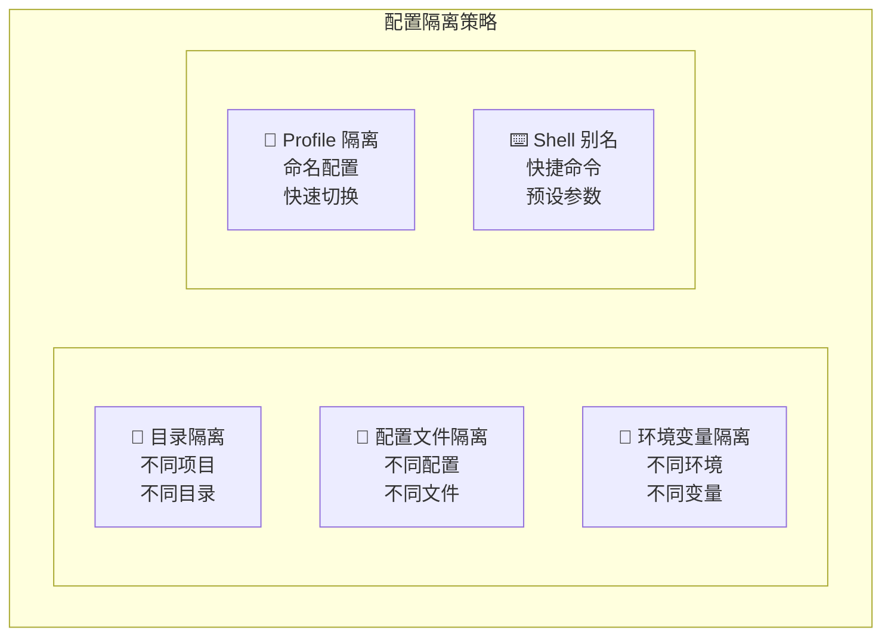

# 第8章：多环境配置管理

## 8.1 多环境配置概述

在实际开发中，开发者通常需要在多个环境中工作：个人项目、公司项目、开源贡献等。每个环境可能需要不同的配置：不同的 API 密钥、不同的权限级别、不同的行为偏好。本章将介绍如何管理这些多环境配置。

### 8.1.1 常见的多环境场景

| 场景 | 特点 | 配置需求 |
|------|------|---------|
| 个人项目 | 自由度高，实验性强 | 宽松权限，快速迭代 |
| 公司项目 | 规范严格，安全要求高 | 严格权限，审计日志 |
| 开源贡献 | 遵循社区规范 | 特定代码风格 |
| 客户项目 | 保密要求，隔离需求 | 独立配置，数据隔离 |
| 学习实验 | 探索性，容错性高 | 最大权限，详细输出 |

### 8.1.2 配置隔离策略

Claude Code 支持多种配置隔离方式：



## 8.2 基于目录的配置隔离

### 8.2.1 项目级 CLAUDE.md

最自然的配置隔离方式是在每个项目中维护独立的 CLAUDE.md：

```
~/projects/
├── personal-blog/
│   ├── CLAUDE.md          # 个人博客项目配置
│   └── ...
├── company-app/
│   ├── CLAUDE.md          # 公司项目配置
│   └── ...
└── opensource-contrib/
    ├── CLAUDE.md          # 开源项目配置
    └── ...
```

每个项目的 CLAUDE.md 包含该项目特定的配置：

**个人博客项目**：
```markdown
# Project: Personal Blog

个人技术博客，基于 Next.js。

## Claude 配置
- 可以自由实验新技术
- 允许执行所有命令
- 代码风格偏好简洁
```

**公司项目**：
```markdown
# Project: Company Internal App

公司内部管理系统，需要遵循公司规范。

## Claude 配置
- 严格遵循公司编码规范
- 命令执行需要确认
- 不允许访问 .env 文件
- 所有修改需要添加注释说明
```

### 8.2.2 子目录配置覆盖

在大型 monorepo 中，可以为不同子项目设置不同配置：

```
company-monorepo/
├── CLAUDE.md              # 根配置（通用规范）
├── apps/
│   ├── admin/
│   │   └── CLAUDE.md      # 管理后台特定配置
│   └── mobile/
│       └── CLAUDE.md      # 移动端特定配置
└── packages/
    └── shared/
        └── CLAUDE.md      # 共享库特定配置
```

子目录的 CLAUDE.md 会继承并覆盖父目录配置：

**根配置 (company-monorepo/CLAUDE.md)**：
```markdown
# Company Monorepo

## 通用规范
- TypeScript 严格模式
- ESLint + Prettier
- 提交信息遵循 Conventional Commits
```

**管理后台配置 (apps/admin/CLAUDE.md)**：
```markdown
# Admin Dashboard

继承根配置，额外添加：

## 特定规范
- 使用 Ant Design 组件库
- 表格组件优先使用 ProTable
- 权限控制使用 RBAC 模式
```

## 8.3 基于配置文件的隔离

### 8.3.1 多配置文件管理

在用户配置目录下维护多个配置文件：

```
~/.config/claude/
├── config.json            # 默认配置
├── config.personal.json   # 个人项目配置
├── config.work.json       # 工作项目配置
├── config.secure.json     # 高安全配置
└── config.learning.json   # 学习实验配置
```

使用时通过参数指定：

```bash
# 使用工作配置
claude --config ~/.config/claude/config.work.json

# 使用高安全配置
claude --config ~/.config/claude/config.secure.json
```

### 8.3.2 配置文件示例

**默认配置 (config.json)**：
```json
{
  "model": "claude-sonnet-4-20250514",
  "maxTokens": 8192,
  "permissions": {
    "allowedTools": ["Read", "Write", "Edit", "Grep", "Glob", "List", "Bash"],
    "confirmCommands": true
  }
}
```

**工作配置 (config.work.json)**：
```json
{
  "model": "claude-sonnet-4-20250514",
  "maxTokens": 8192,
  "permissions": {
    "allowedTools": ["Read", "Write", "Edit", "Grep", "Glob", "List"],
    "deniedTools": ["Bash"],
    "deniedPaths": [".env*", "secrets/", "credentials/"]
  },
  "audit": {
    "enabled": true,
    "logPath": "~/.config/claude/audit/work/"
  }
}
```

**高安全配置 (config.secure.json)**：
```json
{
  "model": "claude-sonnet-4-20250514",
  "maxTokens": 4096,
  "permissions": {
    "allowedTools": ["Read", "Grep", "Glob", "List"],
    "deniedTools": ["Write", "Edit", "Bash"],
    "allowedPaths": ["./src/", "./docs/"],
    "deniedPaths": ["**/*"]
  },
  "security": {
    "sensitiveDataHandling": {
      "mode": "block"
    }
  }
}
```

**学习配置 (config.learning.json)**：
```json
{
  "model": "claude-3-opus-20240229",
  "maxTokens": 16384,
  "temperature": 0.8,
  "permissions": {
    "allowedTools": ["Read", "Write", "Edit", "Grep", "Glob", "List", "Bash"],
    "confirmCommands": false,
    "autoApproveCommands": ["*"]
  },
  "output": {
    "verbose": true,
    "showThinking": true
  }
}
```

### 8.3.3 配置继承

可以使用 `extends` 字段实现配置继承：

```json
{
  "extends": "./config.json",
  "permissions": {
    "deniedTools": ["Bash"]
  }
}
```

这样只需要定义差异部分，其他配置从基础配置继承。

## 8.4 基于环境变量的配置

### 8.4.1 环境变量配置项

Claude Code 支持通过环境变量配置：

```bash
# API 配置
export ANTHROPIC_API_KEY="sk-ant-..."
export ANTHROPIC_API_BASE="https://api.anthropic.com"

# 模型配置
export CLAUDE_MODEL="claude-3-opus-20240229"
export CLAUDE_MAX_TOKENS="8192"

# 配置目录
export CLAUDE_CONFIG_DIR="~/.config/claude-work"

# 权限配置
export CLAUDE_ALLOWED_TOOLS="Read,Write,Edit"
export CLAUDE_DENIED_TOOLS="Bash"

# 调试配置
export CLAUDE_DEBUG="true"
export CLAUDE_LOG_LEVEL="debug"
```

### 8.4.2 环境变量文件

使用 `.env` 风格的文件管理环境变量：

**~/.claude-env/personal**：
```bash
export ANTHROPIC_API_KEY="sk-ant-personal-..."
export CLAUDE_MODEL="claude-sonnet-4-20250514"
export CLAUDE_CONFIG_DIR="~/.config/claude/personal"
```

**~/.claude-env/work**：
```bash
export ANTHROPIC_API_KEY="sk-ant-work-..."
export CLAUDE_MODEL="claude-sonnet-4-20250514"
export CLAUDE_CONFIG_DIR="~/.config/claude/work"
```

使用时加载对应的环境文件：

```bash
# 加载个人环境
source ~/.claude-env/personal && claude

# 加载工作环境
source ~/.claude-env/work && claude
```

### 8.4.3 direnv 集成

使用 direnv 实现目录级环境变量自动切换：

**安装 direnv**：
```bash
# macOS
brew install direnv

# Ubuntu
sudo apt install direnv

# 添加到 shell 配置
echo 'eval "$(direnv hook bash)"' >> ~/.bashrc
```

**项目配置 (.envrc)**：
```bash
# ~/projects/work-project/.envrc
export ANTHROPIC_API_KEY="sk-ant-work-..."
export CLAUDE_CONFIG_DIR="~/.config/claude/work"
```

允许目录配置：
```bash
cd ~/projects/work-project
direnv allow
```

进入目录时自动加载配置，离开时自动卸载。

## 8.5 Profile 配置管理

### 8.5.1 Profile 概念

Profile 是一组命名的配置集合，可以快速切换：

```bash
# 列出可用 profiles
claude profile list

# 切换 profile
claude profile use work

# 创建新 profile
claude profile create client-a

# 删除 profile
claude profile delete old-profile
```

### 8.5.2 Profile 配置结构

```
~/.config/claude/
├── profiles/
│   ├── default/
│   │   ├── config.json
│   │   └── CLAUDE.md
│   ├── work/
│   │   ├── config.json
│   │   └── CLAUDE.md
│   ├── personal/
│   │   ├── config.json
│   │   └── CLAUDE.md
│   └── secure/
│       ├── config.json
│       └── CLAUDE.md
└── current-profile        # 记录当前激活的 profile
```

### 8.5.3 Profile 快速切换

```bash
# 使用特定 profile 启动（不改变默认）
claude --profile work

# 切换默认 profile
claude profile use personal

# 查看当前 profile
claude profile current
```

### 8.5.4 Profile 配置示例

**work profile (profiles/work/config.json)**：
```json
{
  "name": "work",
  "description": "Work projects configuration",
  "model": "claude-sonnet-4-20250514",
  "permissions": {
    "deniedTools": ["Bash"],
    "deniedPaths": [".env*", "secrets/"]
  },
  "audit": {
    "enabled": true
  }
}
```

**personal profile (profiles/personal/config.json)**：
```json
{
  "name": "personal",
  "description": "Personal projects configuration",
  "model": "claude-sonnet-4-20250514",
  "permissions": {
    "allowedTools": ["*"],
    "confirmCommands": false
  }
}
```

## 8.6 Shell 别名与函数

### 8.6.1 基础别名

在 shell 配置中定义别名简化操作：

```bash
# ~/.bashrc 或 ~/.zshrc

# 基础别名
alias c='claude'
alias cw='claude --profile work'
alias cp='claude --profile personal'
alias cs='claude --profile secure'

# 模型快捷切换
alias copus='claude --model claude-3-opus-20240229'
alias chaiku='claude --model claude-3-5-haiku-20241022'

# 常用操作
alias cq='claude -p'  # 快速查询
alias cr='claude --resume'  # 恢复会话
```

### 8.6.2 高级函数

定义函数实现更复杂的逻辑：

```bash
# 根据当前目录自动选择配置
claude-auto() {
  local dir=$(pwd)
  
  if [[ $dir == *"/work/"* ]]; then
    claude --profile work "$@"
  elif [[ $dir == *"/personal/"* ]]; then
    claude --profile personal "$@"
  elif [[ $dir == *"/opensource/"* ]]; then
    claude --profile opensource "$@"
  else
    claude "$@"
  fi
}

alias ca='claude-auto'
```

```bash
# 带项目初始化的 Claude
claude-init() {
  local project_name=$1
  
  if [[ -z "$project_name" ]]; then
    echo "Usage: claude-init <project-name>"
    return 1
  fi
  
  # 创建项目目录
  mkdir -p "$project_name"
  cd "$project_name"
  
  # 创建基础 CLAUDE.md
  cat > CLAUDE.md << EOF
# Project: $project_name

## 技术栈
[待填写]

## 项目结构
[待填写]

## Claude 指令
- 遵循项目编码规范
- 修改前先阅读相关代码
EOF

  echo "Project $project_name initialized with CLAUDE.md"
  claude
}
```

### 8.6.3 项目特定别名

在项目的 shell 配置中定义项目特定别名：

```bash
# ~/projects/my-app/.claude-aliases

alias ct='claude -p "运行测试并分析失败原因"'
alias cb='claude -p "构建项目并检查错误"'
alias cd='claude -p "分析这个目录的代码结构"'
alias cf='claude -p "修复当前文件的 linter 错误"'
```

在 `.envrc` 中加载：
```bash
source .claude-aliases
```

## 8.7 多账户管理

### 8.7.1 账户场景

可能需要使用多个 Anthropic 账户的场景：

- 个人账户 vs 公司账户
- 不同客户的独立账户
- 测试账户 vs 生产账户

### 8.7.2 账户配置

每个账户使用独立的配置目录：

```
~/.config/
├── claude-personal/
│   ├── config.json      # 个人账户配置
│   └── credentials.json # 个人账户凭证
├── claude-work/
│   ├── config.json      # 工作账户配置
│   └── credentials.json # 工作账户凭证
└── claude-client-a/
    ├── config.json      # 客户A账户配置
    └── credentials.json # 客户A账户凭证
```

### 8.7.3 账户切换

```bash
# 通过环境变量切换
CLAUDE_CONFIG_DIR=~/.config/claude-work claude

# 通过别名
alias claude-work='CLAUDE_CONFIG_DIR=~/.config/claude-work claude'
alias claude-personal='CLAUDE_CONFIG_DIR=~/.config/claude-personal claude'
```

### 8.7.4 账户隔离最佳实践

1. **凭证隔离**：每个账户使用独立的 API 密钥
2. **配置隔离**：每个账户使用独立的配置目录
3. **会话隔离**：每个账户的会话独立存储
4. **审计隔离**：每个账户的审计日志独立

## 8.8 配置同步与备份

### 8.8.1 Git 同步

将配置纳入版本控制：

```bash
# 初始化配置仓库
cd ~/.config/claude
git init
git remote add origin git@github.com:user/claude-config.git

# 忽略敏感文件
cat > .gitignore << EOF
credentials.json
*.key
*.pem
sessions/
audit/
EOF

# 提交配置
git add .
git commit -m "Initial claude configuration"
git push
```

在新机器上恢复：
```bash
git clone git@github.com:user/claude-config.git ~/.config/claude
```

### 8.8.2 配置导出导入

```bash
# 导出配置（不含敏感信息）
claude config export --output claude-config-backup.json

# 导入配置
claude config import --input claude-config-backup.json
```

### 8.8.3 敏感信息管理

使用密钥管理工具存储敏感配置：

```bash
# macOS Keychain
security add-generic-password -a "claude" -s "anthropic-api-key" -w "sk-ant-..."

# 在配置中引用
{
  "apiKey": "${keychain:anthropic-api-key}"
}
```

```bash
# 使用 1Password CLI
{
  "apiKey": "${op://vault/claude/api-key}"
}
```

## 8.9 本章小结

本章介绍了 Claude Code 的多环境配置管理方法，包括基于目录、配置文件、环境变量、Profile 等多种隔离策略。合理的配置管理可以让您在不同场景下高效、安全地使用 Claude Code。

在下一部分中，我们将进入进阶篇，深入探讨会话管理、文件操作和技术架构等话题。

---

**关键要点回顾**：

1. 项目级 CLAUDE.md 是最自然的配置隔离方式
2. 多配置文件支持不同场景的快速切换
3. 环境变量配合 direnv 可实现自动配置切换
4. Profile 机制提供了命名配置集合的管理
5. Shell 别名和函数可以简化日常操作
6. 多账户场景需要完整的配置隔离

**配置管理检查清单**：

- [ ] 为每个项目创建适当的 CLAUDE.md
- [ ] 准备不同场景的配置文件
- [ ] 设置常用的 shell 别名
- [ ] 配置敏感信息的安全存储
- [ ] 建立配置备份和同步机制
