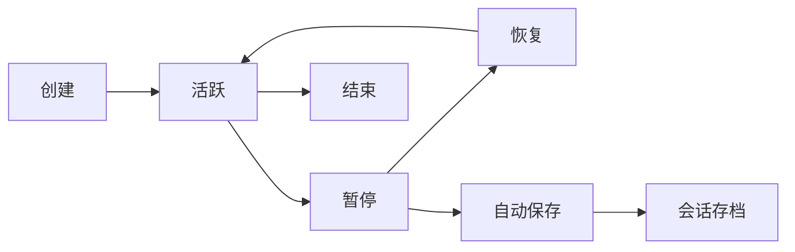
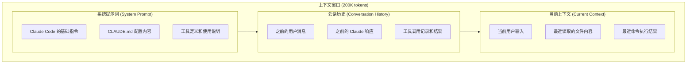

# 第9章：会话与上下文管理

## 9.1 会话机制深度解析

Claude Code 的会话机制是其核心功能之一，理解会话的工作原理对于高效使用 Claude Code 至关重要。

### 9.1.1 会话的本质

会话（Session）是用户与 Claude 之间一系列交互的集合。每个会话包含：

- **会话标识**：唯一的会话 ID
- **消息历史**：用户输入和 Claude 响应的完整记录
- **上下文状态**：当前的工作目录、已读取的文件等
- **配置快照**：会话开始时的配置状态
- **元数据**：创建时间、最后更新时间等

### 9.1.2 会话生命周期



**创建阶段**：
- 用户启动 Claude Code
- 系统生成唯一会话 ID
- 加载配置和初始上下文

**活跃阶段**：
- 用户与 Claude 交互
- 消息历史持续累积
- 上下文动态更新

**暂停阶段**：
- 用户退出或切换会话
- 会话状态自动保存
- 资源释放

**恢复阶段**：
- 用户使用 `--resume` 恢复
- 加载保存的会话状态
- 继续之前的对话

**结束阶段**：
- 用户明确结束会话
- 或会话过期被清理

### 9.1.3 会话存储结构

会话数据存储在本地文件系统：

```
~/.config/claude/sessions/
├── index.json                    # 会话索引
├── session_abc123/
│   ├── metadata.json             # 会话元数据
│   ├── messages.json             # 消息历史
│   ├── context.json              # 上下文状态
│   └── files/                    # 缓存的文件内容
│       ├── src_index.js.cache
│       └── package.json.cache
└── session_def456/
    └── ...
```

**metadata.json 结构**：
```json
{
  "id": "session_abc123",
  "name": "feature-auth-development",
  "createdAt": "2025-12-01T10:00:00Z",
  "updatedAt": "2025-12-01T14:30:00Z",
  "workingDirectory": "/home/user/project",
  "model": "claude-sonnet-4-5-20250929",
  "messageCount": 45,
  "tokenUsage": {
    "input": 125000,
    "output": 45000
  }
}
```

## 9.2 上下文窗口管理

### 9.2.1 上下文窗口概念

上下文窗口是 Claude 模型能够"看到"的信息范围。Claude 4.5 系列支持最大 200K tokens 的上下文窗口，这意味着：

- 约 150,000 个英文单词
- 约 50,000 行代码
- 整本技术书籍的内容

### 9.2.2 上下文组成

Claude Code 的上下文由以下部分组成：



### 9.2.3 上下文使用监控

查看当前上下文使用情况：

```
> /context

上下文使用情况：
━━━━━━━━━━━━━━━━━━━━━━━━━━━━━━━━━━━━━━━━━━━━━━━━
总容量：200,000 tokens
已使用：45,230 tokens (22.6%)
剩余：154,770 tokens

组成明细：
- 系统提示词：3,500 tokens (1.8%)
- CLAUDE.md：1,200 tokens (0.6%)
- 会话历史：28,530 tokens (14.3%)
- 文件内容：12,000 tokens (6.0%)

最近加载的文件：
- src/auth/AuthService.ts (2,340 tokens)
- src/auth/types.ts (890 tokens)
- src/utils/crypto.ts (1,250 tokens)
━━━━━━━━━━━━━━━━━━━━━━━━━━━━━━━━━━━━━━━━━━━━━━━━
```

### 9.2.4 上下文优化策略

当上下文接近上限时，Claude Code 会自动进行优化：

**消息压缩**：
- 保留最近的完整消息
- 压缩较早的消息，保留关键信息
- 移除冗余的工具调用细节

**文件缓存管理**：
- 移除长时间未引用的文件内容
- 保留最近使用的文件
- 对大文件进行智能截取

**手动优化命令**：
```
> /compact

正在优化上下文...
- 压缩了 15 条历史消息
- 释放了 12,500 tokens
- 当前使用：32,730 tokens (16.4%)
```

## 9.3 会话管理操作

### 9.3.1 创建会话

**默认创建**：
```bash
# 启动新会话
claude
```

**命名会话**：
```bash
# 创建命名会话
claude --session feature-user-auth

# 或在会话中命名
> /name feature-user-auth
会话已命名为：feature-user-auth
```

**从模板创建**：
```bash
# 使用会话模板
claude --template code-review
```

### 9.3.2 会话列表与查看

```bash
# 列出所有会话
claude sessions list

# 详细列表
claude sessions list --verbose

# 按时间排序
claude sessions list --sort updated

# 按项目筛选
claude sessions list --filter "workdir:/home/user/project"
```

输出示例：
```
会话列表：
━━━━━━━━━━━━━━━━━━━━━━━━━━━━━━━━━━━━━━━━━━━━━━━━━━━━━━━━━━━━━━
ID              名称                    更新时间            消息数
━━━━━━━━━━━━━━━━━━━━━━━━━━━━━━━━━━━━━━━━━━━━━━━━━━━━━━━━━━━━━━
abc123          feature-user-auth       2024-12-01 14:30    45
def456          bug-fix-login           2024-12-01 12:15    23
ghi789          refactor-api            2024-11-30 18:00    67
━━━━━━━━━━━━━━━━━━━━━━━━━━━━━━━━━━━━━━━━━━━━━━━━━━━━━━━━━━━━━━
```

### 9.3.3 恢复会话

```bash
# 恢复最近会话
claude --resume

# 恢复指定会话
claude --resume abc123

# 恢复命名会话
claude --resume feature-user-auth

# 交互式选择
claude sessions resume
```

### 9.3.4 会话操作命令

在会话中使用的命令：

```
# 保存当前会话
> /save
会话已保存

# 另存为新名称
> /save new-feature-branch

# 清除会话历史（保持配置）
> /clear
会话历史已清除

# 查看会话信息
> /info
会话 ID：abc123
名称：feature-user-auth
创建时间：2024-12-01 10:00
消息数：45
Token 使用：45,230

# 导出会话
> /export markdown
已导出至：./session-abc123.md
```

### 9.3.5 会话清理

```bash
# 删除指定会话
claude sessions delete abc123

# 删除多个会话
claude sessions delete abc123 def456

# 清理过期会话
claude sessions clean --older-than 30d

# 清理所有会话（谨慎）
claude sessions clean --all
```

## 9.4 上下文工程实践

### 9.4.1 有效的上下文构建

构建有效上下文的原则：

**相关性原则**：只加载与当前任务相关的文件

```
# 不好的做法：加载整个项目
> 读取 src/ 下的所有文件

# 好的做法：加载相关文件
> 我要修改用户认证功能，请先读取 src/auth/ 目录下的文件
```

**层次性原则**：从概览到细节

```
> 首先概述一下这个项目的结构
[Claude 分析项目结构]

> 我关注用户模块，详细看看 src/modules/user/
[Claude 深入分析用户模块]

> 具体看看 UserService.ts 的实现
[Claude 分析具体文件]
```

**增量性原则**：逐步添加上下文

```
> 读取 src/auth/AuthService.ts
[添加认证服务到上下文]

> 这个服务依赖了哪些其他模块？
[Claude 分析依赖]

> 读取 src/utils/crypto.ts，这是加密工具
[添加依赖到上下文]
```

### 9.4.2 上下文刷新策略

当上下文中的文件已被外部修改时：

```
> /refresh

检测到以下文件已更新：
- src/auth/AuthService.ts (外部修改)
- package.json (外部修改)

是否重新加载？(y/n) y

已刷新 2 个文件的内容
```

手动刷新特定文件：
```
> /refresh src/auth/AuthService.ts
已刷新：src/auth/AuthService.ts
```

### 9.4.3 上下文书签

为重要的上下文状态创建书签：

```
> /bookmark create before-refactor
书签已创建：before-refactor

# 进行一些修改后...

> /bookmark restore before-refactor
已恢复到书签：before-refactor
```

### 9.4.4 跨会话上下文共享

在不同会话间共享上下文：

```bash
# 导出上下文
claude sessions export-context abc123 -o context.json

# 在新会话中导入
claude --import-context context.json
```

## 9.5 长对话管理

### 9.5.1 长对话的挑战

长时间的对话会面临以下挑战：

1. **上下文溢出**：消息历史超过窗口限制
2. **话题漂移**：对话偏离原始目标
3. **信息冗余**：重复的信息占用空间
4. **响应变慢**：大上下文增加处理时间

### 9.5.2 对话分段策略

将长任务分解为多个会话：

```
会话 1：需求分析
├── 理解需求
├── 确定技术方案
└── 保存分析结果

会话 2：核心实现
├── 加载分析结果
├── 实现核心功能
└── 保存实现进度

会话 3：测试完善
├── 加载实现代码
├── 编写测试
└── 修复问题
```

### 9.5.3 会话摘要

为长会话创建摘要，便于后续恢复：

```
> /summarize

会话摘要：
━━━━━━━━━━━━━━━━━━━━━━━━━━━━━━━━━━━━━━━━━━━━━━━━
主题：用户认证模块重构

已完成：
1. 分析了现有 AuthService 的问题
2. 设计了新的认证流程
3. 实现了 JWT token 管理
4. 添加了 refresh token 机制

待完成：
1. 实现登出功能
2. 添加单元测试
3. 更新 API 文档

关键文件：
- src/auth/AuthService.ts (已修改)
- src/auth/TokenManager.ts (新建)
- src/auth/types.ts (已修改)

关键决策：
- 使用 RS256 算法签名 JWT
- Access token 有效期 15 分钟
- Refresh token 有效期 7 天
━━━━━━━━━━━━━━━━━━━━━━━━━━━━━━━━━━━━━━━━━━━━━━━━
```

### 9.5.4 上下文重置与继续

当需要重新开始但保留关键信息时：

```
> /reset --keep-summary

会话已重置，保留了摘要信息。
您可以继续之前的工作，我记得：
- 我们在重构用户认证模块
- 已完成 JWT 管理实现
- 下一步是实现登出功能
```

## 9.6 高级会话功能

### 9.6.1 会话分支

创建会话分支，探索不同方案：

```
> /branch solution-a
已创建分支：solution-a

# 在分支中尝试方案 A
> 使用 Redis 实现 session 存储
[Claude 实现方案 A]

> /branch solution-b --from main
已创建分支：solution-b（从 main）

# 在另一分支尝试方案 B
> 使用 JWT 无状态方案
[Claude 实现方案 B]

> /branches
会话分支：
- main
- solution-a (当前)
- solution-b

> /merge solution-a
将 solution-a 合并到 main
```

### 9.6.2 会话模板

创建可复用的会话模板：

```bash
# 创建模板
claude templates create code-review << EOF
{
  "name": "Code Review Session",
  "systemPrompt": "你是一个代码审查专家...",
  "initialContext": [
    "请提供要审查的代码文件路径"
  ],
  "tools": ["Read", "Grep", "Glob"]
}
EOF

# 使用模板
claude --template code-review
```

### 9.6.3 会话共享

与团队成员共享会话：

```bash
# 导出可共享的会话
claude sessions export abc123 --format shareable -o session.json

# 导入共享的会话
claude sessions import session.json
```

注意：共享会话时会自动移除敏感信息。

## 9.7 本章小结

本章深入探讨了 Claude Code 的会话与上下文管理机制。理解这些机制对于高效使用 Claude Code 至关重要，特别是在处理复杂项目和长期任务时。

在下一章中，我们将详细介绍 Claude Code 的文件与代码操作能力。

---

**关键要点回顾**：

1. 会话包含消息历史、上下文状态、配置快照等信息
2. 上下文窗口最大 200K tokens，需要合理管理
3. 使用 `/context`、`/compact` 等命令管理上下文
4. 长对话可通过分段、摘要、分支等策略管理
5. 会话支持保存、恢复、导出、共享等操作

**最佳实践**：

- 为重要会话命名，便于后续查找
- 定期检查上下文使用情况
- 长任务分解为多个会话
- 使用书签保存关键状态
- 定期清理过期会话
