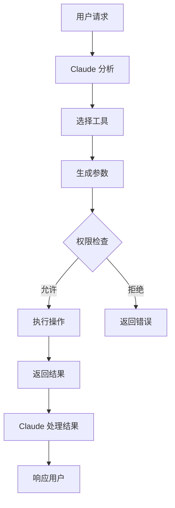

# 第10章：文件与代码操作

## 10.1 文件操作工具体系

Claude Code 提供了一套完整的文件操作工具，使 Claude 能够直接与项目文件交互。理解这些工具的能力和限制是高效使用 Claude Code 的关键。

### 10.1.1 工具概览

| 工具 | 功能 | 典型用途 | 需要权限 |
|------|------|---------|:--------:|
| Read | 读取文件内容 | 分析代码、理解实现 | 否 |
| Write | 创建或覆盖文件 | 创建新文件、完全重写 | 是 |
| Edit | 对特定文件进行针对性编辑 | 修改特定代码段 | 是 |
| Glob | 基于模式匹配查找文件 | 查找特定类型文件 | 否 |
| Grep | 在文件内容中搜索指定模式 | 搜索代码、查找引用 | 否 |
| NotebookEdit | 修改 Jupyter Notebook 单元格 | 编辑 .ipynb 文件 | 是 |
| Task | 运行子代理处理复杂任务 | 多步骤文件操作 | 否 |
| TodoWrite | 创建并管理任务列表 | 跟踪文件修改进度 | 否 |
| List | 列出目录和文件结构（目录浏览能力） | 浏览项目结构、统计文件 | 否 |

> **说明**：下表展示的是 Claude Code 中常用的文件相关能力示例，实际可用工具及其内部名称以当前版本 Claude Code 的内置帮助和官方文档为准。

### 10.1.2 工具调用流程



## 10.2 文件读取操作

### 10.2.1 基础读取

读取单个文件：

```
> 读取 src/index.js 的内容

[Read: src/index.js]

文件内容如下：

const express = require('express');
const app = express();

app.get('/', (req, res) => {
  res.send('Hello World!');
});

app.listen(3000, () => {
  console.log('Server running on port 3000');
});
```

### 10.2.2 部分读取

读取文件的特定部分：

```
> 读取 src/services/UserService.ts 的第 50-100 行

[Read: src/services/UserService.ts, lines 50-100]

显示第 50-100 行：

50 |   async findById(id: string): Promise<User | null> {
51 |     return this.userRepository.findOne({ where: { id } });
52 |   }
53 |
54 |   async update(id: string, data: UpdateUserDto): Promise<User> {
55 |     const user = await this.findById(id);
56 |     if (!user) {
57 |       throw new NotFoundException('User not found');
58 |     }
...
```

### 10.2.3 批量读取

同时读取多个文件：

```
> 读取 src/auth/ 目录下的所有 TypeScript 文件

[Glob: src/auth/*.ts]
找到 4 个文件

[Read: src/auth/AuthService.ts]
[Read: src/auth/AuthController.ts]
[Read: src/auth/auth.module.ts]
[Read: src/auth/types.ts]

已读取以下文件：
1. AuthService.ts - 认证服务，包含登录、注册、token 管理
2. AuthController.ts - 认证控制器，定义 API 端点
3. auth.module.ts - 模块定义，依赖注入配置
4. types.ts - 类型定义，包含 DTO 和接口
```

### 10.2.4 智能读取

Claude 会根据任务需求智能决定读取哪些文件：

```
> 我想了解用户登录的完整流程

让我分析登录流程涉及的文件：

[Grep: "login" in src/]
找到相关文件...

[Read: src/auth/AuthController.ts]
[Read: src/auth/AuthService.ts]
[Read: src/auth/strategies/LocalStrategy.ts]

登录流程分析：

1. 请求入口 (AuthController.ts:23)
   POST /auth/login 接收用户名和密码

2. 验证逻辑 (LocalStrategy.ts:15)
   使用 Passport Local 策略验证凭证

3. Token 生成 (AuthService.ts:45)
   验证通过后生成 JWT token

4. 响应返回
   返回 access_token 和 refresh_token
```

## 10.3 文件写入操作

### 10.3.1 创建新文件

```
> 在 src/utils/ 下创建一个字符串工具文件 stringUtils.ts

我将创建 src/utils/stringUtils.ts：

[Write: src/utils/stringUtils.ts]

/**
 * 字符串工具函数集合
 */

/**
 * 将字符串首字母大写
 */
export function capitalize(str: string): string {
  if (!str) return '';
  return str.charAt(0).toUpperCase() + str.slice(1);
}

/**
 * 将驼峰命名转换为短横线命名
 */
export function camelToKebab(str: string): string {
  return str.replace(/([a-z])([A-Z])/g, '$1-$2').toLowerCase();
}

/**
 * 将短横线命名转换为驼峰命名
 */
export function kebabToCamel(str: string): string {
  return str.replace(/-([a-z])/g, (_, char) => char.toUpperCase());
}

/**
 * 截断字符串并添加省略号
 */
export function truncate(str: string, maxLength: number): string {
  if (str.length <= maxLength) return str;
  return str.slice(0, maxLength - 3) + '...';
}

文件已创建。
```

### 10.3.2 覆盖文件

完全重写文件内容：

```
> 重写 src/config/database.ts，使用环境变量配置

⚠️ 警告：这将覆盖现有文件内容
是否继续？(y/n) y

[Write: src/config/database.ts]

import { DataSourceOptions } from 'typeorm';

export const databaseConfig: DataSourceOptions = {
  type: 'postgres',
  host: process.env.DB_HOST || 'localhost',
  port: parseInt(process.env.DB_PORT || '5432', 10),
  username: process.env.DB_USERNAME || 'postgres',
  password: process.env.DB_PASSWORD || '',
  database: process.env.DB_NAME || 'myapp',
  entities: ['dist/**/*.entity.js'],
  migrations: ['dist/migrations/*.js'],
  synchronize: process.env.NODE_ENV === 'development',
  logging: process.env.DB_LOGGING === 'true',
};

文件已更新。
```

### 10.3.3 安全写入

Claude Code 在写入时会进行安全检查：

```
> 创建 .env 文件

⚠️ 安全警告：.env 文件通常包含敏感信息
建议：
1. 创建 .env.example 作为模板
2. 将 .env 添加到 .gitignore
3. 不要在 .env 中存储生产环境密钥

是否继续创建 .env.example？(y/n)
```

## 10.4 文件编辑操作

### 10.4.1 精确编辑

Edit 工具用于修改文件的特定部分，而非完全重写：

```
> 在 UserService.ts 的 findById 方法中添加缓存逻辑

[Read: src/services/UserService.ts]

我将修改 findById 方法：

[Edit: src/services/UserService.ts]

修改内容：
- 位置：第 50-52 行
- 原代码：
  async findById(id: string): Promise<User | null> {
    return this.userRepository.findOne({ where: { id } });
  }

- 新代码：
  async findById(id: string): Promise<User | null> {
    // 先检查缓存
    const cacheKey = `user:${id}`;
    const cached = await this.cacheService.get<User>(cacheKey);
    if (cached) {
      return cached;
    }

    // 缓存未命中，查询数据库
    const user = await this.userRepository.findOne({ where: { id } });
    
    // 存入缓存
    if (user) {
      await this.cacheService.set(cacheKey, user, 3600);
    }
    
    return user;
  }

修改已应用。
```

### 10.4.2 多处编辑

同时修改文件的多个位置：

```
> 将 UserService 中所有的 console.log 替换为 logger 调用

[Read: src/services/UserService.ts]

找到 5 处 console.log 调用，将进行以下修改：

[Edit: src/services/UserService.ts]

修改 1/5：第 23 行
- console.log('User created:', user.id);
+ this.logger.info('User created', { userId: user.id });

修改 2/5：第 45 行
- console.log('User updated:', id);
+ this.logger.info('User updated', { userId: id });

修改 3/5：第 67 行
- console.log('User deleted:', id);
+ this.logger.info('User deleted', { userId: id });

修改 4/5：第 89 行
- console.log('Error finding user:', error);
+ this.logger.error('Error finding user', { error });

修改 5/5：第 12 行（添加导入）
+ import { Logger } from '../utils/logger';

同时需要添加 logger 实例，在构造函数中：
+ private readonly logger = new Logger('UserService');

所有修改已应用。
```

### 10.4.3 条件编辑

基于条件进行编辑：

```
> 为所有没有 JSDoc 注释的公共方法添加注释

[Read: src/services/UserService.ts]

分析文件，找到 8 个公共方法，其中 3 个缺少 JSDoc 注释：

[Edit: src/services/UserService.ts]

为 create 方法添加注释：
/**
 * 创建新用户
 * @param data - 用户创建数据
 * @returns 创建的用户对象
 * @throws ConflictException 如果邮箱已存在
 */
async create(data: CreateUserDto): Promise<User> {

为 update 方法添加注释：
/**
 * 更新用户信息
 * @param id - 用户ID
 * @param data - 更新数据
 * @returns 更新后的用户对象
 * @throws NotFoundException 如果用户不存在
 */
async update(id: string, data: UpdateUserDto): Promise<User> {

为 delete 方法添加注释：
/**
 * 删除用户（软删除）
 * @param id - 用户ID
 * @throws NotFoundException 如果用户不存在
 */
async delete(id: string): Promise<void> {

已添加 3 处 JSDoc 注释。
```

## 10.5 代码搜索操作

### 10.5.1 Grep 搜索

在文件内容中搜索：

```
> 搜索所有使用了 deprecated API 的地方

[Grep: "@deprecated" in src/]

搜索结果：

src/utils/oldHelpers.ts:5
  /** @deprecated 使用 newHelper 代替 */

src/services/LegacyService.ts:12
  /** @deprecated 将在 v2.0 移除 */

src/api/v1/endpoints.ts:34
  // @deprecated: 使用 v2 API

找到 3 处标记为 deprecated 的代码。
```

```
> 查找所有调用 UserService.findById 的地方

[Grep: "userService.findById\|UserService.*findById" in src/]

搜索结果：

src/controllers/UserController.ts:45
  const user = await this.userService.findById(id);

src/controllers/OrderController.ts:23
  const user = await this.userService.findById(order.userId);

src/services/NotificationService.ts:67
  const user = await this.userService.findById(userId);

src/middlewares/AuthMiddleware.ts:34
  const user = await this.userService.findById(decoded.sub);

找到 4 处调用。
```

### 10.5.2 Glob 匹配

查找特定模式的文件：

```
> 列出所有测试文件

[Glob: **/*.test.ts, **/*.spec.ts]

找到 23 个测试文件：

src/services/__tests__/
├── UserService.test.ts
├── AuthService.test.ts
└── OrderService.test.ts

src/controllers/__tests__/
├── UserController.spec.ts
├── AuthController.spec.ts
└── OrderController.spec.ts

src/utils/__tests__/
├── helpers.test.ts
└── validators.test.ts

...
```

```
> 查找所有配置文件

[Glob: **/*.config.{js,ts,json}, **/config.{js,ts,json}]

找到配置文件：
- jest.config.js
- tsconfig.json
- webpack.config.js
- src/config/database.config.ts
- src/config/app.config.ts
```

### 10.5.3 组合搜索

结合多种搜索方式：

```
> 找出所有包含 SQL 查询的 Service 文件

[Glob: src/**/*Service.ts]
找到 12 个 Service 文件

[Grep: "query\|SELECT\|INSERT\|UPDATE\|DELETE" in matched files]

包含 SQL 查询的 Service：

1. src/services/ReportService.ts
   - 第 45 行：原生 SQL 查询生成报表
   - 第 78 行：复杂聚合查询

2. src/services/SearchService.ts
   - 第 23 行：全文搜索查询

3. src/services/MigrationService.ts
   - 第 12 行：数据迁移 SQL

建议：考虑将原生 SQL 迁移到 ORM 查询，提高可维护性。
```

## 10.6 目录操作

### 10.6.1 列出目录

```
> 显示 src/ 目录结构

Claude 列出了 `src/` 目录结构：

src/
├── controllers/
│   ├── UserController.ts
│   ├── AuthController.ts
│   └── OrderController.ts
├── services/
│   ├── UserService.ts
│   ├── AuthService.ts
│   └── OrderService.ts
├── models/
│   ├── User.ts
│   ├── Order.ts
│   └── Product.ts
├── middlewares/
│   ├── AuthMiddleware.ts
│   └── LoggingMiddleware.ts
├── utils/
│   ├── helpers.ts
│   └── validators.ts
├── config/
│   ├── database.ts
│   └── app.ts
├── app.ts
└── main.ts

统计：
- 目录：6 个
- 文件：15 个
- TypeScript 文件：15 个
```

### 10.6.2 深度列出

```
> 详细列出 src/services/ 目录，包含文件大小和修改时间

Claude 以“详细模式”列出了 `src/services/` 目录：

src/services/
│
├── UserService.ts
│   大小：4.2 KB
│   修改：2024-12-01 14:30
│   行数：156
│
├── AuthService.ts
│   大小：3.8 KB
│   修改：2024-12-01 12:15
│   行数：134
│
├── OrderService.ts
│   大小：5.1 KB
│   修改：2024-11-30 18:00
│   行数：189
│
└── __tests__/
    ├── UserService.test.ts
    │   大小：2.3 KB
    │   修改：2024-11-28 10:00
    │
    └── AuthService.test.ts
        大小：1.9 KB
        修改：2024-11-28 10:00
```

## 10.7 代码重构操作

### 10.7.1 重命名重构

```
> 将 UserService 重命名为 UserManagementService，更新所有引用

这是一个跨文件重构，我将：
1. 重命名文件
2. 更新类名
3. 更新所有导入和引用

[Grep: "UserService" in src/]
找到 23 处引用

开始重构：

1. 重命名文件
   [Move: src/services/UserService.ts → src/services/UserManagementService.ts]

2. 更新类定义
   [Edit: src/services/UserManagementService.ts]
   - export class UserService
   + export class UserManagementService

3. 更新引用（共 22 处）
   [Edit: src/controllers/UserController.ts]
   - import { UserService } from '../services/UserService';
   + import { UserManagementService } from '../services/UserManagementService';
   
   - constructor(private userService: UserService) {}
   + constructor(private userService: UserManagementService) {}

   [Edit: src/modules/user.module.ts]
   ...

重构完成，更新了：
- 1 个文件重命名
- 23 处代码引用
```

### 10.7.2 提取函数

```
> 将 OrderService.createOrder 中的价格计算逻辑提取为独立函数

[Read: src/services/OrderService.ts]

分析 createOrder 方法，识别价格计算逻辑（第 45-67 行）...

[Edit: src/services/OrderService.ts]

1. 提取新函数：
   /**
    * 计算订单总价
    * @param items - 订单项列表
    * @param discount - 折扣信息
    * @returns 计算后的价格明细
    */
   private calculateOrderPrice(
     items: OrderItem[],
     discount?: Discount
   ): PriceBreakdown {
     const subtotal = items.reduce(
       (sum, item) => sum + item.price * item.quantity,
       0
     );
     
     const discountAmount = discount
       ? this.applyDiscount(subtotal, discount)
       : 0;
     
     const tax = (subtotal - discountAmount) * 0.1;
     const total = subtotal - discountAmount + tax;
     
     return { subtotal, discountAmount, tax, total };
   }

2. 更新 createOrder 方法：
   async createOrder(data: CreateOrderDto): Promise<Order> {
     // ... 验证逻辑 ...
     
     // 计算价格（使用提取的函数）
     const priceBreakdown = this.calculateOrderPrice(
       data.items,
       data.discount
     );
     
     // ... 创建订单逻辑 ...
   }

重构完成。新函数可以被其他方法复用，如 updateOrder、previewOrder 等。
```

### 10.7.3 模式替换

```
> 将所有回调风格的异步代码转换为 async/await

[Grep: "\.then\(|\.catch\(" in src/]
找到 15 处回调风格代码

[Edit: 批量修改]

示例转换：

文件：src/services/FileService.ts

- readFile(path)
-   .then(content => {
-     return processContent(content);
-   })
-   .then(result => {
-     return saveResult(result);
-   })
-   .catch(error => {
-     console.error(error);
-     throw error;
-   });

+ try {
+   const content = await readFile(path);
+   const result = await processContent(content);
+   await saveResult(result);
+ } catch (error) {
+   console.error(error);
+   throw error;
+ }

已转换 15 处回调代码为 async/await 风格。
```

## 10.8 批量操作

### 10.8.1 批量文件创建

```
> 为 User, Order, Product 三个实体创建 CRUD 服务

我将创建以下文件：

[Write: src/services/UserService.ts]
[Write: src/services/OrderService.ts]
[Write: src/services/ProductService.ts]

每个服务包含：
- create: 创建记录
- findAll: 查询列表（支持分页）
- findById: 按 ID 查询
- update: 更新记录
- delete: 删除记录（软删除）

同时创建对应的 DTO：
[Write: src/dto/user.dto.ts]
[Write: src/dto/order.dto.ts]
[Write: src/dto/product.dto.ts]

已创建 6 个文件。
```

### 10.8.2 批量修改

```
> 为所有 Controller 添加 Swagger 装饰器

[Glob: src/controllers/*Controller.ts]
找到 5 个 Controller 文件

[Edit: 批量添加 Swagger 装饰器]

为每个 Controller 添加：
1. @ApiTags 类装饰器
2. @ApiOperation 方法装饰器
3. @ApiResponse 响应装饰器

修改进度：
- UserController.ts ✓
- AuthController.ts ✓
- OrderController.ts ✓
- ProductController.ts ✓
- CategoryController.ts ✓

已为 5 个 Controller 的 28 个方法添加 Swagger 装饰器。
```

## 10.9 本章小结

本章详细介绍了 Claude Code 的文件与代码操作能力，包括读取、写入、编辑、搜索和批量操作。这些能力使 Claude 能够真正参与到代码开发工作中，而非仅提供建议。

在下一章中，我们将深入探讨 Claude Code 的技术架构，理解其内部工作原理。

---

**关键要点回顾**：

1. 文件操作工具包括 Read、Write、Edit、Glob、Grep、List
2. Read 支持完整读取和部分读取
3. Write 用于创建新文件或完全重写
4. Edit 用于精确修改文件的特定部分
5. Grep 和 Glob 用于搜索和匹配文件
6. 支持复杂的重构和批量操作

**操作安全提示**：

- 重要修改前先备份或提交
- 使用 Edit 而非 Write 进行局部修改
- 批量操作前确认影响范围
- 敏感文件操作需要额外确认
