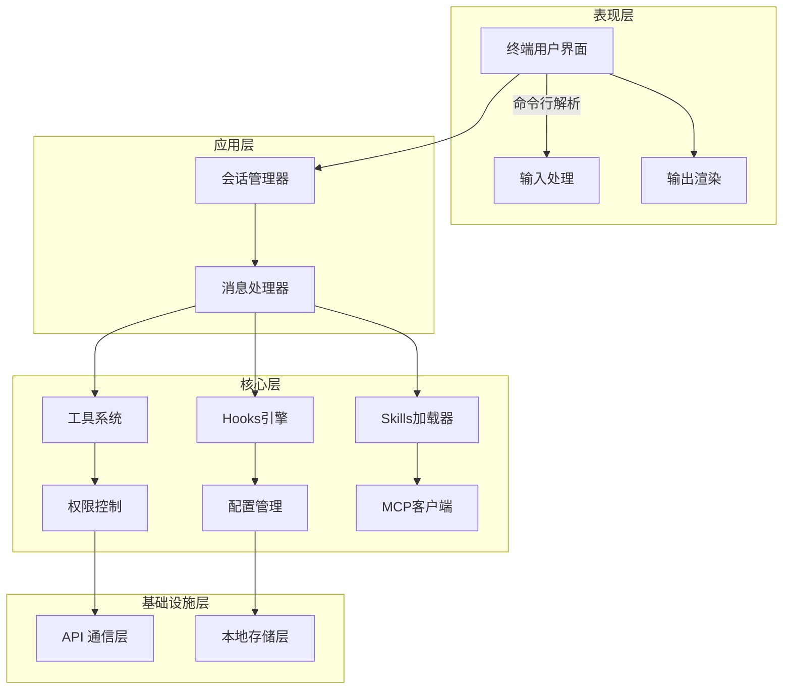
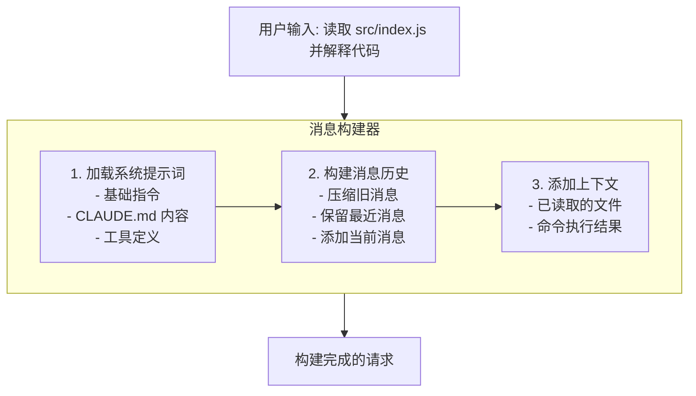
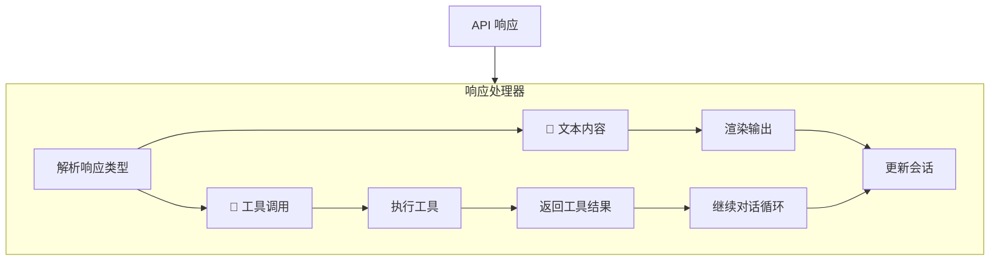
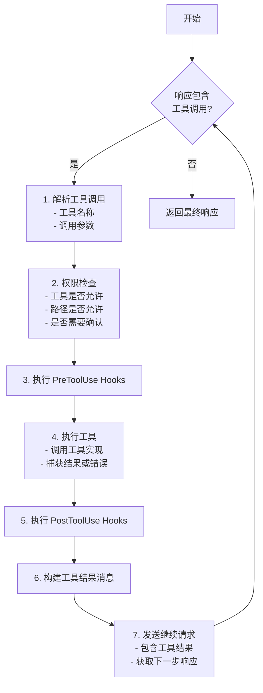
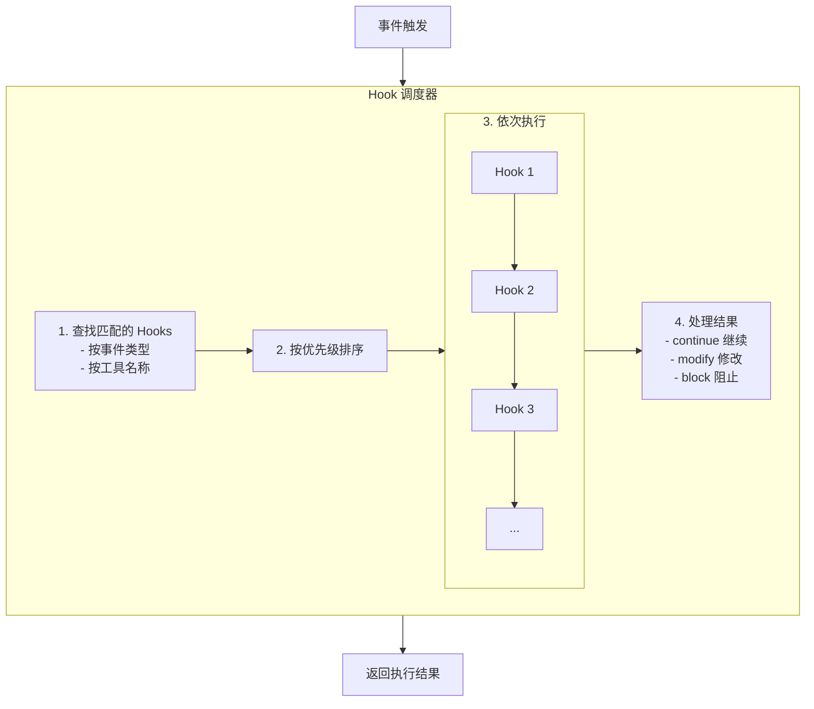
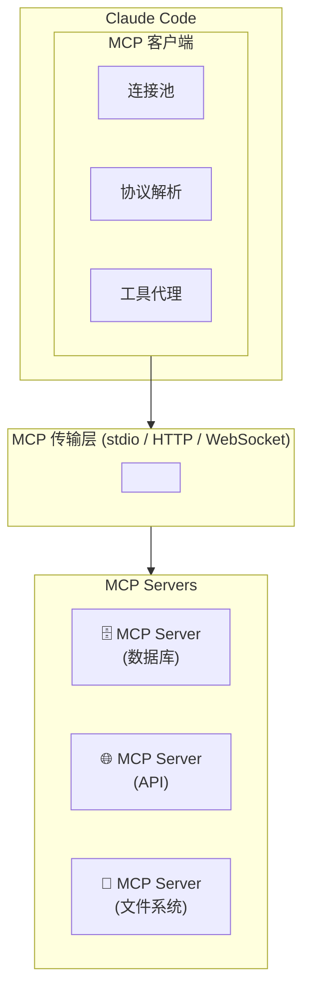
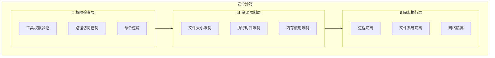

# 第11章：技术架构深度解析

## 11.1 整体架构概览

理解 Claude Code 的技术架构有助于更好地使用这一工具，并在遇到问题时能够快速定位和解决。本章将深入剖析 Claude Code 的内部工作原理。

### 11.1.1 架构层次

Claude Code 采用分层架构设计：



### 11.1.2 核心组件

| 组件 | 职责 | 关键特性 |
|------|------|---------|
| CLI Parser | 命令行参数解析 | 支持子命令、选项、参数 |
| Session Manager | 会话生命周期管理 | 持久化、恢复、清理 |
| Message Handler | 消息构建与处理 | 流式响应、工具调用 |
| Tool System | 工具注册与执行 | 可扩展、权限控制 |
| Hooks Engine | 钩子事件处理 | 事件驱动、异步执行 |
| API Client | 与 Claude API 通信 | 认证、重试、错误处理 |

## 11.2 消息处理流程

### 11.2.1 请求构建

当用户输入消息时，Claude Code 构建 API 请求：



**请求结构示例**：

```json
{
  "model": "claude-sonnet-4-5-20250929",
  "max_tokens": 8192,
  "system": "你是 Claude Code，一个命令行 AI 编程助手...",
  "messages": [
    {
      "role": "user",
      "content": "读取 src/index.js 并解释代码"
    }
  ],
  "tools": [
    {
      "name": "Read",
      "description": "读取文件内容",
      "input_schema": {
        "type": "object",
        "properties": {
          "path": { "type": "string" }
        },
        "required": ["path"]
      }
    }
  ]
}
```

### 11.2.2 响应处理

Claude API 返回的响应可能包含文本和工具调用：



### 11.2.3 工具调用循环

当 Claude 需要使用工具时，会进入工具调用循环：



## 11.3 工具系统架构

### 11.3.1 工具接口定义

每个工具都实现统一的接口：

```typescript
interface Tool {
  // 工具名称
  name: string;
  
  // 工具描述（供 Claude 理解）
  description: string;
  
  // 参数 Schema（JSON Schema 格式）
  inputSchema: JSONSchema;
  
  // 执行函数
  execute(params: ToolParams, context: ExecutionContext): Promise<ToolResult>;
  
  // 权限要求
  permissions: PermissionRequirement[];
}
```

### 11.3.2 内置工具实现

**Read 工具**：

```typescript
const ReadTool: Tool = {
  name: 'Read',
  description: '读取文件内容',
  inputSchema: {
    type: 'object',
    properties: {
      path: {
        type: 'string',
        description: '文件路径'
      },
      startLine: {
        type: 'number',
        description: '起始行号（可选）'
      },
      endLine: {
        type: 'number',
        description: '结束行号（可选）'
      }
    },
    required: ['path']
  },
  
  async execute(params, context) {
    const { path, startLine, endLine } = params;
    const absolutePath = resolvePath(context.workingDirectory, path);
    
    // 权限检查
    if (!context.permissions.canRead(absolutePath)) {
      throw new PermissionError(`无权读取: ${path}`);
    }
    
    // 读取文件
    const content = await fs.readFile(absolutePath, 'utf-8');
    
    // 处理行范围
    if (startLine !== undefined) {
      const lines = content.split('\n');
      const selectedLines = lines.slice(startLine - 1, endLine);
      return { content: selectedLines.join('\n') };
    }
    
    return { content };
  },
  
  permissions: ['file:read']
};
```

**Bash 工具**：

```typescript
const BashTool: Tool = {
  name: 'Bash',
  description: '执行 shell 命令',
  inputSchema: {
    type: 'object',
    properties: {
      command: {
        type: 'string',
        description: '要执行的命令'
      },
      timeout: {
        type: 'number',
        description: '超时时间（毫秒）'
      }
    },
    required: ['command']
  },
  
  async execute(params, context) {
    const { command, timeout = 30000 } = params;
    
    // 命令安全检查
    const riskLevel = assessCommandRisk(command);
    
    // 需要确认的命令
    if (riskLevel >= RiskLevel.MEDIUM) {
      const approved = await context.requestApproval({
        type: 'command',
        command,
        riskLevel
      });
      
      if (!approved) {
        return { error: '用户拒绝执行命令' };
      }
    }
    
    // 执行命令
    try {
      const result = await execCommand(command, {
        cwd: context.workingDirectory,
        timeout,
        env: context.environment
      });
      
      return {
        stdout: result.stdout,
        stderr: result.stderr,
        exitCode: result.exitCode
      };
    } catch (error) {
      return { error: error.message };
    }
  },
  
  permissions: ['command:execute']
};
```

### 11.3.3 工具注册机制

```typescript
class ToolRegistry {
  private tools: Map<string, Tool> = new Map();
  
  // 注册工具
  register(tool: Tool): void {
    this.tools.set(tool.name, tool);
  }
  
  // 获取工具
  get(name: string): Tool | undefined {
    return this.tools.get(name);
  }
  
  // 获取所有工具定义（用于 API 请求）
  getToolDefinitions(): ToolDefinition[] {
    return Array.from(this.tools.values()).map(tool => ({
      name: tool.name,
      description: tool.description,
      input_schema: tool.inputSchema
    }));
  }
  
  // 执行工具
  async execute(
    name: string,
    params: any,
    context: ExecutionContext
  ): Promise<ToolResult> {
    const tool = this.tools.get(name);
    if (!tool) {
      throw new Error(`未知工具: ${name}`);
    }
    
    return tool.execute(params, context);
  }
}
```

## 11.4 Hooks 引擎

### 11.4.1 事件系统

Hooks 引擎基于事件驱动架构：

```typescript
enum HookEvent {
  PreToolUse = 'PreToolUse',
  PostToolUse = 'PostToolUse',
  Notification = 'Notification',
  Stop = 'Stop'
}

interface HookContext {
  event: HookEvent;
  tool?: string;
  params?: any;
  result?: any;
  session: Session;
}

type HookHandler = (context: HookContext) => Promise<HookResult>;
```

### 11.4.2 Hook 执行流程



### 11.4.3 Hook 配置解析

```typescript
interface HookConfig {
  event: HookEvent;
  match?: {
    tool?: string | string[];
    path?: string;
  };
  action: 'run' | 'block' | 'modify';
  command?: string;
  script?: string;
}

class HookLoader {
  async loadHooks(configPath: string): Promise<Hook[]> {
    const config = await this.readConfig(configPath);
    
    return config.hooks.map(hookConfig => ({
      event: hookConfig.event,
      matcher: this.createMatcher(hookConfig.match),
      handler: this.createHandler(hookConfig)
    }));
  }
  
  private createHandler(config: HookConfig): HookHandler {
    switch (config.action) {
      case 'run':
        return async (context) => {
          await this.executeCommand(config.command, context);
          return { action: 'continue' };
        };
      
      case 'block':
        return async () => {
          return { action: 'block', reason: config.reason };
        };
      
      case 'modify':
        return async (context) => {
          const modified = await this.executeScript(config.script, context);
          return { action: 'modify', data: modified };
        };
    }
  }
}
```

## 11.5 MCP 协议实现

### 11.5.1 MCP 架构

Model Context Protocol (MCP) 允许 Claude Code 连接外部服务：



### 11.5.2 MCP 消息格式

```typescript
// 请求消息
interface MCPRequest {
  jsonrpc: '2.0';
  id: string | number;
  method: string;
  params?: any;
}

// 响应消息
interface MCPResponse {
  jsonrpc: '2.0';
  id: string | number;
  result?: any;
  error?: {
    code: number;
    message: string;
    data?: any;
  };
}

// 通知消息
interface MCPNotification {
  jsonrpc: '2.0';
  method: string;
  params?: any;
}
```

### 11.5.3 MCP 工具代理

```typescript
class MCPToolProxy {
  private client: MCPClient;
  
  async getTools(): Promise<Tool[]> {
    const response = await this.client.request({
      method: 'tools/list'
    });
    
    return response.tools.map(tool => ({
      name: `mcp_${this.serverName}_${tool.name}`,
      description: tool.description,
      inputSchema: tool.inputSchema,
      execute: (params, context) => this.executeTool(tool.name, params)
    }));
  }
  
  private async executeTool(name: string, params: any): Promise<ToolResult> {
    const response = await this.client.request({
      method: 'tools/call',
      params: { name, arguments: params }
    });
    
    return response.content;
  }
}
```

## 11.6 安全沙箱

### 11.6.1 沙箱架构



### 11.6.2 权限检查实现

```typescript
class PermissionChecker {
  private config: PermissionConfig;
  
  canReadFile(path: string): boolean {
    const absolutePath = path.resolve(path);
    
    // 检查路径黑名单
    if (this.matchesPattern(absolutePath, this.config.deniedPaths)) {
      return false;
    }
    
    // 检查路径白名单
    if (this.config.allowedPaths.length > 0) {
      return this.matchesPattern(absolutePath, this.config.allowedPaths);
    }
    
    // 检查是否在工作目录内
    return absolutePath.startsWith(this.config.workingDirectory);
  }
  
  canWriteFile(path: string): boolean {
    if (!this.canReadFile(path)) {
      return false;
    }
    
    // 检查文件类型
    const ext = path.extname(path);
    if (this.config.deniedFileTypes.includes(ext)) {
      return false;
    }
    
    return true;
  }
  
  canExecuteCommand(command: string): CommandPermission {
    // 检查命令黑名单
    if (this.matchesCommandPattern(command, this.config.blockedCommands)) {
      return { allowed: false, reason: '命令被禁止' };
    }
    
    // 检查自动批准列表
    if (this.matchesCommandPattern(command, this.config.autoApproveCommands)) {
      return { allowed: true, requireConfirm: false };
    }
    
    // 评估风险级别
    const riskLevel = this.assessRisk(command);
    
    return {
      allowed: true,
      requireConfirm: riskLevel >= RiskLevel.MEDIUM,
      riskLevel
    };
  }
}
```

## 11.7 性能优化机制

### 11.7.1 上下文压缩

```typescript
class ContextCompressor {
  compress(messages: Message[], targetTokens: number): Message[] {
    const currentTokens = this.countTokens(messages);
    
    if (currentTokens <= targetTokens) {
      return messages;
    }
    
    // 策略 1：移除旧的工具调用详情
    messages = this.removeOldToolDetails(messages);
    
    // 策略 2：压缩长消息
    messages = this.compressLongMessages(messages);
    
    // 策略 3：合并相似消息
    messages = this.mergeSimilarMessages(messages);
    
    // 策略 4：移除最旧的消息
    while (this.countTokens(messages) > targetTokens && messages.length > 2) {
      messages = this.removeOldestMessage(messages);
    }
    
    return messages;
  }
  
  private compressLongMessages(messages: Message[]): Message[] {
    return messages.map(msg => {
      if (this.countTokens([msg]) > 2000) {
        return {
          ...msg,
          content: this.summarize(msg.content)
        };
      }
      return msg;
    });
  }
}
```

### 11.7.2 响应流式处理

```typescript
class StreamHandler {
  async handleStream(
    stream: AsyncIterable<StreamChunk>,
    callbacks: StreamCallbacks
  ): Promise<void> {
    let buffer = '';
    let currentToolCall: ToolCall | null = null;
    
    for await (const chunk of stream) {
      switch (chunk.type) {
        case 'content_block_delta':
          // 文本内容
          if (chunk.delta.type === 'text_delta') {
            buffer += chunk.delta.text;
            callbacks.onText(chunk.delta.text);
          }
          // 工具调用
          else if (chunk.delta.type === 'input_json_delta') {
            currentToolCall.inputJson += chunk.delta.partial_json;
          }
          break;
          
        case 'content_block_stop':
          if (currentToolCall) {
            callbacks.onToolCall(currentToolCall);
            currentToolCall = null;
          }
          break;
          
        case 'message_stop':
          callbacks.onComplete(buffer);
          break;
      }
    }
  }
}
```

### 11.7.3 缓存机制

```typescript
class FileCache {
  private cache: LRUCache<string, CachedFile>;
  
  async getFile(path: string): Promise<string> {
    const stat = await fs.stat(path);
    const cacheKey = `${path}:${stat.mtimeMs}`;
    
    // 检查缓存
    const cached = this.cache.get(cacheKey);
    if (cached) {
      return cached.content;
    }
    
    // 读取文件
    const content = await fs.readFile(path, 'utf-8');
    
    // 存入缓存
    this.cache.set(cacheKey, {
      content,
      tokens: this.countTokens(content),
      accessTime: Date.now()
    });
    
    return content;
  }
  
  invalidate(path: string): void {
    // 使用前缀匹配删除相关缓存
    for (const key of this.cache.keys()) {
      if (key.startsWith(path)) {
        this.cache.delete(key);
      }
    }
  }
}
```

## 11.8 本章小结

本章深入剖析了 Claude Code 的技术架构，包括整体架构设计、消息处理流程、工具系统、Hooks 引擎、MCP 协议和安全沙箱等核心组件。理解这些内部机制有助于更好地使用和扩展 Claude Code。

在下一章中，我们将探讨提示词工程，学习如何更有效地与 Claude 交互。

---

**关键要点回顾**：

1. Claude Code 采用分层架构：表现层、应用层、核心层、基础设施层
2. 消息处理包含请求构建、响应处理、工具调用循环
3. 工具系统基于统一接口，支持注册和扩展
4. Hooks 引擎基于事件驱动，支持拦截和修改
5. MCP 协议实现外部服务集成
6. 安全沙箱提供多层保护机制
