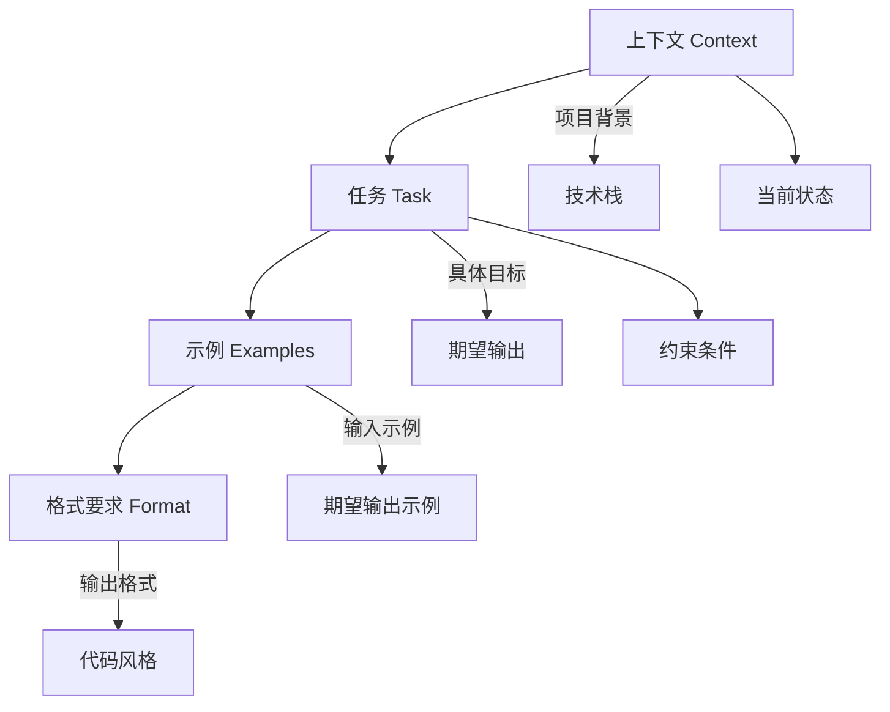

# 第12章：提示词工程

## 12.1 提示词工程基础

提示词工程（Prompt Engineering）是与大语言模型高效交互的关键技能。在 Claude Code 环境中，良好的提示词可以显著提升代码生成质量和任务完成效率。

### 12.1.1 提示词的重要性

提示词质量直接影响：

- **响应准确性**：清晰的指令产生准确的结果
- **代码质量**：详细的要求产生高质量代码
- **效率**：好的提示词减少来回修改
- **一致性**：规范的提示词产生一致的输出

### 12.1.2 提示词组成要素

一个完整的提示词通常包含：



## 12.2 代码生成提示词

### 12.2.1 基础代码生成

**低效提示词**：
```
> 写一个用户服务
```

**高效提示词**：
```
> 创建一个 UserService 类，要求：
  
  技术栈：TypeScript, NestJS, Prisma
  
  功能：
  1. create - 创建用户，验证邮箱唯一性
  2. findById - 按 ID 查询，支持关联查询
  3. update - 更新用户信息
  4. delete - 软删除
  5. findAll - 分页查询，支持按姓名搜索
  
  要求：
  - 使用依赖注入
  - 添加完整的 TypeScript 类型
  - 包含错误处理
  - 添加 JSDoc 注释
  
  参考现有的 src/services/OrderService.ts 的风格
```

### 12.2.2 带约束的代码生成

```
> 为订单模块创建 API 端点，约束如下：

  路由前缀：/api/v1/orders
  
  端点设计：
  - GET /          列表查询，支持分页和筛选
  - GET /:id       获取详情
  - POST /         创建订单
  - PATCH /:id     更新订单
  - DELETE /:id    取消订单
  
  安全要求：
  - 所有端点需要 JWT 认证
  - 用户只能访问自己的订单
  - 管理员可以访问所有订单
  
  性能要求：
  - 列表查询需要索引优化
  - 详情查询使用缓存
  
  请遵循 RESTful 设计规范和项目现有的代码风格
```

### 12.2.3 重构提示词

```
> 重构 src/services/PaymentService.ts，目标：

  当前问题：
  1. 方法过长（processPayment 超过 200 行）
  2. 支付渠道逻辑耦合
  3. 缺少错误处理
  4. 没有单元测试
  
  重构方向：
  1. 使用策略模式处理不同支付渠道
  2. 提取公共逻辑到基类
  3. 添加完善的错误处理和日志
  4. 保持接口不变，确保向后兼容
  
  请先分析现有代码，然后给出重构方案，
  确认方案后再进行实际修改
```

## 12.3 代码分析提示词

### 12.3.1 代码审查

```
> 审查 src/controllers/AuthController.ts，关注以下方面：

  安全性：
  - SQL 注入风险
  - XSS 风险
  - 认证/授权漏洞
  - 敏感信息泄露
  
  代码质量：
  - 代码重复
  - 复杂度过高
  - 命名规范
  - 注释完整性
  
  性能：
  - N+1 查询问题
  - 不必要的数据库调用
  - 缺少缓存
  
  请按严重程度排序，并给出具体的改进建议
```

### 12.3.2 架构分析

```
> 分析 src/modules/ 目录的模块架构：

  请回答：
  1. 各模块的职责是什么？
  2. 模块间的依赖关系如何？是否存在循环依赖？
  3. 是否符合单一职责原则？
  4. 哪些模块耦合度过高？
  5. 建议如何改进架构？
  
  请用依赖图的形式展示模块关系
```

### 12.3.3 性能分析

```
> 分析 src/services/ReportService.ts 的性能问题：

  背景：
  - 该服务生成销售报表
  - 数据量约 100 万条记录
  - 当前执行时间约 30 秒
  - 目标：降低到 5 秒以内
  
  请分析：
  1. 识别性能瓶颈
  2. 数据库查询是否可优化
  3. 是否可以使用缓存
  4. 是否可以并行处理
  5. 给出具体的优化方案和预期效果
```

## 12.4 问题排查提示词

### 12.4.1 错误诊断

```
> 帮我诊断这个错误：

  错误信息：
  TypeError: Cannot read property 'map' of undefined
    at UserService.findAll (src/services/UserService.ts:45:23)
    at processTicksAndRejections (internal/process/task_queues.js:95:5)
  
  上下文：
  - 在调用 GET /api/users?page=1 时发生
  - 数据库中有数据
  - 昨天还能正常工作
  
  请：
  1. 分析可能的原因
  2. 读取相关代码确认问题
  3. 提供修复方案
```

### 12.4.2 Bug 复现

```
> 用户报告了一个 bug：

  描述：
  - 用户在购物车添加商品后，刷新页面商品消失
  - 只有未登录用户会遇到
  - 移动端和桌面端都有
  
  请：
  1. 分析购物车相关代码
  2. 找出可能导致此问题的原因
  3. 提供修复方案
  4. 建议如何添加测试防止回归
```

## 12.5 高级提示词技巧

### 12.5.1 思维链提示

让 Claude 展示推理过程：

```
> 我需要设计一个限流系统，请一步步分析：

  1. 首先，分析常见的限流算法（令牌桶、漏桶、滑动窗口）
  2. 然后，根据我们的场景选择合适的算法
     - 场景：API 网关，需要支持每秒 1000 请求
     - 要求：突发流量友好，分布式环境
  3. 接着，设计具体的实现方案
  4. 最后，给出代码实现
  
  请在每一步都解释你的思考过程
```

### 12.5.2 角色设定

```
> 请以高级后端工程师的角色审查这段代码，
  你有 10 年 Node.js 开发经验，专注于高并发系统。
  
  审查 src/services/QueueService.ts，
  特别关注：
  - 并发安全性
  - 内存泄漏风险
  - 错误恢复机制
```

### 12.5.3 对比分析

```
> 比较以下两种实现方案：

  方案 A：使用 Redis 实现分布式锁
  方案 B：使用数据库乐观锁
  
  场景：
  - 电商秒杀系统
  - 预期并发：10000 QPS
  - 数据一致性要求高
  
  请从以下维度对比：
  1. 性能
  2. 可靠性
  3. 实现复杂度
  4. 运维成本
  5. 扩展性
  
  最后给出推荐方案及理由
```

### 12.5.4 迭代优化

```
> 让我们迭代优化这个函数：

  第一轮：基础实现
  请实现一个 debounce 函数

  [Claude 实现]

  第二轮：添加功能
  请添加 leading 和 trailing 选项

  [Claude 修改]

  第三轮：类型完善
  请添加完整的 TypeScript 类型，支持泛型

  [Claude 修改]

  第四轮：边界处理
  请处理 this 绑定和参数传递问题
```

## 12.6 提示词模板

### 12.6.1 功能开发模板

```markdown
## 功能需求：[功能名称]

### 背景
[功能的业务背景和目的]

### 技术要求
- 框架：[使用的框架]
- 语言：[编程语言和版本]
- 依赖：[相关依赖]

### 功能详情
1. [功能点 1]
2. [功能点 2]
3. [功能点 3]

### 接口设计
- 输入：[输入参数]
- 输出：[输出格式]
- 错误处理：[错误情况]

### 非功能要求
- 性能：[性能要求]
- 安全：[安全要求]
- 可测试性：[测试要求]

### 参考
- 参考文件：[相关文件路径]
- 参考文档：[相关文档]
```

### 12.6.2 Bug 修复模板

```markdown
## Bug 修复：[Bug 标题]

### 问题描述
[详细描述问题现象]

### 复现步骤
1. [步骤 1]
2. [步骤 2]
3. [步骤 3]

### 期望行为
[描述正确的行为应该是什么]

### 实际行为
[描述实际发生的错误行为]

### 环境信息
- 操作系统：[OS]
- Node 版本：[版本]
- 相关依赖版本：[版本]

### 错误日志
```
[粘贴错误日志]
```

### 相关代码
- 文件：[相关文件路径]
- 行号：[大概的行号范围]

### 请求
1. 分析根本原因
2. 提供修复方案
3. 建议预防措施
```

### 12.6.3 代码审查模板

```markdown
## 代码审查请求

### 审查范围
- 文件：[文件路径或目录]
- 变更类型：[新功能/重构/Bug修复]

### 审查重点
- [ ] 代码正确性
- [ ] 安全性
- [ ] 性能
- [ ] 可维护性
- [ ] 测试覆盖

### 特别关注
[列出需要特别关注的点]

### 上下文
[提供必要的背景信息]

### 输出要求
1. 按严重程度分类问题
2. 提供具体的改进建议
3. 指出优秀的实践（如果有）
```

## 12.7 常见问题与优化

### 12.7.1 提示词过长

**问题**：提示词太长导致上下文溢出

**解决方案**：
```
# 不好：一次性给出所有要求
> 创建一个完整的用户管理系统，包含注册、登录、
  权限管理、个人信息、密码重置...（500字）

# 好：分阶段进行
> 第一步：创建用户注册功能
  [完成后]
> 第二步：添加登录功能
  [完成后]
> 第三步：实现权限管理
```

### 12.7.2 响应不符合预期

**问题**：Claude 的响应偏离预期

**解决方案**：
```
# 添加明确的约束
> 创建一个日志工具，要求：
  - 必须使用 Winston 库
  - 不要使用 console.log
  - 输出格式必须是 JSON
  - 必须支持日志级别过滤
  
  请严格按照以上要求实现，不要添加额外功能
```

### 12.7.3 代码风格不一致

**问题**：生成的代码与项目风格不一致

**解决方案**：
```
> 在生成代码前，请先阅读以下文件了解项目风格：
  - src/services/UserService.ts
  - src/utils/helpers.ts
  
  然后按照相同的风格创建 ProductService
```

### 12.7.4 缺少错误处理

**问题**：生成的代码缺少错误处理

**解决方案**：
```
> 实现文件上传功能，必须包含以下错误处理：
  - 文件类型验证失败
  - 文件大小超限
  - 存储空间不足
  - 网络错误
  - 权限不足
  
  每种错误都要有明确的错误码和用户友好的提示信息
```

## 12.8 本章小结

提示词工程是高效使用 Claude Code 的核心技能。通过清晰的上下文、明确的任务描述、具体的约束条件和合适的格式要求，可以显著提升 Claude 的响应质量。

在下一章中，我们将介绍 Headless 模式与脚本集成，学习如何在自动化场景中使用 Claude Code。

---

**关键要点回顾**：

1. 好的提示词包含：上下文、任务、示例、格式要求
2. 代码生成提示词要明确技术栈、功能要求、约束条件
3. 使用思维链、角色设定、对比分析等高级技巧
4. 建立提示词模板提高效率
5. 针对常见问题有相应的优化策略

**提示词检查清单**：

- [ ] 是否提供了足够的上下文？
- [ ] 任务描述是否清晰具体？
- [ ] 是否明确了技术约束？
- [ ] 是否指定了输出格式？
- [ ] 是否参考了项目现有代码风格？
