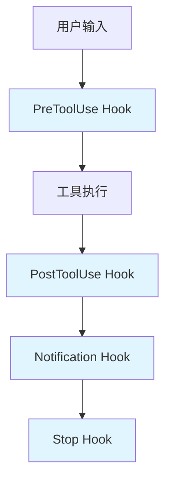

# 第14章：Hooks 自动化机制

## 14.1 Hooks 机制概述

Hooks 是 Claude Code 提供的事件驱动扩展机制，允许用户在特定时机注入自定义逻辑，实现工作流的自动化和定制化。

### 应用场景速览

在深入学习 Hooks 之前，先看看它能解决哪些实际问题：

| 场景 | 问题 | Hooks 解决方案 |
|------|------|---------------|
| 代码质量保障 | 每次写代码都要手动运行 Prettier 和 ESLint | 使用 PostToolUse Hook 自动格式化 |
| 安全审计 | 担心 Claude 执行危险命令（如 `rm -rf`） | 使用 PreToolUse Hook 拦截危险操作 |
| 团队协作 | 需要记录 Claude 的所有文件操作 | 使用 PostToolUse Hook 写入审计日志 |
| 通知集成 | 希望任务完成后收到 Slack 通知 | 使用 Notification Hook 发送消息 |
| 自动化测试 | 代码修改后忘记运行测试 | 使用 PostToolUse Hook 自动触发测试 |
| Git 工作流 | 每次修改都要手动 `git add` | 使用 PostToolUse Hook 自动暂存 |

> **提示**：本章将详细讲解每种场景的实现方法，并在 14.8 节提供完整的实战案例。

### 14.1.1 什么是 Hooks

Hooks 是在 Claude Code 执行过程中的特定事件点触发的回调机制：



### 14.1.2 Hook 事件类型

Claude Code 支持以下 Hook 事件类型：

**工具调用相关事件**：

| 事件 | 触发时机 | 常用 Matcher | 典型用途 |
|------|---------|-------------|---------|
| PreToolUse | Claude 生成工具参数后、执行前 | `Write`, `Edit`, `Bash`, `*` | 审核/修改/阻止工具调用 |
| PermissionRequest | 用户看到权限弹窗时 | 同 PreToolUse | 自动批准或拒绝权限请求 |
| PostToolUse | 工具成功执行后 | 同 PreToolUse | 后置检查、日志记录、格式化 |

**会话生命周期事件**：

| 事件 | 触发时机 | Matcher 选项 | 典型用途 |
|------|---------|-------------|---------|
| SessionStart | 新会话开始或恢复时 | `startup`, `resume`, `clear`, `compact` | 初始化环境、注入上下文 |
| SessionEnd | 会话结束时 | 无 | 清理资源、保存日志 |
| PreCompact | 执行压缩操作前 | `manual`, `auto` | 压缩前自定义处理 |

**用户交互事件**：

| 事件 | 触发时机 | 典型用途 |
|------|---------|---------|
| UserPromptSubmit | 用户提交提示后、Claude 处理前 | 验证提示、注入额外上下文 |
| Notification | Claude Code 发送通知时 | 自定义通知处理 |

**流程控制事件**：

| 事件 | 触发时机 | 典型用途 |
|------|---------|---------|
| Stop | 主代理完成响应时 | 智能判断是否应继续工作 |
| SubagentStop | 子代理（Task 工具）完成时 | 判断子任务是否真正完成 |

### 14.1.3 Hook 的价值

- **自动化**：自动执行重复性任务
- **定制化**：根据项目需求定制行为
- **集成**：与外部系统集成
- **监控**：记录和分析使用情况
- **安全**：添加额外的安全检查

## 14.2 Hook 配置

### 14.2.1 配置文件位置

Hooks 可以在多个位置配置：

```
~/.config/claude/
├── hooks.json              # 全局 Hooks
└── hooks/
    ├── pre-tool-use.sh     # 全局脚本
    └── post-tool-use.sh

~/project/
├── .claude/
│   ├── hooks.json          # 项目级 Hooks
│   └── hooks/
│       └── custom-hook.sh
└── CLAUDE.md               # 也可在此配置
```

### 14.2.2 配置语法

根据官方文档，Hooks 配置采用以下 JSON 格式：

**基础配置结构**：

```json
{
  "hooks": {
    "事件名": [
      {
        "matcher": "工具模式",
        "hooks": [
          {
            "type": "command",
            "command": "脚本路径",
            "timeout": 30
          }
        ]
      }
    ]
  }
}
```

**两种执行类型**：

1. **command**：执行 Bash 脚本（本地命令）
2. **prompt**：调用 LLM（如 Haiku）进行智能决策（仅支持部分事件）

**完整配置示例**：

```json
{
  "hooks": {
    "PreToolUse": [
      {
        "matcher": "Write",
        "hooks": [
          {
            "type": "command",
            "command": "~/.claude/hooks/validate-write.sh",
            "timeout": 30
          }
        ]
      }
    ],
    "PostToolUse": [
      {
        "matcher": "Bash",
        "hooks": [
          {
            "type": "command",
            "command": "~/.claude/hooks/log-command.sh"
          }
        ]
      }
    ],
    "Stop": [
      {
        "hooks": [
          {
            "type": "prompt",
            "prompt": "评估 Claude 是否应该停止当前任务"
          }
        ]
      }
    ]
  }
}
```

### 14.2.3 配置字段说明

| 字段 | 类型 | 必填 | 说明 |
|------|------|------|------|
| matcher | string | 否 | 工具匹配模式，如 `Write`, `Edit`, `Bash`, `*`（匹配所有） |
| hooks | array | 是 | Hook 执行配置数组 |
| type | string | 是 | 执行类型：`command`（脚本）或 `prompt`（LLM） |
| command | string | 条件必填 | type="command" 时必填，脚本路径 |
| prompt | string | 条件必填 | type="prompt" 时必填，LLM 提示词 |
| timeout | number | 否 | 超时时间（秒），默认 60 秒 |

**重要说明**：
- Hook 修改不会立即生效，需通过 `/hooks` 菜单确认
- 匹配同一事件的多个 Hook 并行运行
- Hook 执行失败不会终止主流程（除非 exit code 为 2）
- 使用 `claude --debug` 可查看详细执行日志

## 14.3 PreToolUse Hooks

### 14.3.1 基本用法

在工具执行前触发：

```json
{
  "event": "PreToolUse",
  "match": {
    "tool": "Write"
  },
  "action": "run",
  "command": "echo '[$(date)] 准备写入: {{path}}' >> ~/.claude/file-ops.log"
}
```

### 14.3.2 参数验证

验证工具参数：

```bash
#!/bin/bash
# .claude/hooks/validate-write.sh

# 接收参数
TOOL_NAME="$1"
PARAMS="$2"

# 解析路径
PATH=$(echo "$PARAMS" | jq -r '.path')

# 检查是否是敏感文件
if [[ "$PATH" == *".env"* ]] || [[ "$PATH" == *"secret"* ]]; then
    echo "错误：不允许修改敏感文件: $PATH" >&2
    exit 1
fi

# 检查文件扩展名
EXT="${PATH##*.}"
ALLOWED_EXTS=("js" "ts" "jsx" "tsx" "json" "md" "css" "html")

if [[ ! " ${ALLOWED_EXTS[@]} " =~ " ${EXT} " ]]; then
    echo "警告：非常规文件类型: .$EXT" >&2
fi

exit 0
```

配置：

```json
{
  "event": "PreToolUse",
  "match": {"tool": "Write"},
  "action": "run",
  "script": ".claude/hooks/validate-write.sh",
  "failOnError": true
}
```

### 14.3.3 权限增强

添加额外的权限检查：

```bash
#!/bin/bash
# .claude/hooks/check-permissions.sh

TOOL_NAME="$1"
PARAMS="$2"

case "$TOOL_NAME" in
    "Bash")
        COMMAND=$(echo "$PARAMS" | jq -r '.command')
        
        # 检查危险命令
        DANGEROUS_PATTERNS=("rm -rf" "sudo" "chmod 777" "> /dev/")
        for pattern in "${DANGEROUS_PATTERNS[@]}"; do
            if [[ "$COMMAND" == *"$pattern"* ]]; then
                echo "阻止危险命令: $COMMAND" >&2
                exit 1
            fi
        done
        ;;
        
    "Write")
        PATH=$(echo "$PARAMS" | jq -r '.path')
        
        # 检查是否在允许的目录
        if [[ "$PATH" != ./src/* ]] && [[ "$PATH" != ./tests/* ]]; then
            echo "只允许在 src/ 和 tests/ 目录写入" >&2
            exit 1
        fi
        ;;
esac

exit 0
```

### 14.3.4 阻止操作

使用 block action 阻止特定操作：

```json
{
  "event": "PreToolUse",
  "match": {
    "tool": "Bash",
    "params": {
      "command": {"contains": "rm -rf"}
    }
  },
  "action": "block",
  "message": "出于安全考虑，禁止执行 rm -rf 命令"
}
```

## 14.4 PostToolUse Hooks

### 14.4.1 基本用法

在工具执行后触发：

```json
{
  "event": "PostToolUse",
  "match": {"tool": "Write"},
  "action": "run",
  "command": "echo '[$(date)] 已写入: {{path}}' >> ~/.claude/file-ops.log"
}
```

### 14.4.2 结果处理

处理工具执行结果：

```bash
#!/bin/bash
# .claude/hooks/process-result.sh

TOOL_NAME="$1"
PARAMS="$2"
RESULT="$3"

case "$TOOL_NAME" in
    "Bash")
        # 检查命令是否失败
        EXIT_CODE=$(echo "$RESULT" | jq -r '.exitCode')
        if [ "$EXIT_CODE" != "0" ]; then
            # 发送通知
            notify-send "Claude Code" "命令执行失败: exit code $EXIT_CODE"
        fi
        ;;
        
    "Write")
        PATH=$(echo "$PARAMS" | jq -r '.path')
        # 自动格式化
        if [[ "$PATH" == *.ts ]] || [[ "$PATH" == *.js ]]; then
            npx prettier --write "$PATH" 2>/dev/null
        fi
        ;;
esac
```

### 14.4.3 自动化测试

文件修改后自动运行测试：

```bash
#!/bin/bash
# .claude/hooks/auto-test.sh

TOOL_NAME="$1"
PARAMS="$2"

if [ "$TOOL_NAME" == "Write" ] || [ "$TOOL_NAME" == "Edit" ]; then
    PATH=$(echo "$PARAMS" | jq -r '.path')
    
    # 检查是否是源代码文件
    if [[ "$PATH" == src/*.ts ]]; then
        # 查找对应的测试文件
        TEST_FILE="${PATH/src\//tests/}"
        TEST_FILE="${TEST_FILE/.ts/.test.ts}"
        
        if [ -f "$TEST_FILE" ]; then
            echo "运行相关测试: $TEST_FILE"
            npm test -- "$TEST_FILE" --silent
        fi
    fi
fi
```

### 14.4.4 通知集成

发送通知到外部系统：

```bash
#!/bin/bash
# .claude/hooks/notify-slack.sh

TOOL_NAME="$1"
PARAMS="$2"
RESULT="$3"

# Slack Webhook URL
WEBHOOK_URL="$SLACK_WEBHOOK_URL"

if [ "$TOOL_NAME" == "Write" ]; then
    PATH=$(echo "$PARAMS" | jq -r '.path')
    
    # 发送 Slack 通知
    curl -X POST "$WEBHOOK_URL" \
        -H 'Content-type: application/json' \
        -d "{
            \"text\": \"Claude Code 修改了文件\",
            \"attachments\": [{
                \"color\": \"#36a64f\",
                \"fields\": [{
                    \"title\": \"文件\",
                    \"value\": \"$PATH\",
                    \"short\": true
                }]
            }]
        }" 2>/dev/null
fi
```

## 14.5 Notification Hooks

### 14.5.1 自定义通知

替换默认的通知方式：

```json
{
  "event": "Notification",
  "action": "run",
  "script": ".claude/hooks/custom-notify.sh"
}
```

```bash
#!/bin/bash
# .claude/hooks/custom-notify.sh

MESSAGE="$1"
TYPE="$2"  # info, warning, error

case "$TYPE" in
    "info")
        # macOS 通知
        osascript -e "display notification \"$MESSAGE\" with title \"Claude Code\""
        ;;
    "warning")
        osascript -e "display notification \"$MESSAGE\" with title \"Claude Code ⚠️\""
        ;;
    "error")
        osascript -e "display notification \"$MESSAGE\" with title \"Claude Code ❌\" sound name \"Basso\""
        ;;
esac
```

### 14.5.2 多渠道通知

```bash
#!/bin/bash
# .claude/hooks/multi-channel-notify.sh

MESSAGE="$1"
TYPE="$2"

# 终端通知
echo "[$TYPE] $MESSAGE"

# 系统通知
if command -v notify-send &> /dev/null; then
    notify-send "Claude Code" "$MESSAGE"
elif command -v osascript &> /dev/null; then
    osascript -e "display notification \"$MESSAGE\" with title \"Claude Code\""
fi

# 日志记录
echo "[$(date)] [$TYPE] $MESSAGE" >> ~/.claude/notifications.log

# 如果是错误，发送邮件
if [ "$TYPE" == "error" ]; then
    echo "$MESSAGE" | mail -s "Claude Code Error" admin@company.com
fi
```

## 14.6 Stop Hooks

### 14.6.1 会话清理

会话结束时执行清理：

```json
{
  "event": "Stop",
  "action": "run",
  "script": ".claude/hooks/cleanup.sh"
}
```

```bash
#!/bin/bash
# .claude/hooks/cleanup.sh

# 清理临时文件
rm -f /tmp/claude-*.tmp 2>/dev/null

# 生成会话摘要
echo "[$(date)] 会话结束" >> ~/.claude/session.log

# 如果有未提交的更改，提醒用户
if git diff --quiet 2>/dev/null; then
    :
else
    echo "提醒：有未提交的代码更改"
fi
```

### 14.6.2 报告生成

会话结束时生成报告：

```bash
#!/bin/bash
# .claude/hooks/generate-report.sh

SESSION_ID="$1"
REPORT_DIR="$HOME/.claude/reports"
REPORT_FILE="$REPORT_DIR/session-$SESSION_ID.md"

mkdir -p "$REPORT_DIR"

cat > "$REPORT_FILE" << EOF
# Claude Code 会话报告

- 会话 ID: $SESSION_ID
- 结束时间: $(date)

## 文件操作统计

$(cat ~/.claude/file-ops.log | grep "$SESSION_ID" | wc -l) 次文件操作

## 命令执行统计

$(cat ~/.claude/command.log | grep "$SESSION_ID" | wc -l) 次命令执行

EOF

echo "报告已生成: $REPORT_FILE"
```

## 14.7 高级 Hook 技巧

### 14.7.1 条件执行

基于条件执行 Hook：

```json
{
  "event": "PreToolUse",
  "match": {
    "tool": "Write",
    "params": {
      "path": {"pattern": ".*\\.test\\.ts$"}
    }
  },
  "action": "run",
  "command": "echo '正在修改测试文件'"
}
```

### 14.7.2 链式 Hooks

多个 Hook 按顺序执行：

```json
{
  "hooks": [
    {
      "event": "PostToolUse",
      "match": {"tool": "Write"},
      "action": "run",
      "command": "npx prettier --write {{path}}",
      "order": 1
    },
    {
      "event": "PostToolUse",
      "match": {"tool": "Write"},
      "action": "run",
      "command": "npx eslint --fix {{path}}",
      "order": 2
    },
    {
      "event": "PostToolUse",
      "match": {"tool": "Write"},
      "action": "run",
      "command": "git add {{path}}",
      "order": 3
    }
  ]
}
```

### 14.7.3 异步 Hooks

不阻塞主流程的异步执行：

```json
{
  "event": "PostToolUse",
  "match": {"tool": "Write"},
  "action": "run",
  "script": ".claude/hooks/async-process.sh",
  "async": true
}
```

### 14.7.4 环境变量传递

```bash
#!/bin/bash
# Hook 脚本可以访问以下环境变量

echo "工具名称: $CLAUDE_TOOL_NAME"
echo "工作目录: $CLAUDE_WORKING_DIR"
echo "会话 ID: $CLAUDE_SESSION_ID"
echo "用户: $CLAUDE_USER"
```

## 14.8 实战案例

### 14.8.1 自动代码格式化

```json
{
  "hooks": [
    {
      "event": "PostToolUse",
      "match": {
        "tool": ["Write", "Edit"],
        "params": {
          "path": {"pattern": ".*\\.(js|ts|jsx|tsx)$"}
        }
      },
      "action": "run",
      "command": "npx prettier --write {{path}} && npx eslint --fix {{path}}"
    }
  ]
}
```

### 14.8.2 Git 自动暂存

```json
{
  "hooks": [
    {
      "event": "PostToolUse",
      "match": {"tool": ["Write", "Edit"]},
      "action": "run",
      "command": "git add {{path}}"
    },
    {
      "event": "Stop",
      "action": "run",
      "command": "git status --short"
    }
  ]
}
```

### 14.8.3 安全审计日志

```bash
#!/bin/bash
# .claude/hooks/audit-log.sh

TIMESTAMP=$(date -u +"%Y-%m-%dT%H:%M:%SZ")
TOOL_NAME="$1"
PARAMS="$2"
RESULT="$3"

# 记录到审计日志
cat >> ~/.claude/audit.log << EOF
{
  "timestamp": "$TIMESTAMP",
  "tool": "$TOOL_NAME",
  "params": $PARAMS,
  "result": $RESULT,
  "user": "$USER",
  "workdir": "$(pwd)"
}
EOF
```

## 14.9 本章小结

Hooks 机制为 Claude Code 提供了强大的扩展能力，通过在关键事件点注入自定义逻辑，可以实现自动化、安全增强、集成等多种功能。

在下一章中，我们将探讨 Skills 能力扩展系统，学习如何封装和复用能力。

---

**关键要点回顾**：

1. Hooks 支持 PreToolUse、PostToolUse、Notification、Stop 四种事件
2. 可以通过 JSON 配置或 CLAUDE.md 定义 Hooks
3. action 支持 run（执行）、block（阻止）、modify（修改）
4. Hook 脚本可以访问工具参数和执行结果
5. 支持条件匹配、链式执行、异步执行等高级特性

**常用 Hook 场景**：

- 自动代码格式化
- Git 操作自动化
- 安全审计日志
- 外部系统通知
- 自动化测试触发
