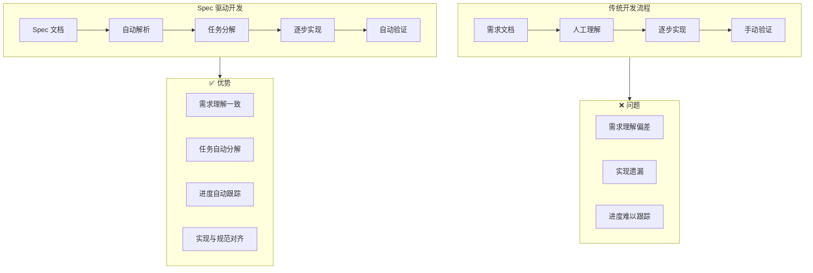
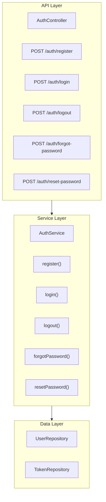

# 第16章：Spec 规范驱动开发

## 16.1 Spec 功能概述

Spec（Specification）是 Claude Code 提供的规范驱动开发功能，允许用户通过编写需求规范文档来指导 Claude 进行系统性的开发工作。

### 16.1.1 什么是 Spec

Spec 是一种结构化的需求描述方式：

- **需求文档**：详细描述要实现的功能
- **任务分解**：自动将需求分解为可执行的任务
- **进度跟踪**：跟踪每个任务的完成状态
- **质量保证**：确保实现符合规范要求

### 16.1.2 Spec 的价值



### 16.1.3 适用场景

| 场景 | 描述 | 示例 |
|------|------|------|
| 新功能开发 | 从零实现新功能 | 用户认证模块 |
| 模块重构 | 按规范重构现有代码 | API 层重构 |
| 技术迁移 | 按规范进行技术栈迁移 | 从 JavaScript 迁移到 TypeScript |
| 标准化改造 | 按规范统一代码风格 | 添加类型定义 |

## 16.2 Spec 文档结构

### 16.2.1 基本结构

```markdown
# Feature: [功能名称]

## Overview
[功能概述]

## Requirements
[详细需求列表]

## Technical Design
[技术设计]

## Implementation Tasks
[实现任务]

## Acceptance Criteria
[验收标准]
```

### 16.2.2 完整示例

```markdown
# Feature: User Authentication Module

## Overview

实现一个完整的用户认证模块，支持注册、登录、登出和密码重置功能。

## Requirements

### Functional Requirements

1. **用户注册**
   - 支持邮箱注册
   - 密码强度验证（至少 8 位，包含大小写和数字）
   - 邮箱验证码确认
   - 防止重复注册

2. **用户登录**
   - 支持邮箱 + 密码登录
   - 支持"记住我"功能
   - 登录失败锁定（5 次失败后锁定 30 分钟）
   - 返回 JWT token

3. **用户登出**
   - 清除服务端 session
   - 使 token 失效
   - 清除客户端存储

4. **密码重置**
   - 发送重置邮件
   - 验证重置链接有效性（24 小时内有效）
   - 设置新密码

### Non-Functional Requirements

- 响应时间 < 200ms
- 支持 1000 并发用户
- 密码使用 bcrypt 加密（rounds >= 10）
- 所有接口需要 HTTPS

## Technical Design

### Architecture



### Data Models

```typescript
interface User {
  id: string;
  email: string;
  passwordHash: string;
  isEmailVerified: boolean;
  failedLoginAttempts: number;
  lockedUntil: Date | null;
  createdAt: Date;
  updatedAt: Date;
}

interface Token {
  id: string;
  userId: string;
  type: 'access' | 'refresh' | 'reset';
  token: string;
  expiresAt: Date;
  createdAt: Date;
}
```

### API Specifications

#### POST /auth/register

Request:
```json
{
  "email": "user@example.com",
  "password": "SecurePass123"
}
```

Response (201):
```json
{
  "message": "Registration successful. Please verify your email.",
  "userId": "uuid"
}
```

#### POST /auth/login

Request:
```json
{
  "email": "user@example.com",
  "password": "SecurePass123",
  "rememberMe": true
}
```

Response (200):
```json
{
  "accessToken": "jwt-token",
  "refreshToken": "refresh-token",
  "expiresIn": 900
}
```

## Implementation Tasks

### Phase 1: Foundation
- [ ] 创建 User 数据模型和迁移
- [ ] 创建 Token 数据模型和迁移
- [ ] 实现密码加密工具
- [ ] 实现 JWT 工具

### Phase 2: Core Features
- [ ] 实现注册功能
- [ ] 实现登录功能
- [ ] 实现登出功能
- [ ] 实现 token 刷新

### Phase 3: Advanced Features
- [ ] 实现密码重置
- [ ] 实现邮箱验证
- [ ] 实现登录失败锁定

### Phase 4: Quality Assurance
- [ ] 编写单元测试
- [ ] 编写集成测试
- [ ] 性能测试
- [ ] 安全审计

## Acceptance Criteria

### Registration
- [ ] 可以使用有效邮箱注册
- [ ] 重复邮箱注册返回错误
- [ ] 弱密码被拒绝
- [ ] 注册后收到验证邮件

### Login
- [ ] 正确凭证可以登录
- [ ] 错误凭证返回 401
- [ ] 5 次失败后账户锁定
- [ ] 返回有效的 JWT token

### Logout
- [ ] 登出后 token 失效
- [ ] 使用失效 token 返回 401

### Password Reset
- [ ] 可以请求密码重置
- [ ] 重置链接 24 小时内有效
- [ ] 可以设置新密码
- [ ] 旧密码不再有效
```

## 16.3 使用 Spec 功能

### 16.3.1 创建 Spec

```bash
# 创建 Spec 文件
mkdir -p specs
touch specs/user-auth.spec.md

# 编辑 Spec 文件
# 按照上述结构编写需求规范
```

### 16.3.2 加载 Spec

```bash
# 启动 Claude Code 并加载 Spec
claude --spec specs/user-auth.spec.md

# 或在会话中加载
> /spec load specs/user-auth.spec.md

已加载 Spec: User Authentication Module
识别到 15 个任务
当前进度: 0/15 (0%)
```

### 16.3.3 查看任务

```
> /spec tasks

User Authentication Module - 任务列表
━━━━━━━━━━━━━━━━━━━━━━━━━━━━━━━━━━━━━━━━━━━━━━━━━━━━━━━━━━

Phase 1: Foundation
  [ ] 1. 创建 User 数据模型和迁移
  [ ] 2. 创建 Token 数据模型和迁移
  [ ] 3. 实现密码加密工具
  [ ] 4. 实现 JWT 工具

Phase 2: Core Features
  [ ] 5. 实现注册功能
  [ ] 6. 实现登录功能
  [ ] 7. 实现登出功能
  [ ] 8. 实现 token 刷新

Phase 3: Advanced Features
  [ ] 9. 实现密码重置
  [ ] 10. 实现邮箱验证
  [ ] 11. 实现登录失败锁定

Phase 4: Quality Assurance
  [ ] 12. 编写单元测试
  [ ] 13. 编写集成测试
  [ ] 14. 性能测试
  [ ] 15. 安全审计

进度: 0/15 (0%)
━━━━━━━━━━━━━━━━━━━━━━━━━━━━━━━━━━━━━━━━━━━━━━━━━━━━━━━━━━
```

### 16.3.4 执行任务

```
> /spec start 1

开始任务 1: 创建 User 数据模型和迁移

根据 Spec 中的数据模型定义，我将创建：
1. User 实体类
2. 数据库迁移文件

[Read: src/entities/]
[Write: src/entities/User.ts]
[Write: src/migrations/001_create_users_table.ts]

任务 1 完成。
进度: 1/15 (6.7%)

是否继续下一个任务？(y/n)
```

### 16.3.5 自动执行

```
> /spec auto

自动执行模式已启动
将按顺序执行所有待完成任务

执行任务 1/15: 创建 User 数据模型和迁移
[执行中...]
✓ 完成

执行任务 2/15: 创建 Token 数据模型和迁移
[执行中...]
✓ 完成

执行任务 3/15: 实现密码加密工具
[执行中...]
✓ 完成

...

所有任务执行完成
进度: 15/15 (100%)
```

### 16.3.6 验证实现

```
> /spec verify

验证 Spec 实现...

Acceptance Criteria 验证结果：
━━━━━━━━━━━━━━━━━━━━━━━━━━━━━━━━━━━━━━━━━━━━━━━━━━━━━━━━━━

Registration:
  ✓ 可以使用有效邮箱注册
  ✓ 重复邮箱注册返回错误
  ✓ 弱密码被拒绝
  ✓ 注册后收到验证邮件

Login:
  ✓ 正确凭证可以登录
  ✓ 错误凭证返回 401
  ✓ 5 次失败后账户锁定
  ✓ 返回有效的 JWT token

Logout:
  ✓ 登出后 token 失效
  ✓ 使用失效 token 返回 401

Password Reset:
  ✓ 可以请求密码重置
  ✓ 重置链接 24 小时内有效
  ✓ 可以设置新密码
  ✓ 旧密码不再有效

验证通过: 14/14 (100%)
━━━━━━━━━━━━━━━━━━━━━━━━━━━━━━━━━━━━━━━━━━━━━━━━━━━━━━━━━━
```

## 16.4 Spec 命令详解

### 16.4.1 Spec 管理命令

```bash
# 加载 Spec
/spec load <path>

# 查看当前 Spec
/spec show

# 查看任务列表
/spec tasks

# 查看进度
/spec progress

# 保存进度
/spec save

# 重置进度
/spec reset
```

### 16.4.2 任务执行命令

```bash
# 开始特定任务
/spec start <task-number>

# 自动执行所有任务
/spec auto

# 暂停自动执行
/spec pause

# 跳过当前任务
/spec skip

# 标记任务完成
/spec complete <task-number>

# 标记任务失败
/spec fail <task-number> <reason>
```

### 16.4.3 验证命令

```bash
# 验证所有验收标准
/spec verify

# 验证特定部分
/spec verify registration

# 生成验证报告
/spec report
```

## 16.5 高级 Spec 技巧

### 16.5.1 任务依赖

定义任务间的依赖关系：

```markdown
## Implementation Tasks

### Task 1: 创建数据模型
- Dependencies: none

### Task 2: 实现 Repository
- Dependencies: Task 1

### Task 3: 实现 Service
- Dependencies: Task 2

### Task 4: 实现 Controller
- Dependencies: Task 3
```

### 16.5.2 条件任务

基于条件的可选任务：

```markdown
## Implementation Tasks

### Task: 实现 OAuth 登录
- Condition: if config.oauth.enabled
- Subtasks:
  - [ ] Google OAuth
  - [ ] GitHub OAuth
```

### 16.5.3 并行任务

可以并行执行的任务：

```markdown
## Implementation Tasks

### Phase 2: Core Features (parallel)
- [ ] 实现注册功能
- [ ] 实现登录功能
- [ ] 实现登出功能

这些任务可以并行执行，无依赖关系。
```

### 16.5.4 任务模板

使用模板定义重复性任务：

```markdown
## Task Templates

### CRUD Template
对于每个实体，执行以下任务：
1. 创建实体类
2. 创建 Repository
3. 创建 Service
4. 创建 Controller
5. 编写单元测试

## Implementation Tasks

### User CRUD
- Template: CRUD Template
- Entity: User

### Product CRUD
- Template: CRUD Template
- Entity: Product
```

## 16.6 Spec 最佳实践

### 16.6.1 需求编写

**清晰具体**：

```markdown
# 不好
- 实现用户登录

# 好
- 实现用户登录
  - 支持邮箱 + 密码登录
  - 返回 JWT token（有效期 15 分钟）
  - 同时返回 refresh token（有效期 7 天）
  - 记录登录日志（IP、时间、设备）
```

**可验证**：

```markdown
# 不好
- 系统应该快速响应

# 好
- API 响应时间 < 200ms（P95）
- 支持 1000 并发用户
- 数据库查询 < 50ms
```

### 16.6.2 任务分解

**粒度适中**：

```markdown
# 太粗
- [ ] 实现认证模块

# 太细
- [ ] 创建 User 类
- [ ] 添加 id 字段
- [ ] 添加 email 字段
- [ ] 添加 password 字段

# 适中
- [ ] 创建 User 数据模型（包含所有字段和关系）
- [ ] 实现用户注册功能
- [ ] 实现用户登录功能
```

**逻辑顺序**：

```markdown
## 任务顺序原则

1. 基础设施优先（数据模型、工具类）
2. 核心功能其次（主要业务逻辑）
3. 辅助功能再次（边缘情况、优化）
4. 质量保证最后（测试、文档）
```

### 16.6.3 验收标准

**用户视角**：

```markdown
## Acceptance Criteria

### 用户注册
从用户角度描述：
- 用户可以输入邮箱和密码注册
- 用户会收到验证邮件
- 用户点击链接后账户激活
- 用户可以使用账户登录
```

**可测试**：

```markdown
## Acceptance Criteria

### 登录失败锁定
可测试的标准：
- 连续 5 次密码错误后，账户锁定
- 锁定期间尝试登录返回"账户已锁定"
- 30 分钟后自动解锁
- 解锁后可以正常登录
```

## 16.7 实战案例

### 16.7.1 API 重构 Spec

```markdown
# Feature: API v2 Migration

## Overview

将现有 REST API 从 v1 迁移到 v2，改进设计并保持向后兼容。

## Requirements

### Breaking Changes
- 统一响应格式
- 规范化错误码
- 改进分页参数

### Non-Breaking Changes
- 添加新端点
- 扩展现有响应

## Implementation Tasks

### Phase 1: Preparation
- [ ] 创建 v2 路由结构
- [ ] 实现统一响应格式中间件
- [ ] 实现错误处理中间件

### Phase 2: Migration
- [ ] 迁移 User API
- [ ] 迁移 Product API
- [ ] 迁移 Order API

### Phase 3: Compatibility
- [ ] 实现 v1 到 v2 适配层
- [ ] 添加版本协商
- [ ] 更新文档

## Acceptance Criteria
- [ ] v2 API 功能完整
- [ ] v1 API 继续工作
- [ ] 所有测试通过
- [ ] 文档已更新
```

## 16.8 本章小结

Spec 功能为 Claude Code 提供了规范驱动的开发能力，通过结构化的需求文档指导开发过程，确保实现与规范一致。

在下一章中，我们将探讨 MCP 协议与生态，学习如何扩展 Claude Code 连接外部服务。

---

**关键要点回顾**：

1. Spec 是规范驱动开发的核心功能
2. Spec 文档包含需求、设计、任务和验收标准
3. 支持任务自动分解和进度跟踪
4. 提供验证功能确保实现符合规范
5. 遵循最佳实践编写高质量的 Spec

**Spec 编写检查清单**：

- [ ] 需求描述清晰具体
- [ ] 技术设计完整
- [ ] 任务分解粒度适中
- [ ] 任务顺序合理
- [ ] 验收标准可测试
