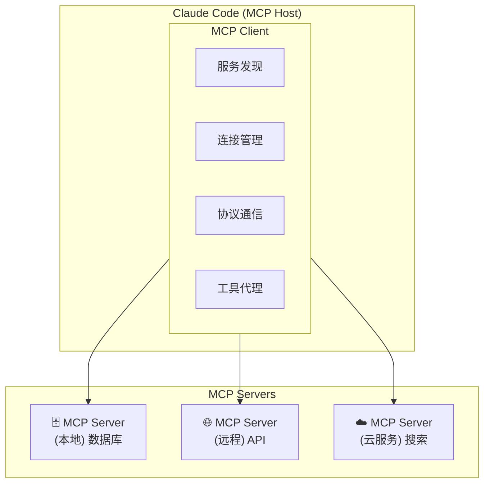

# 第17章：MCP 协议与生态

## 17.1 MCP 协议概述

Model Context Protocol（MCP，模型上下文协议）是 Anthropic 于 **2024年11月25日** 推出的开放标准协议，旨在标准化大语言模型与外部数据源和服务的连接方式。MCP 可以理解为"AI 世界的 USB 接口"——就像 USB 统一了设备连接标准一样，MCP 统一了 AI 模型与外部系统的交互标准。

### 17.1.1 什么是 MCP

MCP 定义了一套标准化的接口，使 Claude 能够：

- 访问外部数据源（数据库、API、文件系统）
- 调用外部服务（搜索、计算、第三方 API）
- 获取实时信息（天气、股票、新闻）
- 执行特定领域的操作

**MCP 的核心价值**：

| 传统方式 | MCP 方式 |
|---------|---------|
| 每个数据源需要定制集成代码 | 统一的协议标准 |
| 维护成本高 | 即插即用 |
| 难以扩展 | 生态系统共享 |
| 安全性参差不齐 | 标准化安全机制 |

### 17.1.2 MCP 架构

MCP 采用客户端-服务器架构，包含三个核心组件：



**三大组件说明**：

| 组件 | 角色 | 说明 |
|------|------|------|
| **MCP Host** | 宿主环境 | 运行 AI 模型的应用程序（如 Claude Code），提供 AI 交互环境 |
| **MCP Client** | 客户端 | AI 模型内部的组件，负责与 MCP Server 通信，格式化请求 |
| **MCP Server** | 服务端 | 连接 AI 模型与外部系统的中间层，提供工具和数据 |

### 17.1.3 核心概念

| 概念 | 描述 | 示例 |
|------|------|------|
| **Tools** | Server 暴露的可调用工具 | `query_database`, `search_web` |
| **Resources** | Server 提供的数据资源 | 文件、数据库记录、API 响应 |
| **Prompts** | Server 提供的提示词模板 | 预定义的查询模板 |
| **Sampling** | 请求 LLM 生成内容 | 让 Server 调用模型能力 |

## 17.2 MCP 协议规范

### 17.2.1 通信协议

MCP 使用 **JSON-RPC 2.0** 协议进行通信：

```json
// 请求示例
{
  "jsonrpc": "2.0",
  "id": 1,
  "method": "tools/call",
  "params": {
    "name": "query_database",
    "arguments": {
      "sql": "SELECT * FROM users LIMIT 10"
    }
  }
}

// 响应示例
{
  "jsonrpc": "2.0",
  "id": 1,
  "result": {
    "content": [
      {
        "type": "text",
        "text": "查询结果：10 条记录..."
      }
    ]
  }
}
```

### 17.2.2 传输层

MCP 支持多种传输方式：

| 传输方式 | 描述 | 适用场景 | 支持版本 |
|---------|------|---------|---------|
| **stdio** | 标准输入输出 | 本地进程 | 初始版本 |
| **HTTP/SSE** | HTTP + Server-Sent Events | 远程服务 | 2025年7月+ |
| **WebSocket** | 双向通信 | 实时交互 | 规划中 |

### 17.2.3 核心方法

**初始化**：

```json
// 客户端发起初始化
{
  "method": "initialize",
  "params": {
    "protocolVersion": "2024-11-05",
    "capabilities": {
      "tools": {},
      "resources": {}
    },
    "clientInfo": {
      "name": "claude-code",
      "version": "1.0.0"
    }
  }
}
```

**工具列表**：

```json
// 获取可用工具
{
  "method": "tools/list"
}

// 响应
{
  "tools": [
    {
      "name": "query_database",
      "description": "执行 SQL 查询",
      "inputSchema": {
        "type": "object",
        "properties": {
          "sql": { "type": "string" }
        },
        "required": ["sql"]
      }
    }
  ]
}
```

**工具调用**：

```json
// 调用工具
{
  "method": "tools/call",
  "params": {
    "name": "query_database",
    "arguments": {
      "sql": "SELECT COUNT(*) FROM orders"
    }
  }
}
```

## 17.3 配置 MCP Server

### 17.3.1 基本配置命令

```bash
# 添加 MCP 服务器
claude mcp add <name> <command> [args...]

# 列出已配置的服务器
claude mcp list

# 移除服务器
claude mcp remove <name>

# 查看服务器详情
claude mcp get <name>
```

### 17.3.2 本地 MCP Server 配置

**添加文件系统服务器**：

```bash
# 添加文件系统 MCP 服务器
claude mcp add filesystem -s user -- npx -y @modelcontextprotocol/server-filesystem ~/Projects

# 添加 SQLite 数据库服务器
claude mcp add sqlite -- npx -y @modelcontextprotocol/server-sqlite ~/data/mydb.sqlite

# 添加 Git 服务器
claude mcp add git -- npx -y @modelcontextprotocol/server-git --repository ~/myproject
```

**配置文件方式**：

`~/.claude/mcp_servers.json`：

```json
{
  "mcpServers": {
    "filesystem": {
      "command": "npx",
      "args": ["-y", "@modelcontextprotocol/server-filesystem", "~/Projects"],
      "scope": "user"
    },
    "sqlite": {
      "command": "npx",
      "args": ["-y", "@modelcontextprotocol/server-sqlite", "~/data/app.db"],
      "scope": "project"
    },
    "github": {
      "command": "npx",
      "args": ["-y", "@modelcontextprotocol/server-github"],
      "env": {
        "GITHUB_TOKEN": "${GITHUB_TOKEN}"
      }
    }
  }
}
```

### 17.3.3 远程 MCP Server 配置（2025年7月新功能）

2025年7月，Claude Code 正式支持远程 MCP 服务器，这是重大升级：

**核心优势**：
- **低维护成本**：只需添加供应商 URL，无需本地部署
- **自动更新**：供应商负责更新、扩展和可用性管理
- **专注开发**：开发者可以专注于构建，而不是管理服务器基础设施

**配置示例**：

```bash
# 添加远程 MCP 服务器
claude mcp add remote-search --url https://mcp.example.com/search

# 带认证的远程服务器
claude mcp add remote-db --url https://mcp.example.com/database \
  --header "Authorization: Bearer ${API_TOKEN}"
```

**配置文件方式**：

```json
{
  "mcpServers": {
    "remote-search": {
      "url": "https://mcp.example.com/search",
      "transport": "sse"
    },
    "remote-analytics": {
      "url": "https://mcp.example.com/analytics",
      "transport": "sse",
      "headers": {
        "Authorization": "Bearer ${ANALYTICS_TOKEN}"
      }
    }
  }
}
```

## 17.4 常用 MCP Server

### 17.4.1 官方 MCP Server

Anthropic 和社区提供了多个官方 MCP Server：

| Server | 功能 | 安装命令 |
|--------|------|---------|
| **filesystem** | 文件系统访问 | `npx @modelcontextprotocol/server-filesystem` |
| **sqlite** | SQLite 数据库 | `npx @modelcontextprotocol/server-sqlite` |
| **postgres** | PostgreSQL 数据库 | `npx @modelcontextprotocol/server-postgres` |
| **github** | GitHub API | `npx @modelcontextprotocol/server-github` |
| **git** | Git 仓库操作 | `npx @modelcontextprotocol/server-git` |
| **slack** | Slack 集成 | `npx @modelcontextprotocol/server-slack` |
| **google-drive** | Google Drive | `npx @modelcontextprotocol/server-google-drive` |
| **brave-search** | Brave 搜索 | `npx @modelcontextprotocol/server-brave-search` |

### 17.4.2 推荐的 10 个必备 MCP Server

1. **filesystem** - 本地文件系统访问
2. **sqlite/postgres** - 数据库查询
3. **github** - GitHub 仓库和 Issue 管理
4. **git** - Git 版本控制操作
5. **brave-search** - 网络搜索
6. **fetch** - HTTP 请求
7. **puppeteer** - 浏览器自动化
8. **docker** - Docker 容器管理
9. **kubernetes** - K8s 集群操作
10. **aws** - AWS 服务集成

### 17.4.3 配置示例：完整的开发环境

```json
{
  "mcpServers": {
    "filesystem": {
      "command": "npx",
      "args": ["-y", "@modelcontextprotocol/server-filesystem", "~/Projects"]
    },
    "github": {
      "command": "npx",
      "args": ["-y", "@modelcontextprotocol/server-github"],
      "env": {
        "GITHUB_TOKEN": "${GITHUB_TOKEN}"
      }
    },
    "postgres": {
      "command": "npx",
      "args": ["-y", "@modelcontextprotocol/server-postgres"],
      "env": {
        "DATABASE_URL": "${DATABASE_URL}"
      }
    },
    "brave-search": {
      "command": "npx",
      "args": ["-y", "@modelcontextprotocol/server-brave-search"],
      "env": {
        "BRAVE_API_KEY": "${BRAVE_API_KEY}"
      }
    },
    "docker": {
      "command": "npx",
      "args": ["-y", "@modelcontextprotocol/server-docker"]
    }
  }
}
```

## 17.5 开发自定义 MCP Server

### 17.5.1 使用 TypeScript 开发

**项目初始化**：

```bash
mkdir my-mcp-server
cd my-mcp-server
npm init -y
npm install @modelcontextprotocol/sdk typescript @types/node
```

**基本结构**：

```typescript
// src/index.ts
import { Server } from "@modelcontextprotocol/sdk/server/index.js";
import { StdioServerTransport } from "@modelcontextprotocol/sdk/server/stdio.js";
import {
  CallToolRequestSchema,
  ListToolsRequestSchema,
} from "@modelcontextprotocol/sdk/types.js";

// 创建服务器实例
const server = new Server(
  {
    name: "my-custom-server",
    version: "1.0.0",
  },
  {
    capabilities: {
      tools: {},
    },
  }
);

// 定义工具列表
server.setRequestHandler(ListToolsRequestSchema, async () => {
  return {
    tools: [
      {
        name: "get_weather",
        description: "获取指定城市的天气信息",
        inputSchema: {
          type: "object",
          properties: {
            city: {
              type: "string",
              description: "城市名称",
            },
          },
          required: ["city"],
        },
      },
      {
        name: "calculate",
        description: "执行数学计算",
        inputSchema: {
          type: "object",
          properties: {
            expression: {
              type: "string",
              description: "数学表达式",
            },
          },
          required: ["expression"],
        },
      },
    ],
  };
});

// 实现工具调用
server.setRequestHandler(CallToolRequestSchema, async (request) => {
  const { name, arguments: args } = request.params;

  switch (name) {
    case "get_weather":
      // 实际应用中应调用天气 API
      const city = args?.city as string;
      return {
        content: [
          {
            type: "text",
            text: `${city}的天气：晴，温度 25°C，湿度 60%`,
          },
        ],
      };

    case "calculate":
      const expression = args?.expression as string;
      try {
        // 注意：实际应用中应使用安全的表达式解析器
        const result = eval(expression);
        return {
          content: [
            {
              type: "text",
              text: `计算结果：${expression} = ${result}`,
            },
          ],
        };
      } catch (error) {
        return {
          content: [
            {
              type: "text",
              text: `计算错误：${error}`,
            },
          ],
          isError: true,
        };
      }

    default:
      throw new Error(`未知工具：${name}`);
  }
});

// 启动服务器
async function main() {
  const transport = new StdioServerTransport();
  await server.connect(transport);
  console.error("MCP Server 已启动");
}

main().catch(console.error);
```

### 17.5.2 使用 Python 开发

```python
# server.py
import asyncio
import json
from mcp.server import Server
from mcp.server.stdio import stdio_server
from mcp.types import Tool, TextContent

# 创建服务器
app = Server("my-python-server")

# 定义工具
@app.list_tools()
async def list_tools():
    return [
        Tool(
            name="analyze_code",
            description="分析代码质量",
            inputSchema={
                "type": "object",
                "properties": {
                    "code": {"type": "string", "description": "要分析的代码"},
                    "language": {"type": "string", "description": "编程语言"},
                },
                "required": ["code"],
            },
        ),
    ]

# 实现工具
@app.call_tool()
async def call_tool(name: str, arguments: dict):
    if name == "analyze_code":
        code = arguments.get("code", "")
        language = arguments.get("language", "unknown")
        
        # 简单的代码分析逻辑
        lines = code.split("\n")
        analysis = {
            "lines": len(lines),
            "language": language,
            "has_comments": "#" in code or "//" in code,
        }
        
        return [
            TextContent(
                type="text",
                text=f"代码分析结果：\n{json.dumps(analysis, indent=2, ensure_ascii=False)}",
            )
        ]
    
    raise ValueError(f"未知工具：{name}")

# 启动服务器
async def main():
    async with stdio_server() as (read_stream, write_stream):
        await app.run(read_stream, write_stream)

if __name__ == "__main__":
    asyncio.run(main())
```

### 17.5.3 注册自定义 Server

```bash
# 注册 TypeScript Server
claude mcp add my-server -- node /path/to/my-mcp-server/dist/index.js

# 注册 Python Server
claude mcp add my-python-server -- python /path/to/server.py
```

## 17.6 MCP 生态系统

### 17.6.1 官方资源

| 资源 | 地址 | 说明 |
|------|------|------|
| MCP 规范 | https://spec.modelcontextprotocol.io | 协议规范文档 |
| TypeScript SDK | https://github.com/modelcontextprotocol/typescript-sdk | 官方 TS SDK |
| Python SDK | https://github.com/modelcontextprotocol/python-sdk | 官方 Python SDK |
| 官方 Servers | https://github.com/modelcontextprotocol/servers | 官方 Server 集合 |

### 17.6.2 社区生态

MCP 协议自发布以来，社区贡献了大量 Server：

- **数据库**：MySQL、MongoDB、Redis、Elasticsearch
- **云服务**：AWS、GCP、Azure、Cloudflare
- **开发工具**：Jira、Linear、Notion、Confluence
- **通信**：Slack、Discord、Email
- **AI/ML**：Hugging Face、OpenAI、Replicate

### 17.6.3 MCP 与其他协议的对比

| 特性 | MCP | OpenAI Function Calling | LangChain Tools |
|------|-----|------------------------|-----------------|
| 标准化 | 开放标准 | OpenAI 专有 | 框架特定 |
| 传输层 | stdio/HTTP/WebSocket | HTTP | 内存 |
| 资源管理 | 原生支持 | 不支持 | 部分支持 |
| 生态系统 | 快速增长 | 有限 | 丰富 |
| 跨模型 | 设计目标 | 仅 OpenAI | 多模型 |

## 17.7 MCP 故障排除

### 17.7.1 常见问题

**问题1：Server 无法启动**

```bash
# 检查 Server 是否正确安装
npx @modelcontextprotocol/server-filesystem --help

# 检查日志
claude mcp logs filesystem
```

**问题2：连接超时**

```bash
# 增加超时时间
claude config set mcp.timeout 30000

# 检查网络连接（远程 Server）
curl -I https://mcp.example.com/health
```

**问题3：权限错误**

```bash
# 检查环境变量
echo $GITHUB_TOKEN

# 确保 Server 有正确的权限
chmod +x /path/to/server
```

### 17.7.2 调试模式

```bash
# 启用 MCP 调试日志
export MCP_DEBUG=1
claude

# 查看详细的 MCP 通信日志
claude --mcp-debug
```

## 17.8 最佳实践

### 17.8.1 安全性建议

1. **最小权限原则**：只授予 Server 必要的权限
2. **环境变量管理**：敏感信息使用环境变量，不要硬编码
3. **输入验证**：在 Server 中验证所有输入
4. **审计日志**：记录所有工具调用

### 17.8.2 性能优化

1. **连接池**：复用数据库连接
2. **缓存**：缓存频繁访问的数据
3. **异步处理**：使用异步 I/O
4. **批量操作**：合并多个小请求

### 17.8.3 开发建议

1. **清晰的工具描述**：帮助 Claude 理解何时使用工具
2. **合理的输入 Schema**：定义明确的参数类型和约束
3. **有意义的错误信息**：帮助调试和用户理解
4. **版本管理**：遵循语义化版本

## 17.9 本章小结

本章深入介绍了 MCP 协议的概念、架构、配置和开发方法。MCP 作为 Anthropic 推出的开放标准，正在成为 AI 模型与外部系统交互的重要桥梁。

2025年7月支持远程 MCP 服务器后，MCP 生态系统进入了新的发展阶段，开发者可以更轻松地集成各种外部服务。

---

**关键要点回顾**：

1. MCP 是 Anthropic 于 2024年11月推出的开放协议，标准化 AI 与外部系统的交互
2. MCP 架构包含 Host、Client、Server 三个核心组件
3. 2025年7月起支持远程 MCP 服务器，降低了部署和维护成本
4. 可以使用 TypeScript 或 Python SDK 开发自定义 MCP Server
5. MCP 生态系统正在快速发展，社区贡献了大量 Server
