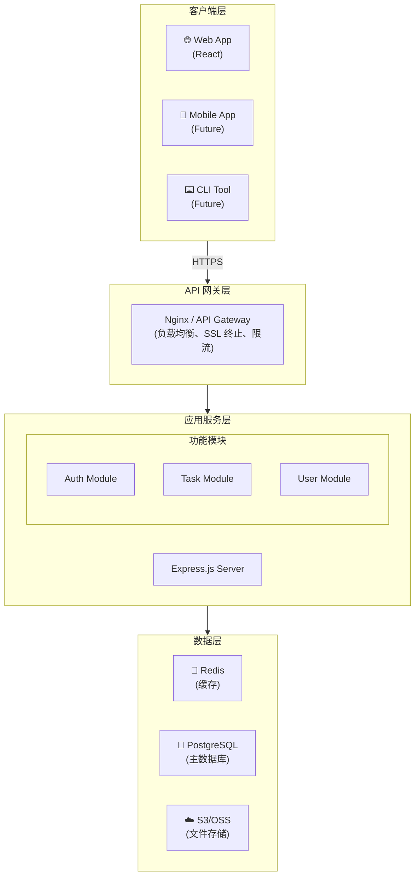

# 第21章：从零构建全栈项目

本章将通过一个完整的实战案例，展示如何使用 Claude Code 从零开始构建一个全栈 Web 应用。我们将开发一个任务管理系统（Task Management System），涵盖需求分析、架构设计、前后端开发、数据库设计等完整流程。

## 21.1 项目概述与需求分析

### 21.1.1 项目背景

任务管理系统是一个典型的 CRUD 应用，但包含足够的复杂度来展示 Claude Code 在实际项目中的应用。该系统需要支持：

- 用户认证与授权
- 任务的创建、编辑、删除
- 任务分类与标签
- 任务状态流转
- 团队协作功能
- 数据统计与报表

### 21.1.2 使用 Claude Code 进行需求分析

首先，让 Claude Code 帮助我们细化需求：

```bash
claude "我需要开发一个任务管理系统，目标用户是小型团队（5-20人）。
请帮我进行需求分析，输出：
1. 用户角色定义
2. 核心功能列表（按优先级排序）
3. 非功能性需求
4. MVP 范围界定"
```

Claude Code 的分析输出：

```
## 需求分析报告

### 1. 用户角色定义

| 角色 | 描述 | 权限范围 |
|------|------|---------|
| 管理员 | 系统管理者 | 全部权限，包括用户管理、系统配置 |
| 团队负责人 | 项目/团队管理者 | 创建项目、分配任务、查看团队报表 |
| 普通成员 | 执行任务的团队成员 | 查看分配的任务、更新任务状态、添加评论 |
| 访客 | 只读访问者 | 查看公开项目和任务（可选功能） |

### 2. 核心功能列表

**P0 - 必须实现（MVP）**
- 用户注册与登录
- 任务 CRUD 操作
- 任务状态管理（待办/进行中/已完成）
- 任务分配给成员
- 基础搜索与筛选

**P1 - 重要功能**
- 项目/分组管理
- 任务标签系统
- 任务评论
- 截止日期与提醒
- 任务优先级

**P2 - 增强功能**
- 团队管理
- 数据统计仪表板
- 文件附件
- 活动日志
- 导出功能

### 3. 非功能性需求

- 性能：页面加载时间 < 2秒，API 响应时间 < 500ms
- 安全：HTTPS、密码加密、SQL 注入防护、XSS 防护
- 可用性：99.9% 可用性目标
- 可扩展性：支持水平扩展
- 兼容性：支持主流浏览器（Chrome、Firefox、Safari、Edge）

### 4. MVP 范围

第一版本聚焦于个人任务管理：
- 用户认证（注册/登录/登出）
- 任务管理（创建/编辑/删除/列表）
- 任务状态切换
- 基础筛选（按状态、按日期）
```

### 21.1.3 技术选型

```bash
claude "基于上述需求，请推荐技术栈选型，考虑因素：
1. 开发效率
2. 团队学习成本（假设团队熟悉 JavaScript）
3. 长期维护性
4. 社区生态"
```

最终技术栈决策：

| 层级 | 技术选择 | 理由 |
|------|---------|------|
| 前端 | React 18 + TypeScript | 生态成熟，类型安全 |
| UI 框架 | Tailwind CSS + Headless UI | 灵活性高，定制性强 |
| 状态管理 | Zustand | 轻量级，学习成本低 |
| 后端 | Node.js + Express | 与前端技术栈统一 |
| 数据库 | PostgreSQL | 功能强大，适合复杂查询 |
| ORM | Prisma | 类型安全，开发体验好 |
| 认证 | JWT + bcrypt | 标准方案，无状态 |

## 21.2 架构设计

### 21.2.1 系统架构

```bash
claude "请为任务管理系统设计系统架构，要求：
1. 前后端分离
2. RESTful API
3. 考虑后续扩展性
4. 输出架构图（ASCII 形式）"
```

系统架构设计：



### 21.2.2 数据库设计

```bash
claude "请设计任务管理系统的数据库模型，使用 Prisma Schema 格式，包含：
1. 用户表
2. 任务表
3. 项目表
4. 标签表
5. 评论表
6. 必要的关联关系"
```

生成的 Prisma Schema：

```prisma
// prisma/schema.prisma

generator client {
  provider = "prisma-client-js"
}

datasource db {
  provider = "postgresql"
  url      = env("DATABASE_URL")
}

// 用户模型
model User {
  id            String    @id @default(cuid())
  email         String    @unique
  passwordHash  String
  name          String
  avatar        String?
  role          UserRole  @default(MEMBER)
  createdAt     DateTime  @default(now())
  updatedAt     DateTime  @updatedAt
  
  // 关联
  ownedProjects Project[] @relation("ProjectOwner")
  memberOfProjects ProjectMember[]
  assignedTasks Task[]    @relation("TaskAssignee")
  createdTasks  Task[]    @relation("TaskCreator")
  comments      Comment[]
  
  @@map("users")
}

enum UserRole {
  ADMIN
  LEADER
  MEMBER
}

// 项目模型
model Project {
  id          String   @id @default(cuid())
  name        String
  description String?
  color       String   @default("#6366f1")
  isArchived  Boolean  @default(false)
  createdAt   DateTime @default(now())
  updatedAt   DateTime @updatedAt
  
  // 关联
  ownerId     String
  owner       User     @relation("ProjectOwner", fields: [ownerId], references: [id])
  members     ProjectMember[]
  tasks       Task[]
  
  @@map("projects")
}

// 项目成员关联表
model ProjectMember {
  id        String   @id @default(cuid())
  role      ProjectRole @default(MEMBER)
  joinedAt  DateTime @default(now())
  
  projectId String
  project   Project  @relation(fields: [projectId], references: [id], onDelete: Cascade)
  userId    String
  user      User     @relation(fields: [userId], references: [id], onDelete: Cascade)
  
  @@unique([projectId, userId])
  @@map("project_members")
}

enum ProjectRole {
  OWNER
  ADMIN
  MEMBER
  VIEWER
}

// 任务模型
model Task {
  id          String     @id @default(cuid())
  title       String
  description String?
  status      TaskStatus @default(TODO)
  priority    Priority   @default(MEDIUM)
  dueDate     DateTime?
  completedAt DateTime?
  position    Int        @default(0)
  createdAt   DateTime   @default(now())
  updatedAt   DateTime   @updatedAt
  
  // 关联
  projectId   String
  project     Project    @relation(fields: [projectId], references: [id], onDelete: Cascade)
  assigneeId  String?
  assignee    User?      @relation("TaskAssignee", fields: [assigneeId], references: [id])
  creatorId   String
  creator     User       @relation("TaskCreator", fields: [creatorId], references: [id])
  tags        TaskTag[]
  comments    Comment[]
  
  @@index([projectId, status])
  @@index([assigneeId])
  @@map("tasks")
}

enum TaskStatus {
  TODO
  IN_PROGRESS
  IN_REVIEW
  DONE
  CANCELLED
}

enum Priority {
  LOW
  MEDIUM
  HIGH
  URGENT
}

// 标签模型
model Tag {
  id        String    @id @default(cuid())
  name      String
  color     String    @default("#gray")
  createdAt DateTime  @default(now())
  
  tasks     TaskTag[]
  
  @@map("tags")
}

// 任务-标签关联表
model TaskTag {
  taskId String
  task   Task   @relation(fields: [taskId], references: [id], onDelete: Cascade)
  tagId  String
  tag    Tag    @relation(fields: [tagId], references: [id], onDelete: Cascade)
  
  @@id([taskId, tagId])
  @@map("task_tags")
}

// 评论模型
model Comment {
  id        String   @id @default(cuid())
  content   String
  createdAt DateTime @default(now())
  updatedAt DateTime @updatedAt
  
  taskId    String
  task      Task     @relation(fields: [taskId], references: [id], onDelete: Cascade)
  authorId  String
  author    User     @relation(fields: [authorId], references: [id])
  
  @@map("comments")
}
```

### 21.2.3 API 设计

```bash
claude "请设计任务管理系统的 RESTful API，遵循以下原则：
1. 资源命名使用复数名词
2. 使用标准 HTTP 方法
3. 统一响应格式
4. 包含分页、筛选、排序
5. 输出 OpenAPI 格式"
```

API 端点设计：

```yaml
# 认证相关
POST   /api/v1/auth/register     # 用户注册
POST   /api/v1/auth/login        # 用户登录
POST   /api/v1/auth/logout       # 用户登出
POST   /api/v1/auth/refresh      # 刷新令牌
GET    /api/v1/auth/me           # 获取当前用户

# 用户管理
GET    /api/v1/users             # 获取用户列表
GET    /api/v1/users/:id         # 获取用户详情
PATCH  /api/v1/users/:id         # 更新用户信息
DELETE /api/v1/users/:id         # 删除用户

# 项目管理
GET    /api/v1/projects          # 获取项目列表
POST   /api/v1/projects          # 创建项目
GET    /api/v1/projects/:id      # 获取项目详情
PATCH  /api/v1/projects/:id      # 更新项目
DELETE /api/v1/projects/:id      # 删除项目
GET    /api/v1/projects/:id/members    # 获取项目成员
POST   /api/v1/projects/:id/members    # 添加项目成员
DELETE /api/v1/projects/:id/members/:userId  # 移除项目成员

# 任务管理
GET    /api/v1/projects/:projectId/tasks     # 获取任务列表
POST   /api/v1/projects/:projectId/tasks     # 创建任务
GET    /api/v1/tasks/:id                     # 获取任务详情
PATCH  /api/v1/tasks/:id                     # 更新任务
DELETE /api/v1/tasks/:id                     # 删除任务
PATCH  /api/v1/tasks/:id/status              # 更新任务状态
POST   /api/v1/tasks/:id/assign              # 分配任务

# 评论管理
GET    /api/v1/tasks/:taskId/comments        # 获取评论列表
POST   /api/v1/tasks/:taskId/comments        # 添加评论
PATCH  /api/v1/comments/:id                  # 更新评论
DELETE /api/v1/comments/:id                  # 删除评论

# 标签管理
GET    /api/v1/tags              # 获取标签列表
POST   /api/v1/tags              # 创建标签
PATCH  /api/v1/tags/:id          # 更新标签
DELETE /api/v1/tags/:id          # 删除标签
```

## 21.3 后端开发

### 21.3.1 项目初始化

```bash
claude "请帮我初始化后端项目，使用 Express + TypeScript + Prisma，包含：
1. 项目结构
2. 必要的依赖
3. TypeScript 配置
4. ESLint + Prettier 配置"
```

项目结构：

```
backend/
├── src/
│   ├── config/           # 配置文件
│   │   ├── database.ts
│   │   ├── auth.ts
│   │   └── index.ts
│   ├── controllers/      # 控制器
│   │   ├── auth.controller.ts
│   │   ├── task.controller.ts
│   │   ├── project.controller.ts
│   │   └── user.controller.ts
│   ├── middlewares/      # 中间件
│   │   ├── auth.middleware.ts
│   │   ├── error.middleware.ts
│   │   └── validate.middleware.ts
│   ├── routes/           # 路由
│   │   ├── auth.routes.ts
│   │   ├── task.routes.ts
│   │   ├── project.routes.ts
│   │   └── index.ts
│   ├── services/         # 业务逻辑
│   │   ├── auth.service.ts
│   │   ├── task.service.ts
│   │   ├── project.service.ts
│   │   └── user.service.ts
│   ├── validators/       # 请求验证
│   │   ├── auth.validator.ts
│   │   ├── task.validator.ts
│   │   └── project.validator.ts
│   ├── types/            # 类型定义
│   │   └── index.ts
│   ├── utils/            # 工具函数
│   │   ├── response.ts
│   │   ├── errors.ts
│   │   └── logger.ts
│   ├── app.ts            # Express 应用
│   └── server.ts         # 服务入口
├── prisma/
│   ├── schema.prisma
│   └── seed.ts
├── tests/
│   ├── unit/
│   └── integration/
├── .env.example
├── .eslintrc.js
├── .prettierrc
├── tsconfig.json
└── package.json
```

### 21.3.2 核心代码实现

```bash
claude "请实现认证模块，包含：
1. 用户注册（密码加密）
2. 用户登录（JWT 生成）
3. 令牌验证中间件
4. 刷新令牌机制"
```

认证服务实现：

```typescript
// src/services/auth.service.ts
import bcrypt from 'bcrypt';
import jwt from 'jsonwebtoken';
import { prisma } from '../config/database';
import { config } from '../config';
import { AppError } from '../utils/errors';

interface RegisterInput {
  email: string;
  password: string;
  name: string;
}

interface LoginInput {
  email: string;
  password: string;
}

interface TokenPayload {
  userId: string;
  email: string;
  role: string;
}

interface AuthTokens {
  accessToken: string;
  refreshToken: string;
}

export class AuthService {
  private readonly SALT_ROUNDS = 12;
  private readonly ACCESS_TOKEN_EXPIRY = '15m';
  private readonly REFRESH_TOKEN_EXPIRY = '7d';

  async register(input: RegisterInput) {
    const { email, password, name } = input;

    // 检查邮箱是否已存在
    const existingUser = await prisma.user.findUnique({
      where: { email },
    });

    if (existingUser) {
      throw new AppError('邮箱已被注册', 400);
    }

    // 密码加密
    const passwordHash = await bcrypt.hash(password, this.SALT_ROUNDS);

    // 创建用户
    const user = await prisma.user.create({
      data: {
        email,
        passwordHash,
        name,
      },
      select: {
        id: true,
        email: true,
        name: true,
        role: true,
        createdAt: true,
      },
    });

    // 生成令牌
    const tokens = this.generateTokens({
      userId: user.id,
      email: user.email,
      role: user.role,
    });

    return { user, ...tokens };
  }

  async login(input: LoginInput) {
    const { email, password } = input;

    // 查找用户
    const user = await prisma.user.findUnique({
      where: { email },
    });

    if (!user) {
      throw new AppError('邮箱或密码错误', 401);
    }

    // 验证密码
    const isPasswordValid = await bcrypt.compare(password, user.passwordHash);

    if (!isPasswordValid) {
      throw new AppError('邮箱或密码错误', 401);
    }

    // 生成令牌
    const tokens = this.generateTokens({
      userId: user.id,
      email: user.email,
      role: user.role,
    });

    return {
      user: {
        id: user.id,
        email: user.email,
        name: user.name,
        role: user.role,
      },
      ...tokens,
    };
  }

  async refreshToken(refreshToken: string) {
    try {
      const payload = jwt.verify(
        refreshToken,
        config.jwt.refreshSecret
      ) as TokenPayload;

      // 验证用户是否仍然存在
      const user = await prisma.user.findUnique({
        where: { id: payload.userId },
      });

      if (!user) {
        throw new AppError('用户不存在', 401);
      }

      // 生成新的访问令牌
      const accessToken = this.generateAccessToken({
        userId: user.id,
        email: user.email,
        role: user.role,
      });

      return { accessToken };
    } catch (error) {
      throw new AppError('刷新令牌无效或已过期', 401);
    }
  }

  async validateToken(token: string): Promise<TokenPayload> {
    try {
      const payload = jwt.verify(token, config.jwt.accessSecret) as TokenPayload;
      return payload;
    } catch (error) {
      throw new AppError('访问令牌无效或已过期', 401);
    }
  }

  private generateTokens(payload: TokenPayload): AuthTokens {
    const accessToken = this.generateAccessToken(payload);
    const refreshToken = jwt.sign(payload, config.jwt.refreshSecret, {
      expiresIn: this.REFRESH_TOKEN_EXPIRY,
    });

    return { accessToken, refreshToken };
  }

  private generateAccessToken(payload: TokenPayload): string {
    return jwt.sign(payload, config.jwt.accessSecret, {
      expiresIn: this.ACCESS_TOKEN_EXPIRY,
    });
  }
}

export const authService = new AuthService();
```

认证中间件：

```typescript
// src/middlewares/auth.middleware.ts
import { Request, Response, NextFunction } from 'express';
import { authService } from '../services/auth.service';
import { AppError } from '../utils/errors';

export interface AuthenticatedRequest extends Request {
  user?: {
    userId: string;
    email: string;
    role: string;
  };
}

export const authenticate = async (
  req: AuthenticatedRequest,
  res: Response,
  next: NextFunction
) => {
  try {
    const authHeader = req.headers.authorization;

    if (!authHeader || !authHeader.startsWith('Bearer ')) {
      throw new AppError('未提供认证令牌', 401);
    }

    const token = authHeader.split(' ')[1];
    const payload = await authService.validateToken(token);

    req.user = payload;
    next();
  } catch (error) {
    next(error);
  }
};

export const authorize = (...allowedRoles: string[]) => {
  return (req: AuthenticatedRequest, res: Response, next: NextFunction) => {
    if (!req.user) {
      return next(new AppError('未认证', 401));
    }

    if (!allowedRoles.includes(req.user.role)) {
      return next(new AppError('无权限执行此操作', 403));
    }

    next();
  };
};
```

### 21.3.3 任务服务实现

```bash
claude "请实现任务服务，包含：
1. 任务 CRUD
2. 状态流转验证
3. 分页查询
4. 筛选和排序"
```

```typescript
// src/services/task.service.ts
import { prisma } from '../config/database';
import { TaskStatus, Priority, Prisma } from '@prisma/client';
import { AppError } from '../utils/errors';

interface CreateTaskInput {
  title: string;
  description?: string;
  priority?: Priority;
  dueDate?: Date;
  projectId: string;
  assigneeId?: string;
  creatorId: string;
  tagIds?: string[];
}

interface UpdateTaskInput {
  title?: string;
  description?: string;
  priority?: Priority;
  dueDate?: Date;
  assigneeId?: string;
  tagIds?: string[];
}

interface TaskQueryParams {
  projectId?: string;
  status?: TaskStatus;
  priority?: Priority;
  assigneeId?: string;
  search?: string;
  page?: number;
  limit?: number;
  sortBy?: string;
  sortOrder?: 'asc' | 'desc';
}

// 状态流转规则
const STATUS_TRANSITIONS: Record<TaskStatus, TaskStatus[]> = {
  TODO: [TaskStatus.IN_PROGRESS, TaskStatus.CANCELLED],
  IN_PROGRESS: [TaskStatus.TODO, TaskStatus.IN_REVIEW, TaskStatus.CANCELLED],
  IN_REVIEW: [TaskStatus.IN_PROGRESS, TaskStatus.DONE, TaskStatus.CANCELLED],
  DONE: [TaskStatus.TODO],
  CANCELLED: [TaskStatus.TODO],
};

export class TaskService {
  async create(input: CreateTaskInput) {
    const { tagIds, ...taskData } = input;

    // 验证项目存在
    const project = await prisma.project.findUnique({
      where: { id: input.projectId },
    });

    if (!project) {
      throw new AppError('项目不存在', 404);
    }

    // 获取最大位置值
    const maxPosition = await prisma.task.aggregate({
      where: { projectId: input.projectId },
      _max: { position: true },
    });

    const task = await prisma.task.create({
      data: {
        ...taskData,
        position: (maxPosition._max.position || 0) + 1,
        tags: tagIds
          ? {
              create: tagIds.map((tagId) => ({ tagId })),
            }
          : undefined,
      },
      include: {
        assignee: {
          select: { id: true, name: true, avatar: true },
        },
        creator: {
          select: { id: true, name: true, avatar: true },
        },
        tags: {
          include: { tag: true },
        },
      },
    });

    return this.formatTask(task);
  }

  async findById(id: string) {
    const task = await prisma.task.findUnique({
      where: { id },
      include: {
        assignee: {
          select: { id: true, name: true, avatar: true },
        },
        creator: {
          select: { id: true, name: true, avatar: true },
        },
        tags: {
          include: { tag: true },
        },
        comments: {
          include: {
            author: {
              select: { id: true, name: true, avatar: true },
            },
          },
          orderBy: { createdAt: 'desc' },
        },
        project: {
          select: { id: true, name: true },
        },
      },
    });

    if (!task) {
      throw new AppError('任务不存在', 404);
    }

    return this.formatTask(task);
  }

  async findMany(params: TaskQueryParams) {
    const {
      projectId,
      status,
      priority,
      assigneeId,
      search,
      page = 1,
      limit = 20,
      sortBy = 'createdAt',
      sortOrder = 'desc',
    } = params;

    const where: Prisma.TaskWhereInput = {
      ...(projectId && { projectId }),
      ...(status && { status }),
      ...(priority && { priority }),
      ...(assigneeId && { assigneeId }),
      ...(search && {
        OR: [
          { title: { contains: search, mode: 'insensitive' } },
          { description: { contains: search, mode: 'insensitive' } },
        ],
      }),
    };

    const [tasks, total] = await Promise.all([
      prisma.task.findMany({
        where,
        include: {
          assignee: {
            select: { id: true, name: true, avatar: true },
          },
          tags: {
            include: { tag: true },
          },
        },
        orderBy: { [sortBy]: sortOrder },
        skip: (page - 1) * limit,
        take: limit,
      }),
      prisma.task.count({ where }),
    ]);

    return {
      data: tasks.map(this.formatTask),
      pagination: {
        page,
        limit,
        total,
        totalPages: Math.ceil(total / limit),
      },
    };
  }

  async update(id: string, input: UpdateTaskInput) {
    const { tagIds, ...updateData } = input;

    const existingTask = await prisma.task.findUnique({
      where: { id },
    });

    if (!existingTask) {
      throw new AppError('任务不存在', 404);
    }

    const task = await prisma.task.update({
      where: { id },
      data: {
        ...updateData,
        tags: tagIds
          ? {
              deleteMany: {},
              create: tagIds.map((tagId) => ({ tagId })),
            }
          : undefined,
      },
      include: {
        assignee: {
          select: { id: true, name: true, avatar: true },
        },
        creator: {
          select: { id: true, name: true, avatar: true },
        },
        tags: {
          include: { tag: true },
        },
      },
    });

    return this.formatTask(task);
  }

  async updateStatus(id: string, newStatus: TaskStatus) {
    const task = await prisma.task.findUnique({
      where: { id },
    });

    if (!task) {
      throw new AppError('任务不存在', 404);
    }

    // 验证状态流转
    const allowedTransitions = STATUS_TRANSITIONS[task.status];
    if (!allowedTransitions.includes(newStatus)) {
      throw new AppError(
        `不能从 ${task.status} 状态转换到 ${newStatus} 状态`,
        400
      );
    }

    const updatedTask = await prisma.task.update({
      where: { id },
      data: {
        status: newStatus,
        completedAt: newStatus === TaskStatus.DONE ? new Date() : null,
      },
      include: {
        assignee: {
          select: { id: true, name: true, avatar: true },
        },
        tags: {
          include: { tag: true },
        },
      },
    });

    return this.formatTask(updatedTask);
  }

  async delete(id: string) {
    const task = await prisma.task.findUnique({
      where: { id },
    });

    if (!task) {
      throw new AppError('任务不存在', 404);
    }

    await prisma.task.delete({
      where: { id },
    });

    return { success: true };
  }

  private formatTask(task: any) {
    return {
      ...task,
      tags: task.tags?.map((t: any) => t.tag) || [],
    };
  }
}

export const taskService = new TaskService();
```

## 21.4 前端开发

### 21.4.1 项目初始化

```bash
claude "请帮我初始化前端项目，使用 Vite + React + TypeScript，包含：
1. 项目结构
2. 路由配置（React Router v6）
3. 状态管理（Zustand）
4. API 客户端封装（Axios）
5. Tailwind CSS 配置"
```

前端项目结构：

```
frontend/
├── src/
│   ├── components/       # 通用组件
│   │   ├── ui/          # 基础 UI 组件
│   │   ├── layout/      # 布局组件
│   │   └── shared/      # 共享业务组件
│   ├── features/        # 功能模块
│   │   ├── auth/        # 认证模块
│   │   ├── tasks/       # 任务模块
│   │   ├── projects/    # 项目模块
│   │   └── dashboard/   # 仪表板模块
│   ├── hooks/           # 自定义 Hooks
│   ├── lib/             # 工具库
│   │   ├── api.ts       # API 客户端
│   │   └── utils.ts     # 工具函数
│   ├── stores/          # Zustand 状态
│   ├── types/           # 类型定义
│   ├── routes/          # 路由配置
│   ├── App.tsx
│   └── main.tsx
├── public/
├── index.html
├── tailwind.config.js
├── tsconfig.json
├── vite.config.ts
└── package.json
```

### 21.4.2 核心组件实现

```bash
claude "请实现任务看板组件，支持：
1. 拖拽排序（使用 @dnd-kit）
2. 按状态分列显示
3. 任务卡片展示
4. 状态切换"
```

任务看板组件：

```tsx
// src/features/tasks/components/TaskBoard.tsx
import { useState } from 'react';
import {
  DndContext,
  DragOverlay,
  closestCorners,
  KeyboardSensor,
  PointerSensor,
  useSensor,
  useSensors,
  DragStartEvent,
  DragEndEvent,
} from '@dnd-kit/core';
import { sortableKeyboardCoordinates } from '@dnd-kit/sortable';
import { TaskColumn } from './TaskColumn';
import { TaskCard } from './TaskCard';
import { Task, TaskStatus } from '@/types';
import { useTaskStore } from '@/stores/taskStore';

const COLUMNS: { id: TaskStatus; title: string; color: string }[] = [
  { id: 'TODO', title: '待办', color: 'bg-gray-100' },
  { id: 'IN_PROGRESS', title: '进行中', color: 'bg-blue-100' },
  { id: 'IN_REVIEW', title: '审核中', color: 'bg-yellow-100' },
  { id: 'DONE', title: '已完成', color: 'bg-green-100' },
];

interface TaskBoardProps {
  projectId: string;
}

export function TaskBoard({ projectId }: TaskBoardProps) {
  const { tasks, updateTaskStatus } = useTaskStore();
  const [activeTask, setActiveTask] = useState<Task | null>(null);

  const sensors = useSensors(
    useSensor(PointerSensor, {
      activationConstraint: {
        distance: 8,
      },
    }),
    useSensor(KeyboardSensor, {
      coordinateGetter: sortableKeyboardCoordinates,
    })
  );

  const getTasksByStatus = (status: TaskStatus) => {
    return tasks.filter(
      (task) => task.projectId === projectId && task.status === status
    );
  };

  const handleDragStart = (event: DragStartEvent) => {
    const task = tasks.find((t) => t.id === event.active.id);
    if (task) {
      setActiveTask(task);
    }
  };

  const handleDragEnd = (event: DragEndEvent) => {
    const { active, over } = event;
    setActiveTask(null);

    if (!over) return;

    const taskId = active.id as string;
    const newStatus = over.id as TaskStatus;

    const task = tasks.find((t) => t.id === taskId);
    if (task && task.status !== newStatus) {
      updateTaskStatus(taskId, newStatus);
    }
  };

  return (
    <DndContext
      sensors={sensors}
      collisionDetection={closestCorners}
      onDragStart={handleDragStart}
      onDragEnd={handleDragEnd}
    >
      <div className="flex gap-4 overflow-x-auto pb-4">
        {COLUMNS.map((column) => (
          <TaskColumn
            key={column.id}
            id={column.id}
            title={column.title}
            color={column.color}
            tasks={getTasksByStatus(column.id)}
          />
        ))}
      </div>

      <DragOverlay>
        {activeTask ? <TaskCard task={activeTask} isDragging /> : null}
      </DragOverlay>
    </DndContext>
  );
}
```

任务卡片组件：

```tsx
// src/features/tasks/components/TaskCard.tsx
import { useSortable } from '@dnd-kit/sortable';
import { CSS } from '@dnd-kit/utilities';
import { Task, Priority } from '@/types';
import { formatDate } from '@/lib/utils';
import { CalendarIcon, UserIcon } from '@heroicons/react/24/outline';
import clsx from 'clsx';

interface TaskCardProps {
  task: Task;
  isDragging?: boolean;
}

const PRIORITY_STYLES: Record<Priority, string> = {
  LOW: 'border-l-gray-400',
  MEDIUM: 'border-l-blue-400',
  HIGH: 'border-l-orange-400',
  URGENT: 'border-l-red-500',
};

export function TaskCard({ task, isDragging }: TaskCardProps) {
  const {
    attributes,
    listeners,
    setNodeRef,
    transform,
    transition,
    isDragging: isSortableDragging,
  } = useSortable({ id: task.id });

  const style = {
    transform: CSS.Transform.toString(transform),
    transition,
  };

  const isOverdue = task.dueDate && new Date(task.dueDate) < new Date();

  return (
    <div
      ref={setNodeRef}
      style={style}
      {...attributes}
      {...listeners}
      className={clsx(
        'bg-white rounded-lg shadow-sm border-l-4 p-4 cursor-grab',
        PRIORITY_STYLES[task.priority],
        {
          'opacity-50': isSortableDragging,
          'shadow-lg scale-105': isDragging,
        }
      )}
    >
      {/* 标签 */}
      {task.tags.length > 0 && (
        <div className="flex flex-wrap gap-1 mb-2">
          {task.tags.map((tag) => (
            <span
              key={tag.id}
              className="px-2 py-0.5 text-xs rounded-full"
              style={{ backgroundColor: tag.color + '20', color: tag.color }}
            >
              {tag.name}
            </span>
          ))}
        </div>
      )}

      {/* 标题 */}
      <h3 className="font-medium text-gray-900 mb-2 line-clamp-2">
        {task.title}
      </h3>

      {/* 描述 */}
      {task.description && (
        <p className="text-sm text-gray-500 mb-3 line-clamp-2">
          {task.description}
        </p>
      )}

      {/* 底部信息 */}
      <div className="flex items-center justify-between text-sm">
        {/* 截止日期 */}
        {task.dueDate && (
          <div
            className={clsx('flex items-center gap-1', {
              'text-red-500': isOverdue,
              'text-gray-500': !isOverdue,
            })}
          >
            <CalendarIcon className="w-4 h-4" />
            <span>{formatDate(task.dueDate)}</span>
          </div>
        )}

        {/* 负责人 */}
        {task.assignee && (
          <div className="flex items-center gap-1">
            {task.assignee.avatar ? (
              
            ) : (
              <div className="w-6 h-6 rounded-full bg-gray-200 flex items-center justify-center">
                <UserIcon className="w-4 h-4 text-gray-500" />
              </div>
            )}
          </div>
        )}
      </div>
    </div>
  );
}
```

### 21.4.3 状态管理

```bash
claude "请实现任务状态管理，使用 Zustand，包含：
1. 任务列表状态
2. CRUD 操作
3. 乐观更新
4. 错误处理"
```

```typescript
// src/stores/taskStore.ts
import { create } from 'zustand';
import { devtools } from 'zustand/middleware';
import { Task, TaskStatus, CreateTaskInput, UpdateTaskInput } from '@/types';
import { taskApi } from '@/lib/api';
import { toast } from 'react-hot-toast';

interface TaskState {
  tasks: Task[];
  isLoading: boolean;
  error: string | null;
  
  // Actions
  fetchTasks: (projectId: string) => Promise<void>;
  createTask: (input: CreateTaskInput) => Promise<Task>;
  updateTask: (id: string, input: UpdateTaskInput) => Promise<void>;
  updateTaskStatus: (id: string, status: TaskStatus) => Promise<void>;
  deleteTask: (id: string) => Promise<void>;
}

export const useTaskStore = create<TaskState>()(
  devtools(
    (set, get) => ({
      tasks: [],
      isLoading: false,
      error: null,

      fetchTasks: async (projectId: string) => {
        set({ isLoading: true, error: null });
        try {
          const response = await taskApi.getByProject(projectId);
          set({ tasks: response.data, isLoading: false });
        } catch (error: any) {
          set({ error: error.message, isLoading: false });
          toast.error('加载任务失败');
        }
      },

      createTask: async (input: CreateTaskInput) => {
        try {
          const task = await taskApi.create(input);
          set((state) => ({ tasks: [...state.tasks, task] }));
          toast.success('任务创建成功');
          return task;
        } catch (error: any) {
          toast.error(error.message || '创建任务失败');
          throw error;
        }
      },

      updateTask: async (id: string, input: UpdateTaskInput) => {
        const previousTasks = get().tasks;
        
        // 乐观更新
        set((state) => ({
          tasks: state.tasks.map((task) =>
            task.id === id ? { ...task, ...input } : task
          ),
        }));

        try {
          await taskApi.update(id, input);
          toast.success('任务更新成功');
        } catch (error: any) {
          // 回滚
          set({ tasks: previousTasks });
          toast.error(error.message || '更新任务失败');
          throw error;
        }
      },

      updateTaskStatus: async (id: string, status: TaskStatus) => {
        const previousTasks = get().tasks;
        
        // 乐观更新
        set((state) => ({
          tasks: state.tasks.map((task) =>
            task.id === id ? { ...task, status } : task
          ),
        }));

        try {
          await taskApi.updateStatus(id, status);
        } catch (error: any) {
          // 回滚
          set({ tasks: previousTasks });
          toast.error(error.message || '状态更新失败');
          throw error;
        }
      },

      deleteTask: async (id: string) => {
        const previousTasks = get().tasks;
        
        // 乐观更新
        set((state) => ({
          tasks: state.tasks.filter((task) => task.id !== id),
        }));

        try {
          await taskApi.delete(id);
          toast.success('任务删除成功');
        } catch (error: any) {
          // 回滚
          set({ tasks: previousTasks });
          toast.error(error.message || '删除任务失败');
          throw error;
        }
      },
    }),
    { name: 'task-store' }
  )
);
```

## 21.5 测试与部署

### 21.5.1 后端测试

```bash
claude "请为任务服务编写集成测试，使用 Jest + Supertest，覆盖：
1. 任务 CRUD 操作
2. 权限验证
3. 状态流转验证"
```

```typescript
// tests/integration/task.test.ts
import request from 'supertest';
import { app } from '../../src/app';
import { prisma } from '../../src/config/database';
import { createTestUser, generateAuthToken } from '../helpers';

describe('Task API', () => {
  let authToken: string;
  let userId: string;
  let projectId: string;

  beforeAll(async () => {
    const user = await createTestUser();
    userId = user.id;
    authToken = generateAuthToken(user);

    const project = await prisma.project.create({
      data: {
        name: 'Test Project',
        ownerId: userId,
      },
    });
    projectId = project.id;
  });

  afterAll(async () => {
    await prisma.task.deleteMany();
    await prisma.project.deleteMany();
    await prisma.user.deleteMany();
  });

  describe('POST /api/v1/projects/:projectId/tasks', () => {
    it('should create a new task', async () => {
      const response = await request(app)
        .post(`/api/v1/projects/${projectId}/tasks`)
        .set('Authorization', `Bearer ${authToken}`)
        .send({
          title: 'Test Task',
          description: 'Test Description',
          priority: 'HIGH',
        });

      expect(response.status).toBe(201);
      expect(response.body.data).toMatchObject({
        title: 'Test Task',
        description: 'Test Description',
        priority: 'HIGH',
        status: 'TODO',
      });
    });

    it('should return 401 without auth token', async () => {
      const response = await request(app)
        .post(`/api/v1/projects/${projectId}/tasks`)
        .send({ title: 'Test Task' });

      expect(response.status).toBe(401);
    });

    it('should return 400 without title', async () => {
      const response = await request(app)
        .post(`/api/v1/projects/${projectId}/tasks`)
        .set('Authorization', `Bearer ${authToken}`)
        .send({ description: 'No title' });

      expect(response.status).toBe(400);
    });
  });

  describe('PATCH /api/v1/tasks/:id/status', () => {
    let taskId: string;

    beforeEach(async () => {
      const task = await prisma.task.create({
        data: {
          title: 'Status Test Task',
          projectId,
          creatorId: userId,
          status: 'TODO',
        },
      });
      taskId = task.id;
    });

    it('should update task status from TODO to IN_PROGRESS', async () => {
      const response = await request(app)
        .patch(`/api/v1/tasks/${taskId}/status`)
        .set('Authorization', `Bearer ${authToken}`)
        .send({ status: 'IN_PROGRESS' });

      expect(response.status).toBe(200);
      expect(response.body.data.status).toBe('IN_PROGRESS');
    });

    it('should reject invalid status transition', async () => {
      const response = await request(app)
        .patch(`/api/v1/tasks/${taskId}/status`)
        .set('Authorization', `Bearer ${authToken}`)
        .send({ status: 'DONE' });

      expect(response.status).toBe(400);
    });
  });
});
```

### 21.5.2 部署配置

```bash
claude "请生成 Docker Compose 部署配置，包含：
1. 后端服务
2. 前端服务（Nginx）
3. PostgreSQL
4. Redis
5. 环境变量管理"
```

```yaml
# docker-compose.yml
version: '3.8'

services:
  # 后端服务
  backend:
    build:
      context: ./backend
      dockerfile: Dockerfile
    environment:
      - NODE_ENV=production
      - DATABASE_URL=postgresql://postgres:${DB_PASSWORD}@db:5432/taskmanager
      - REDIS_URL=redis://redis:6379
      - JWT_ACCESS_SECRET=${JWT_ACCESS_SECRET}
      - JWT_REFRESH_SECRET=${JWT_REFRESH_SECRET}
    depends_on:
      - db
      - redis
    networks:
      - app-network
    restart: unless-stopped

  # 前端服务
  frontend:
    build:
      context: ./frontend
      dockerfile: Dockerfile
    ports:
      - "80:80"
      - "443:443"
    depends_on:
      - backend
    networks:
      - app-network
    restart: unless-stopped

  # PostgreSQL 数据库
  db:
    image: postgres:15-alpine
    environment:
      - POSTGRES_USER=postgres
      - POSTGRES_PASSWORD=${DB_PASSWORD}
      - POSTGRES_DB=taskmanager
    volumes:
      - postgres_data:/var/lib/postgresql/data
    networks:
      - app-network
    restart: unless-stopped

  # Redis 缓存
  redis:
    image: redis:7-alpine
    volumes:
      - redis_data:/data
    networks:
      - app-network
    restart: unless-stopped

networks:
  app-network:
    driver: bridge

volumes:
  postgres_data:
  redis_data:
```

## 21.6 本章小结

本章通过一个完整的任务管理系统项目，展示了如何使用 Claude Code 进行全栈开发：

1. **需求分析**：使用 Claude Code 进行用户角色定义、功能优先级排序、技术选型
2. **架构设计**：生成系统架构图、数据库模型、API 设计
3. **后端开发**：实现认证服务、任务服务、中间件等核心模块
4. **前端开发**：构建任务看板、状态管理、组件库
5. **测试部署**：编写集成测试、配置 Docker 部署

关键收获：

- Claude Code 可以在项目的各个阶段提供有效辅助
- 通过清晰的需求描述，可以获得高质量的代码生成
- 结合项目配置文件（CLAUDE.md），可以保持代码风格一致性
- 迭代式开发：先生成骨架，再逐步完善细节

这个项目可以作为模板，用于其他类似的全栈项目开发。
