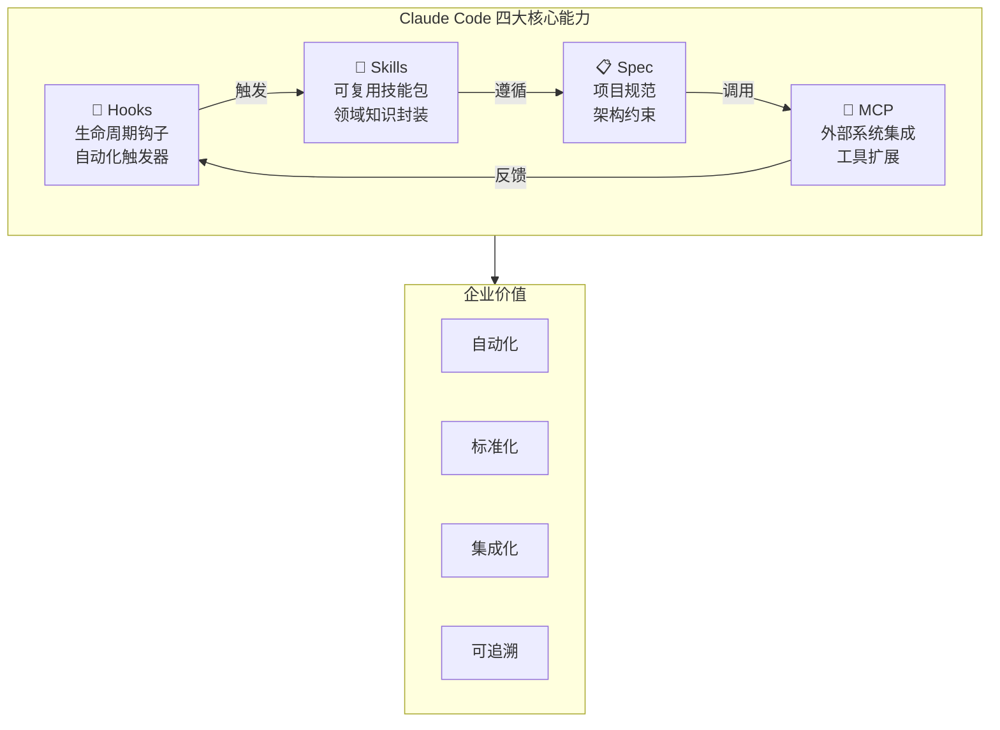
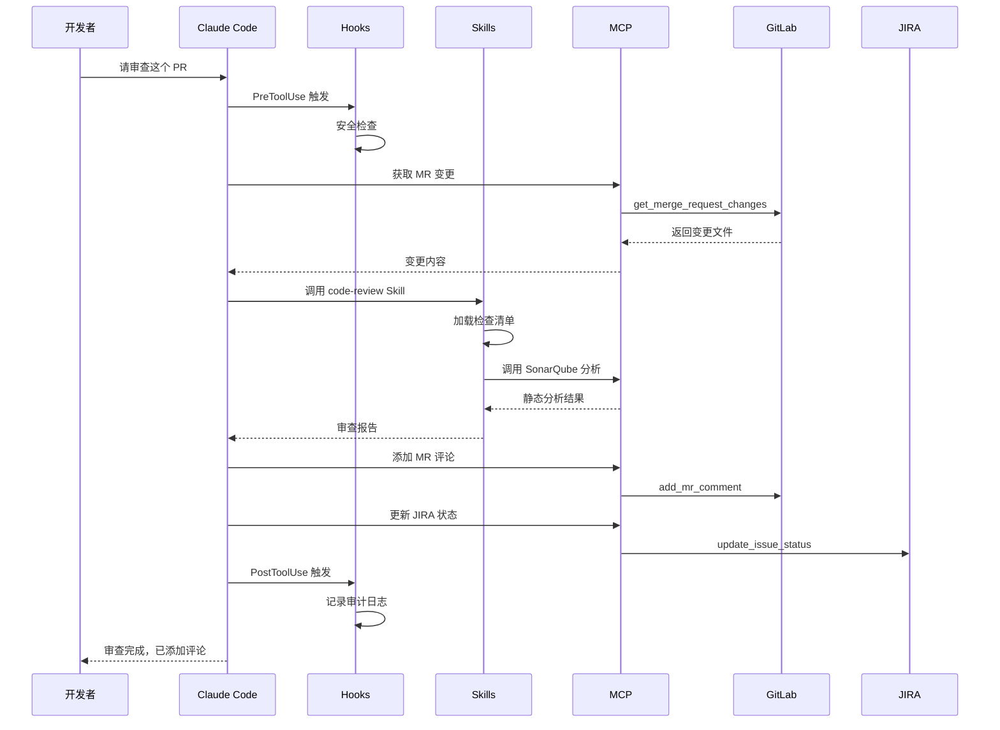
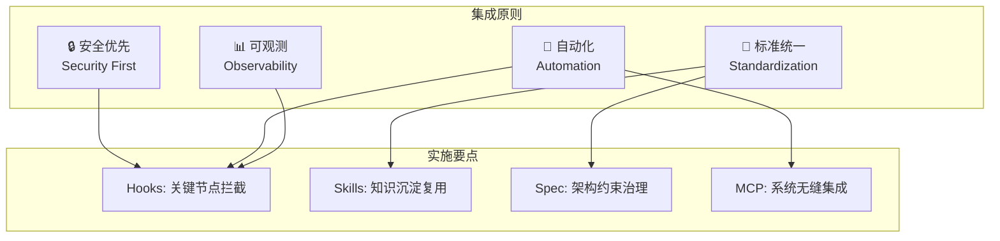

# 第25.5章：企业级 Hooks+Skills+Spec+MCP 集成最佳实践

在企业环境中，Claude Code 的四大核心能力——Hooks（钩子）、Skills（技能）、Spec（规范）和 MCP（模型上下文协议）——可以组合成强大的自动化工作流。本章将深入探讨如何在企业中实现这四者的最佳集成实践。

## 25.5.1 四大能力概述与协同

### 能力定位



### 协同工作模式

| 能力 | 职责 | 企业价值 |
|------|------|----------|
| **Hooks** | 在关键节点自动触发动作 | 流程自动化、合规检查 |
| **Skills** | 封装领域知识和最佳实践 | 知识沉淀、团队标准化 |
| **Spec** | 定义项目架构和约束 | 架构治理、质量保障 |
| **MCP** | 连接外部系统和工具 | 系统集成、能力扩展 |

## 25.5.2 企业级 Hooks 配置

### 完整的 Hooks 生命周期

```yaml
# .claude/settings.yaml - 企业级 Hooks 配置
hooks:
  # 会话开始时的初始化钩子
  PreSession:
    - name: "企业环境初始化"
      command: |
        echo "=== 企业开发环境检查 ===" &&
        ./scripts/check-enterprise-env.sh &&
        ./scripts/load-team-config.sh
      timeout: 30000
      
  # 工具调用前的检查钩子
  PreToolUse:
    - name: "安全检查 - 文件操作"
      matcher:
        toolName: ["write_to_file", "replace_in_file", "delete_files"]
      command: |
        python3 ./scripts/security/file-operation-check.py \
          --tool "$TOOL_NAME" \
          --input "$TOOL_INPUT"
      timeout: 5000
      
    - name: "安全检查 - 命令执行"
      matcher:
        toolName: "execute_command"
      command: |
        python3 ./scripts/security/command-whitelist-check.py \
          --command "$TOOL_INPUT"
      timeout: 3000
      
    - name: "MCP 调用审计"
      matcher:
        toolName: "mcp_*"
      command: |
        ./scripts/audit/log-mcp-call.sh \
          --tool "$TOOL_NAME" \
          --input "$TOOL_INPUT" \
          --user "$USER"
      timeout: 2000

  # 工具调用后的处理钩子
  PostToolUse:
    - name: "代码变更记录"
      matcher:
        toolName: ["write_to_file", "replace_in_file"]
      command: |
        python3 ./scripts/audit/record-code-change.py \
          --tool "$TOOL_NAME" \
          --output "$TOOL_OUTPUT"
          
    - name: "自动代码检查"
      matcher:
        toolName: ["write_to_file", "replace_in_file"]
        outputContains: ".ts"
      command: |
        npm run lint:fix -- --quiet 2>/dev/null || true

  # 会话结束时的清理钩子
  PostSession:
    - name: "会话总结与归档"
      command: |
        python3 ./scripts/session/archive-session.py \
          --session-id "$SESSION_ID" \
          --output-dir "./logs/sessions"
```

### 企业安全检查脚本示例

```python
#!/usr/bin/env python3
# scripts/security/file-operation-check.py
"""
文件操作安全检查脚本
在 PreToolUse 钩子中调用，阻止危险的文件操作
"""

import sys
import json
import argparse
import re
from pathlib import Path

# 敏感路径模式
SENSITIVE_PATHS = [
    r"\.env",
    r"\.env\.\w+",
    r"secrets?\.ya?ml",
    r"credentials?\.json",
    r"private[_-]?key",
    r"\.ssh/",
    r"\.aws/",
    r"\.kube/config",
]

# 禁止写入的目录
FORBIDDEN_DIRS = [
    "/etc",
    "/usr",
    "/bin",
    "/sbin",
    "~/.ssh",
    "~/.aws",
]

# 允许的文件扩展名
ALLOWED_EXTENSIONS = [
    ".ts", ".tsx", ".js", ".jsx",
    ".py", ".go", ".java", ".kt",
    ".json", ".yaml", ".yml",
    ".md", ".txt", ".html", ".css",
    ".sql", ".sh", ".bash",
]

def check_sensitive_path(filepath: str) -> bool:
    """检查是否为敏感路径"""
    for pattern in SENSITIVE_PATHS:
        if re.search(pattern, filepath, re.IGNORECASE):
            return True
    return False

def check_forbidden_dir(filepath: str) -> bool:
    """检查是否为禁止目录"""
    expanded = Path(filepath).expanduser().resolve()
    for forbidden in FORBIDDEN_DIRS:
        forbidden_path = Path(forbidden).expanduser().resolve()
        try:
            expanded.relative_to(forbidden_path)
            return True
        except ValueError:
            continue
    return False

def check_extension(filepath: str) -> bool:
    """检查文件扩展名是否允许"""
    ext = Path(filepath).suffix.lower()
    return ext in ALLOWED_EXTENSIONS or ext == ""

def main():
    parser = argparse.ArgumentParser()
    parser.add_argument("--tool", required=True)
    parser.add_argument("--input", required=True)
    args = parser.parse_args()
    
    try:
        tool_input = json.loads(args.input)
    except json.JSONDecodeError:
        print("警告: 无法解析工具输入", file=sys.stderr)
        sys.exit(0)  # 不阻止，但记录警告
    
    filepath = tool_input.get("filePath") or tool_input.get("target_file", "")
    
    if not filepath:
        sys.exit(0)
    
    # 安全检查
    errors = []
    
    if check_sensitive_path(filepath):
        errors.append(f"🚫 禁止操作敏感文件: {filepath}")
    
    if check_forbidden_dir(filepath):
        errors.append(f"🚫 禁止操作系统目录: {filepath}")
    
    if args.tool in ["write_to_file", "replace_in_file"]:
        if not check_extension(filepath):
            errors.append(f"⚠️ 不允许的文件类型: {filepath}")
    
    if errors:
        print("\n".join(errors), file=sys.stderr)
        sys.exit(2)  # 非零退出码阻止操作
    
    sys.exit(0)

if __name__ == "__main__":
    main()
```

## 25.5.3 企业级 Skills 体系

### Skills 目录结构

```
.claude/
├── skills/
│   ├── _index.yaml              # Skills 索引和元数据
│   ├── code-review/
│   │   ├── skill.yaml           # 技能定义
│   │   ├── prompts/             # 提示词模板
│   │   │   ├── security.md
│   │   │   ├── performance.md
│   │   │   └── style.md
│   │   └── examples/            # 示例
│   ├── architecture/
│   │   ├── skill.yaml
│   │   └── templates/
│   ├── testing/
│   │   ├── skill.yaml
│   │   └── generators/
│   └── documentation/
│       └── skill.yaml
└── team-skills/                 # 团队共享 Skills
    ├── onboarding/
    ├── release/
    └── incident-response/
```

### 企业代码审查 Skill

```yaml
# .claude/skills/code-review/skill.yaml
name: enterprise-code-review
version: 2.0.0
description: 企业级代码审查技能，集成安全、性能、规范检查
author: platform-team
visibility: organization

# 触发条件
triggers:
  keywords:
    - "review"
    - "审查"
    - "code review"
    - "PR review"
  filePatterns:
    - "*.ts"
    - "*.tsx"
    - "*.py"
    - "*.go"

# 依赖的其他 Skills
dependencies:
  - security-check
  - performance-analysis

# MCP 工具依赖
mcpTools:
  - server: sonarqube
    tools: [analyze, get_issues]
  - server: jira
    tools: [get_issue, add_comment]

# 技能配置
config:
  model: claude-3-opus-20240229
  maxTokens: 8000
  temperature: 0.3

# 检查清单
checklist:
  security:
    weight: 30
    items:
      - SQL 注入检查
      - XSS 漏洞检查
      - 敏感信息泄露检查
      - 认证授权检查
      - 输入验证检查
  
  performance:
    weight: 25
    items:
      - N+1 查询检查
      - 内存泄漏风险
      - 并发安全
      - 缓存使用
  
  maintainability:
    weight: 25
    items:
      - 代码复杂度
      - 函数长度
      - 命名规范
      - 注释完整性
  
  testing:
    weight: 20
    items:
      - 单元测试覆盖
      - 边界条件测试
      - 错误处理测试

# 输出格式
output:
  format: markdown
  sections:
    - summary
    - critical_issues
    - warnings
    - suggestions
    - metrics
```

### Skill 提示词模板

```markdown
<!-- .claude/skills/code-review/prompts/security.md -->
# 安全审查提示词

## 角色定义
你是一位资深的安全工程师，专注于代码安全审查。

## 审查重点

### 1. SQL 注入
检查所有数据库操作：
- 是否使用参数化查询
- 是否有字符串拼接 SQL
- ORM 使用是否安全

### 2. XSS 漏洞
检查所有输出点：
- HTML 输出是否转义
- JavaScript 动态内容是否安全
- URL 参数是否验证

### 3. 敏感信息
检查代码中是否包含：
- 硬编码密码或密钥
- API Token
- 数据库连接字符串
- 内部 IP 地址

### 4. 认证授权
检查：
- 接口是否有权限控制
- 权限检查是否完整
- Session 管理是否安全

## 输出格式
```json
{
  "severity": "critical|high|medium|low",
  "category": "sql_injection|xss|sensitive_data|auth",
  "location": "文件:行号",
  "description": "问题描述",
  "recommendation": "修复建议",
  "code_example": "修复示例代码"
}
```
```

### Skills 调用与组合

```typescript
// 在代码中调用 Skills 的示例
// scripts/invoke-skill.ts

interface SkillInvocation {
  skillName: string;
  context: {
    files: string[];
    prNumber?: number;
    branch?: string;
  };
  options?: {
    checklist?: string[];
    outputFormat?: 'markdown' | 'json';
  };
}

async function invokeSkill(invocation: SkillInvocation): Promise<SkillResult> {
  const skill = await loadSkill(invocation.skillName);
  
  // 加载依赖的 Skills
  for (const dep of skill.dependencies || []) {
    await loadSkill(dep);
  }
  
  // 准备 MCP 工具
  const mcpContext = await prepareMcpTools(skill.mcpTools);
  
  // 构建提示词
  const prompt = await buildPrompt(skill, invocation.context);
  
  // 调用 Claude
  const result = await claude.invoke({
    model: skill.config.model,
    maxTokens: skill.config.maxTokens,
    messages: [{ role: 'user', content: prompt }],
    tools: mcpContext.tools,
  });
  
  // 格式化输出
  return formatOutput(result, skill.output);
}
```

## 25.5.4 企业级 Spec 规范

### 项目 Spec 完整配置

```markdown
<!-- CLAUDE.md - 企业级项目规范 -->
# 项目规范 (Project Specification)

## 项目信息
- **名称**: enterprise-platform
- **类型**: 微服务后端
- **技术栈**: Node.js + TypeScript + PostgreSQL
- **团队**: Platform Team

## 架构约束

### 目录结构
```
src/
├── api/              # API 路由层
├── services/         # 业务逻辑层
├── repositories/     # 数据访问层
├── models/           # 数据模型
├── middlewares/      # 中间件
├── utils/            # 工具函数
└── config/           # 配置文件
```

### 分层规则
1. **API 层**只处理 HTTP 请求/响应，不包含业务逻辑
2. **Service 层**包含所有业务逻辑，可调用多个 Repository
3. **Repository 层**只负责数据访问，不包含业务逻辑
4. **禁止**跨层调用（如 API 直接调用 Repository）

### 命名规范
- 文件名：kebab-case（如 `user-service.ts`）
- 类名：PascalCase（如 `UserService`）
- 函数名：camelCase（如 `getUserById`）
- 常量：UPPER_SNAKE_CASE（如 `MAX_RETRY_COUNT`）
- 数据库表名：snake_case（如 `user_profiles`）

## 代码规范

### TypeScript 规范
```typescript
// ✅ 正确：使用接口定义类型
interface UserCreateInput {
  email: string;
  name: string;
  role: UserRole;
}

// ❌ 错误：使用 any 类型
function processData(data: any) { ... }

// ✅ 正确：明确的返回类型
async function getUser(id: string): Promise<User | null> {
  return this.userRepository.findById(id);
}

// ✅ 正确：使用枚举
enum UserRole {
  ADMIN = 'admin',
  USER = 'user',
  GUEST = 'guest',
}
```

### 错误处理规范
```typescript
// 使用自定义错误类
class BusinessError extends Error {
  constructor(
    public code: string,
    message: string,
    public statusCode: number = 400
  ) {
    super(message);
    this.name = 'BusinessError';
  }
}

// 统一错误处理
try {
  await userService.createUser(input);
} catch (error) {
  if (error instanceof BusinessError) {
    return res.status(error.statusCode).json({
      code: error.code,
      message: error.message,
    });
  }
  // 未知错误记录日志
  logger.error('Unexpected error', { error });
  return res.status(500).json({ code: 'INTERNAL_ERROR' });
}
```

## 安全规范

### 必须遵守
1. **SQL 注入防护**：必须使用参数化查询
2. **输入验证**：所有用户输入必须验证
3. **敏感数据**：禁止在代码中硬编码密钥
4. **日志脱敏**：日志中不得包含敏感信息
5. **HTTPS**：所有外部通信必须使用 HTTPS

### 禁止操作
- 禁止使用 `eval()` 或 `Function()` 执行动态代码
- 禁止在前端存储敏感信息
- 禁止关闭 CSRF 保护
- 禁止使用不安全的加密算法（MD5、SHA1）

## API 规范

### RESTful 设计
```yaml
# 资源命名：使用复数名词
GET    /api/v1/users          # 获取用户列表
GET    /api/v1/users/:id      # 获取单个用户
POST   /api/v1/users          # 创建用户
PUT    /api/v1/users/:id      # 更新用户
DELETE /api/v1/users/:id      # 删除用户

# 嵌套资源
GET    /api/v1/users/:id/orders    # 获取用户的订单
```

### 响应格式
```typescript
// 成功响应
interface SuccessResponse<T> {
  success: true;
  data: T;
  meta?: {
    page?: number;
    pageSize?: number;
    total?: number;
  };
}

// 错误响应
interface ErrorResponse {
  success: false;
  error: {
    code: string;
    message: string;
    details?: unknown;
  };
}
```

## 测试规范

### 覆盖率要求
- 单元测试覆盖率 >= 80%
- 核心业务逻辑覆盖率 >= 90%
- API 集成测试覆盖所有端点

### 测试命名
```typescript
describe('UserService', () => {
  describe('createUser', () => {
    it('should create user with valid input', async () => {});
    it('should throw error when email already exists', async () => {});
    it('should hash password before saving', async () => {});
  });
});
```

## MCP 集成规范

### 允许的 MCP 服务器
```yaml
allowedMcpServers:
  - name: internal-gitlab
    purpose: 代码仓库操作
    allowedTools: [search, get_file, create_mr]
  
  - name: jira
    purpose: 任务管理
    allowedTools: [get_issue, update_issue, add_comment]
  
  - name: sonarqube
    purpose: 代码质量分析
    allowedTools: [analyze, get_issues]
  
  - name: internal-docs
    purpose: 内部文档查询
    allowedTools: [search, get_content]
```

### 禁止的 MCP 操作
- 禁止通过 MCP 访问生产数据库
- 禁止通过 MCP 执行部署操作
- 禁止通过 MCP 修改基础设施配置

## 工作流规范

### Git 分支策略
```
main          # 生产分支，只接受 MR
├── develop   # 开发分支
├── feature/* # 功能分支
├── bugfix/*  # 缺陷修复
├── hotfix/*  # 紧急修复
└── release/* # 发布分支
```

### 提交信息格式
```
<type>(<scope>): <subject>

<body>

<footer>

# type: feat|fix|docs|style|refactor|test|chore
# scope: 模块名称
# subject: 简短描述（50字符内）
```

## Claude Code 使用规范

### 允许的操作
- 代码生成和重构
- 代码审查和分析
- 文档生成
- 测试用例生成
- Bug 分析和修复建议

### 需要人工确认的操作
- 删除文件
- 修改配置文件
- 数据库迁移脚本
- 安全相关代码修改

### 禁止的操作
- 直接执行部署命令
- 修改 CI/CD 配置
- 访问生产环境
- 处理真实用户数据
```

## 25.5.5 企业级 MCP 集成

### MCP 服务器配置

```json
// .claude/mcp_servers.json - 企业 MCP 配置
{
  "mcpServers": {
    "internal-gitlab": {
      "command": "npx",
      "args": ["-y", "@anthropic/mcp-gitlab"],
      "env": {
        "GITLAB_URL": "${GITLAB_URL}",
        "GITLAB_TOKEN": "${GITLAB_TOKEN}"
      },
      "allowedTools": [
        "search_projects",
        "get_file_content",
        "create_merge_request",
        "get_merge_request",
        "add_mr_comment"
      ],
      "blockedTools": [
        "delete_project",
        "delete_branch"
      ]
    },
    
    "jira": {
      "command": "node",
      "args": ["./mcp-servers/jira-server.js"],
      "env": {
        "JIRA_URL": "${JIRA_URL}",
        "JIRA_TOKEN": "${JIRA_TOKEN}"
      },
      "allowedTools": [
        "get_issue",
        "search_issues",
        "update_issue_status",
        "add_comment"
      ]
    },
    
    "sonarqube": {
      "command": "python3",
      "args": ["./mcp-servers/sonarqube_server.py"],
      "env": {
        "SONAR_URL": "${SONAR_URL}",
        "SONAR_TOKEN": "${SONAR_TOKEN}"
      }
    },
    
    "internal-docs": {
      "command": "node",
      "args": ["./mcp-servers/docs-server.js"],
      "env": {
        "DOCS_API_URL": "${INTERNAL_DOCS_URL}"
      }
    },
    
    "database-readonly": {
      "command": "node",
      "args": ["./mcp-servers/db-readonly-server.js"],
      "env": {
        "DB_CONNECTION": "${DEV_DB_READONLY_CONNECTION}"
      },
      "allowedTools": [
        "query_schema",
        "explain_query"
      ],
      "blockedTools": [
        "execute_query"
      ]
    }
  }
}
```

### 自定义 MCP 服务器示例

```typescript
// mcp-servers/jira-server.ts
import { Server } from "@modelcontextprotocol/sdk/server/index.js";
import { StdioServerTransport } from "@modelcontextprotocol/sdk/server/stdio.js";

const server = new Server(
  { name: "jira-mcp", version: "1.0.0" },
  { capabilities: { tools: {} } }
);

// 定义工具
server.setRequestHandler("tools/list", async () => ({
  tools: [
    {
      name: "get_issue",
      description: "获取 JIRA Issue 详情",
      inputSchema: {
        type: "object",
        properties: {
          issueKey: { type: "string", description: "Issue Key，如 PROJ-123" }
        },
        required: ["issueKey"]
      }
    },
    {
      name: "search_issues",
      description: "搜索 JIRA Issues",
      inputSchema: {
        type: "object",
        properties: {
          jql: { type: "string", description: "JQL 查询语句" },
          maxResults: { type: "number", default: 10 }
        },
        required: ["jql"]
      }
    },
    {
      name: "update_issue_status",
      description: "更新 Issue 状态",
      inputSchema: {
        type: "object",
        properties: {
          issueKey: { type: "string" },
          status: { type: "string" },
          comment: { type: "string" }
        },
        required: ["issueKey", "status"]
      }
    },
    {
      name: "add_comment",
      description: "添加评论",
      inputSchema: {
        type: "object",
        properties: {
          issueKey: { type: "string" },
          body: { type: "string" }
        },
        required: ["issueKey", "body"]
      }
    }
  ]
}));

// 实现工具调用
server.setRequestHandler("tools/call", async (request) => {
  const { name, arguments: args } = request.params;
  
  switch (name) {
    case "get_issue":
      return await getJiraIssue(args.issueKey);
    case "search_issues":
      return await searchJiraIssues(args.jql, args.maxResults);
    case "update_issue_status":
      return await updateIssueStatus(args.issueKey, args.status, args.comment);
    case "add_comment":
      return await addComment(args.issueKey, args.body);
    default:
      throw new Error(`Unknown tool: ${name}`);
  }
});

// JIRA API 实现
async function getJiraIssue(issueKey: string) {
  const response = await fetch(
    `${process.env.JIRA_URL}/rest/api/3/issue/${issueKey}`,
    {
      headers: {
        Authorization: `Bearer ${process.env.JIRA_TOKEN}`,
        "Content-Type": "application/json"
      }
    }
  );
  
  if (!response.ok) {
    throw new Error(`Failed to get issue: ${response.statusText}`);
  }
  
  const issue = await response.json();
  
  return {
    content: [{
      type: "text",
      text: JSON.stringify({
        key: issue.key,
        summary: issue.fields.summary,
        status: issue.fields.status.name,
        assignee: issue.fields.assignee?.displayName,
        description: issue.fields.description,
        created: issue.fields.created,
        updated: issue.fields.updated
      }, null, 2)
    }]
  };
}

// 启动服务器
const transport = new StdioServerTransport();
await server.connect(transport);
```

## 25.5.6 四大能力组合实战

### 场景一：自动化代码审查流程



### 实现代码

```typescript
// scripts/workflows/auto-code-review.ts
import { ClaudeClient } from './claude-client';
import { SkillManager } from './skill-manager';
import { McpManager } from './mcp-manager';

interface ReviewRequest {
  mrId: string;
  projectId: string;
  jiraKey?: string;
}

async function autoCodeReview(request: ReviewRequest) {
  const claude = new ClaudeClient();
  const skills = new SkillManager();
  const mcp = new McpManager();
  
  // 1. 获取 MR 变更
  const changes = await mcp.call('internal-gitlab', 'get_merge_request_changes', {
    projectId: request.projectId,
    mrId: request.mrId
  });
  
  // 2. 加载代码审查 Skill
  const reviewSkill = await skills.load('enterprise-code-review');
  
  // 3. 获取 SonarQube 分析
  const sonarResults = await mcp.call('sonarqube', 'analyze', {
    projectKey: request.projectId,
    branch: changes.sourceBranch
  });
  
  // 4. 执行 Claude 审查
  const reviewResult = await claude.invoke({
    skill: reviewSkill,
    context: {
      changes: changes.files,
      sonarIssues: sonarResults.issues,
      checklist: reviewSkill.checklist
    }
  });
  
  // 5. 添加 MR 评论
  await mcp.call('internal-gitlab', 'add_mr_comment', {
    projectId: request.projectId,
    mrId: request.mrId,
    body: formatReviewComment(reviewResult)
  });
  
  // 6. 更新 JIRA（如果有关联）
  if (request.jiraKey) {
    await mcp.call('jira', 'add_comment', {
      issueKey: request.jiraKey,
      body: `代码审查完成\n\n${reviewResult.summary}`
    });
    
    if (reviewResult.criticalIssues.length === 0) {
      await mcp.call('jira', 'update_issue_status', {
        issueKey: request.jiraKey,
        status: 'Code Review Passed'
      });
    }
  }
  
  return reviewResult;
}
```

### 场景二：智能需求分析与任务拆解

```yaml
# .claude/skills/requirement-analysis/skill.yaml
name: requirement-analysis
version: 1.0.0
description: 智能需求分析与任务拆解

triggers:
  keywords: ["分析需求", "拆解任务", "PRD 分析"]

mcpTools:
  - server: jira
    tools: [create_issue, link_issues]
  - server: internal-docs
    tools: [search, get_content]

workflow:
  steps:
    - name: 理解需求
      action: analyze_requirement
      input: user_input
      
    - name: 查找相关文档
      action: mcp_call
      server: internal-docs
      tool: search
      params:
        query: "{{requirement_keywords}}"
        
    - name: 技术方案评估
      action: evaluate_technical
      input: requirement + docs
      
    - name: 任务拆解
      action: breakdown_tasks
      output: task_list
      
    - name: 创建 JIRA 任务
      action: mcp_call
      server: jira
      tool: create_issue
      params:
        project: "{{project_key}}"
        tasks: "{{task_list}}"
```

### 场景三：自动化发布检查

```python
#!/usr/bin/env python3
# scripts/workflows/release-check.py
"""
发布前自动化检查流程
结合 Hooks + Skills + Spec + MCP
"""

import asyncio
from dataclasses import dataclass
from typing import List, Dict, Any

@dataclass
class ReleaseCheckResult:
    passed: bool
    checks: List[Dict[str, Any]]
    blockers: List[str]
    warnings: List[str]

async def run_release_check(version: str, branch: str) -> ReleaseCheckResult:
    """执行发布前检查"""
    
    checks = []
    blockers = []
    warnings = []
    
    # 1. 代码质量检查（MCP: SonarQube）
    sonar_result = await mcp_call('sonarqube', 'get_quality_gate', {
        'project': PROJECT_KEY,
        'branch': branch
    })
    checks.append({
        'name': '代码质量门禁',
        'passed': sonar_result['status'] == 'OK',
        'details': sonar_result
    })
    if sonar_result['status'] != 'OK':
        blockers.append(f"代码质量门禁未通过: {sonar_result['message']}")
    
    # 2. 测试覆盖率检查
    coverage = await get_test_coverage(branch)
    checks.append({
        'name': '测试覆盖率',
        'passed': coverage >= 80,
        'value': f"{coverage}%"
    })
    if coverage < 80:
        blockers.append(f"测试覆盖率不足: {coverage}% < 80%")
    elif coverage < 90:
        warnings.append(f"测试覆盖率偏低: {coverage}%")
    
    # 3. 安全扫描（MCP: Security Scanner）
    security_result = await mcp_call('security-scanner', 'scan', {
        'branch': branch,
        'severity': 'high'
    })
    checks.append({
        'name': '安全扫描',
        'passed': len(security_result['high_issues']) == 0,
        'issues': security_result
    })
    if security_result['high_issues']:
        blockers.append(f"存在高危安全问题: {len(security_result['high_issues'])} 个")
    
    # 4. 依赖检查
    deps_result = await check_dependencies(branch)
    checks.append({
        'name': '依赖检查',
        'passed': deps_result['outdated'] == 0 and deps_result['vulnerable'] == 0,
        'details': deps_result
    })
    if deps_result['vulnerable'] > 0:
        blockers.append(f"存在有漏洞的依赖: {deps_result['vulnerable']} 个")
    
    # 5. 文档完整性检查（Skill: doc-check）
    doc_result = await invoke_skill('doc-check', {
        'version': version,
        'branch': branch
    })
    checks.append({
        'name': '文档完整性',
        'passed': doc_result['complete'],
        'missing': doc_result.get('missing_docs', [])
    })
    if not doc_result['complete']:
        warnings.append(f"文档不完整: {doc_result['missing_docs']}")
    
    # 6. CHANGELOG 检查
    changelog_ok = await check_changelog(version)
    checks.append({
        'name': 'CHANGELOG 更新',
        'passed': changelog_ok
    })
    if not changelog_ok:
        warnings.append(f"CHANGELOG 未更新版本 {version}")
    
    # 7. JIRA 任务状态检查（MCP: JIRA）
    jira_result = await mcp_call('jira', 'search_issues', {
        'jql': f'fixVersion = {version} AND status != Done'
    })
    checks.append({
        'name': 'JIRA 任务状态',
        'passed': len(jira_result['issues']) == 0,
        'pending_issues': jira_result['issues']
    })
    if jira_result['issues']:
        warnings.append(f"存在未完成的 JIRA 任务: {len(jira_result['issues'])} 个")
    
    return ReleaseCheckResult(
        passed=len(blockers) == 0,
        checks=checks,
        blockers=blockers,
        warnings=warnings
    )

async def main():
    result = await run_release_check(
        version=os.environ.get('RELEASE_VERSION', '1.0.0'),
        branch=os.environ.get('RELEASE_BRANCH', 'release/1.0.0')
    )
    
    # 输出报告
    print("=" * 60)
    print(f"发布检查报告 - {'✅ 通过' if result.passed else '❌ 未通过'}")
    print("=" * 60)
    
    for check in result.checks:
        status = '✅' if check['passed'] else '❌'
        print(f"{status} {check['name']}")
    
    if result.blockers:
        print("\n🚫 阻塞问题:")
        for blocker in result.blockers:
            print(f"  - {blocker}")
    
    if result.warnings:
        print("\n⚠️ 警告:")
        for warning in result.warnings:
            print(f"  - {warning}")
    
    # 退出码
    sys.exit(0 if result.passed else 1)

if __name__ == "__main__":
    asyncio.run(main())
```

## 25.5.7 企业级配置模板

### 完整的企业配置示例

```yaml
# .claude/enterprise-config.yaml
# 企业级 Claude Code 完整配置模板

# 基础配置
version: "1.0"
organization: "your-company"
team: "platform-team"

# 环境配置
environments:
  development:
    apiEndpoint: "https://api.anthropic.com"
    model: "claude-3-sonnet-20240229"
    maxTokens: 4000
    
  staging:
    apiEndpoint: "https://claude-proxy.internal.company.com"
    model: "claude-3-opus-20240229"
    maxTokens: 8000
    
  production:
    # 生产环境禁用直接使用
    enabled: false

# Hooks 配置
hooks:
  enabled: true
  configPath: ".claude/hooks.yaml"
  
  # 全局 Hooks
  global:
    PreSession:
      - loadTeamConfig
      - checkEnvironment
    PostSession:
      - archiveSession
      - syncMetrics
      
  # 安全 Hooks
  security:
    PreToolUse:
      - sensitiveDataFilter
      - commandWhitelist
      - fileAccessControl

# Skills 配置
skills:
  enabled: true
  paths:
    - ".claude/skills"
    - ".claude/team-skills"
    
  # 默认启用的 Skills
  defaults:
    - code-review
    - security-check
    - documentation
    
  # 团队共享 Skills 仓库
  sharedRepository:
    url: "git@gitlab.internal:platform/claude-skills.git"
    branch: "main"
    syncInterval: "1h"

# Spec 配置
spec:
  enabled: true
  path: "CLAUDE.md"
  
  # 强制执行的规则
  enforced:
    - architecture
    - security
    - naming
    
  # 警告级别的规则
  warnings:
    - documentation
    - testing

# MCP 配置
mcp:
  enabled: true
  configPath: ".claude/mcp_servers.json"
  
  # 允许的服务器
  allowedServers:
    - internal-gitlab
    - jira
    - sonarqube
    - internal-docs
    
  # 全局禁止的工具
  globalBlockedTools:
    - delete_*
    - drop_*
    - truncate_*
    
  # 审计配置
  audit:
    enabled: true
    logPath: "./logs/mcp-audit.log"
    includePayload: false  # 不记录敏感数据

# 安全配置
security:
  # 敏感数据过滤
  sensitiveDataFilter:
    enabled: true
    patterns:
      - "password"
      - "secret"
      - "token"
      - "api[_-]?key"
      
  # 文件访问控制
  fileAccess:
    allowedPaths:
      - "./src"
      - "./tests"
      - "./docs"
    blockedPaths:
      - "./.env*"
      - "./secrets"
      - "./.git/config"
      
  # 命令白名单
  commandWhitelist:
    - "npm *"
    - "yarn *"
    - "pnpm *"
    - "git status"
    - "git diff"
    - "git log"
    - "ls *"
    - "cat *"
    - "grep *"

# 监控与日志
monitoring:
  metrics:
    enabled: true
    endpoint: "https://metrics.internal.company.com/claude"
    
  logging:
    level: "info"
    format: "json"
    output: "./logs/claude.log"
    
  alerts:
    enabled: true
    channels:
      - slack: "#claude-alerts"
      - email: "platform-team@company.com"

# 配额管理
quota:
  daily:
    requests: 1000
    tokens: 1000000
  monthly:
    requests: 20000
    tokens: 20000000
  alerts:
    - threshold: 80
      action: "warn"
    - threshold: 95
      action: "throttle"
```

## 25.5.8 最佳实践总结

### 集成原则



### 实施路线图

| 阶段 | 目标 | 关键任务 |
|------|------|----------|
| **第一阶段** | 基础安全 | 配置安全 Hooks，敏感数据过滤 |
| **第二阶段** | 规范落地 | 编写 Spec，统一代码规范 |
| **第三阶段** | 知识沉淀 | 开发核心 Skills，代码审查自动化 |
| **第四阶段** | 系统集成 | 接入 MCP，打通 GitLab/JIRA |
| **第五阶段** | 持续优化 | 监控分析，迭代改进 |

### 常见问题与解决方案

| 问题 | 原因 | 解决方案 |
|------|------|----------|
| Hooks 执行超时 | 脚本复杂或网络延迟 | 优化脚本，增加超时时间 |
| Skills 加载失败 | 路径配置错误 | 检查 skills 目录结构 |
| Spec 规则冲突 | 多个规则互相矛盾 | 明确规则优先级 |
| MCP 连接失败 | 认证或网络问题 | 检查环境变量和网络 |
| 审计日志过大 | 记录过于详细 | 调整日志级别，定期归档 |

## 25.5.9 本节小结

本章详细介绍了企业级 Hooks+Skills+Spec+MCP 的集成最佳实践：

1. **Hooks**：在关键节点实现自动化检查和审计
2. **Skills**：封装领域知识，实现团队标准化
3. **Spec**：定义项目规范，保障架构治理
4. **MCP**：连接外部系统，扩展 Claude 能力

通过四大能力的有机组合，企业可以实现：
- 🔒 **安全合规**：自动化安全检查，审计追溯
- 📏 **标准统一**：代码规范落地，知识沉淀
- 🔄 **流程自动化**：代码审查、发布检查自动化
- 🔗 **系统集成**：与现有工具链无缝对接

关键成功因素：
- 循序渐进，先安全后效率
- 持续迭代，根据反馈优化
- 团队共建，知识共享
- 监控度量，数据驱动
