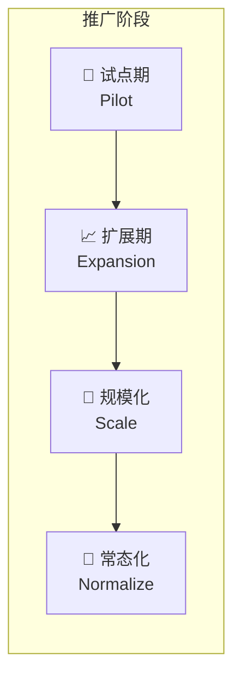
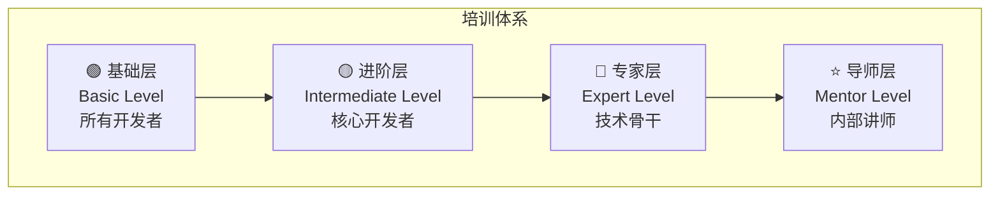
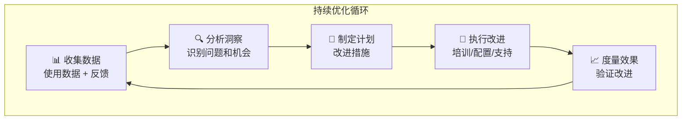
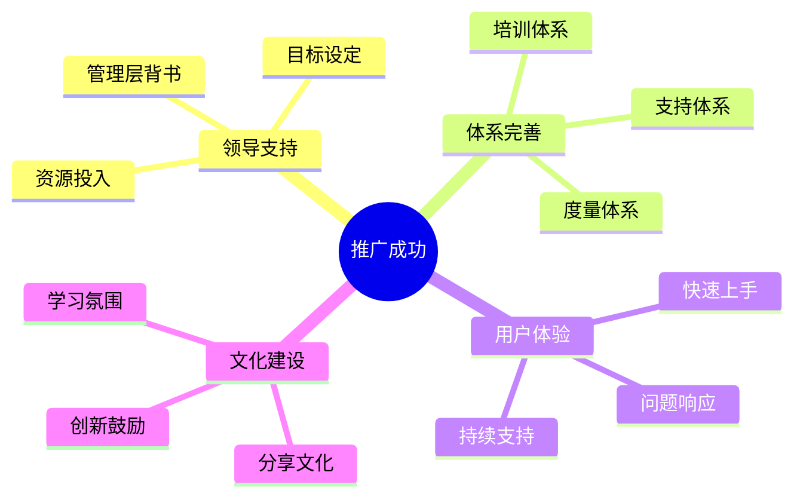

# 第25.6章：团队培训与推广指南

在企业内部成功推广 Claude Code 不仅需要技术能力，更需要系统的培训体系和变革管理策略。本章将提供完整的团队培训与推广指南，帮助技术负责人在组织内有效推动 AI 辅助编程的落地。

## 25.6.1 推广策略规划

### 推广成熟度模型



| 阶段 | 时长 | 目标 | 关键指标 |
|------|------|------|---------|
| 试点期 | 1-2月 | 验证价值，培养种子用户 | 3-5人深度使用 |
| 扩展期 | 2-3月 | 扩大覆盖，收集反馈 | 20-30%团队采用 |
| 规模化 | 3-6月 | 全面推广，建立规范 | 70%+团队采用 |
| 常态化 | 持续 | 融入日常，持续优化 | 成为标准工具链 |

### 推广路线图

```yaml
# promotion-roadmap.yaml
roadmap:
  phase1_pilot:
    duration: "1-2 months"
    goals:
      - 选择 3-5 名技术骨干作为种子用户
      - 在 2-3 个非关键项目中试用
      - 收集使用数据和反馈
    activities:
      - 种子用户深度培训
      - 建立内部交流群
      - 每周复盘会议
    success_criteria:
      - 种子用户能独立使用核心功能
      - 收集到至少 10 个使用案例
      - 识别主要障碍和改进点

  phase2_expansion:
    duration: "2-3 months"
    goals:
      - 扩展到 20-30% 的开发团队
      - 建立内部知识库
      - 形成初步最佳实践
    activities:
      - 分批次培训
      - 种子用户担任内部导师
      - 建立 FAQ 和问题反馈机制
    success_criteria:
      - 新用户 1 周内能独立使用
      - 内部知识库包含 30+ 文档
      - 用户满意度 > 70%

  phase3_scale:
    duration: "3-6 months"
    goals:
      - 覆盖 70%+ 开发团队
      - 集成到标准开发流程
      - 建立完整的支持体系
    activities:
      - 标准化培训课程
      - 集成到 onboarding 流程
      - 建立内部认证体系
    success_criteria:
      - 新员工入职即培训
      - 形成标准化使用规范
      - 建立内部专家团队

  phase4_normalize:
    duration: "ongoing"
    goals:
      - 成为团队标准工具
      - 持续优化和创新
      - 分享外部经验
    activities:
      - 定期更新培训内容
      - 跟踪新功能并推广
      - 参与社区贡献
    success_criteria:
      - 工具使用成为习惯
      - 持续产生效率提升
      - 形成组织竞争优势
```

## 25.6.2 培训体系设计

### 分层培训架构



### 基础培训课程（4小时）

```markdown
# Claude Code 基础培训大纲

## 模块一：认识 Claude Code（1小时）
### 1.1 什么是 Claude Code
- AI 辅助编程的发展历程
- Claude Code 的核心能力
- 与传统 IDE 插件的区别

### 1.2 快速上手
- 安装与配置
- 第一次对话
- 基本命令介绍

### 1.3 实操练习
- 安装 Claude Code
- 完成一个简单的代码生成任务

---

## 模块二：核心功能实战（1.5小时）
### 2.1 代码生成与修改
- 自然语言描述需求
- 代码补全与重构
- 多文件操作

### 2.2 代码理解与分析
- 代码解释
- Bug 分析
- 性能优化建议

### 2.3 实操练习
- 使用 Claude Code 完成一个功能开发
- 让 Claude Code 解释一段复杂代码

---

## 模块三：最佳实践（1小时）
### 3.1 高效使用技巧
- 提示词编写技巧
- 上下文管理
- 常见问题处理

### 3.2 安全与规范
- 敏感信息保护
- 代码审查要点
- 企业使用规范

### 3.3 实操练习
- 练习编写高质量提示词
- 模拟处理包含敏感信息的场景

---

## 模块四：答疑与总结（0.5小时）
- 常见问题解答
- 学习资源推荐
- 后续学习路径
```

### 进阶培训课程（8小时）

```markdown
# Claude Code 进阶培训大纲

## Day 1（4小时）

### 模块一：高级功能深入（2小时）
#### 1.1 Hooks 自动化
- Hooks 机制原理
- 常用 Hooks 配置
- 自定义 Hooks 开发

#### 1.2 Skills 能力扩展
- Skills 系统介绍
- 创建自定义 Skills
- Skills 最佳实践

#### 1.3 实操练习
- 配置代码提交前自动检查 Hook
- 创建一个团队专用 Skill

### 模块二：MCP 协议与集成（2小时）
#### 2.1 MCP 协议基础
- MCP 架构概述
- 内置 MCP 服务器
- 第三方 MCP 集成

#### 2.2 自定义 MCP 开发
- MCP 服务器开发
- 工具定义与实现
- 调试与测试

#### 2.3 实操练习
- 配置 GitHub MCP 服务器
- 开发一个简单的 MCP 工具

---

## Day 2（4小时）

### 模块三：企业级应用（2小时）
#### 3.1 团队协作
- CLAUDE.md 团队配置
- 共享 Skills 和配置
- 代码审查集成

#### 3.2 CI/CD 集成
- Headless 模式
- GitHub Actions 集成
- 自动化工作流

#### 3.3 实操练习
- 配置团队级 CLAUDE.md
- 创建自动化代码审查流程

### 模块四：实战项目（2小时）
#### 4.1 综合项目实战
- 从零开始一个完整功能
- 应用所学技能
- 团队协作模拟

#### 4.2 总结与认证
- 知识点回顾
- 技能评估
- 颁发进阶认证
```

### 专家培训课程（16小时）

```markdown
# Claude Code 专家培训大纲

## 第一天：深度技术（8小时）

### 上午：架构与原理（4小时）
- Claude Code 技术架构深度解析
- 上下文管理与 Token 优化
- 性能调优与成本控制
- 安全模型与权限管理

### 下午：高级集成（4小时）
- 复杂 MCP 服务器开发
- 企业系统集成（GitLab/JIRA/SSO）
- 自定义工作流引擎
- 监控与可观测性

---

## 第二天：企业实践（8小时）

### 上午：企业级部署（4小时）
- 代理网关设计与实现
- 多团队配置管理
- 合规与审计
- 灾备与高可用

### 下午：变革管理（4小时）
- 推广策略与方法论
- 培训体系设计
- 效果度量与优化
- 案例研究与讨论

---

## 认证考核
- 技术笔试（30%）
- 实操考核（40%）
- 方案设计（30%）
```

## 25.6.3 培训材料与资源

### 培训 PPT 模板

```markdown
# 培训 PPT 结构建议

## 封面页
- 培训主题
- 讲师信息
- 日期和时长

## 目录页
- 培训模块概览
- 学习目标

## 内容页原则
- 每页一个核心概念
- 图文结合，避免纯文字
- 包含实际代码/命令示例
- 设置互动环节

## 实操页
- 清晰的步骤说明
- 预期结果展示
- 常见错误提示

## 总结页
- 关键要点回顾
- 学习资源链接
- 下一步行动
```

### 实操练习设计

```yaml
# training-exercises.yaml
exercises:
  basic_level:
    - name: "Hello Claude Code"
      duration: "15 min"
      objective: "完成第一次 Claude Code 交互"
      steps:
        - 安装 Claude Code
        - 进入示例项目目录
        - 使用 claude 命令启动
        - 让 Claude 解释项目结构
      success_criteria:
        - Claude Code 正常启动
        - 能够进行基本对话

    - name: "代码生成实战"
      duration: "30 min"
      objective: "使用 Claude Code 生成一个完整功能"
      steps:
        - 描述需求：创建一个 TODO API
        - 观察 Claude 的规划过程
        - 审查生成的代码
        - 运行并测试
      success_criteria:
        - 功能正常运行
        - 理解生成过程

    - name: "代码重构练习"
      duration: "30 min"
      objective: "使用 Claude Code 重构遗留代码"
      steps:
        - 打开提供的遗留代码
        - 让 Claude 分析代码问题
        - 逐步进行重构
        - 验证重构结果
      success_criteria:
        - 代码质量提升
        - 功能保持不变

  intermediate_level:
    - name: "配置 Hooks 自动化"
      duration: "45 min"
      objective: "配置代码提交前自动检查"
      steps:
        - 创建 .claude/settings.json
        - 配置 PreCommit Hook
        - 编写检查脚本
        - 测试 Hook 效果
      success_criteria:
        - Hook 正常触发
        - 能拦截不规范提交

    - name: "创建团队 Skill"
      duration: "60 min"
      objective: "创建一个团队专用的代码审查 Skill"
      steps:
        - 设计 Skill 功能
        - 编写 Skill 定义文件
        - 测试 Skill 效果
        - 分享给团队
      success_criteria:
        - Skill 能正常调用
        - 符合团队规范

  expert_level:
    - name: "MCP 服务器开发"
      duration: "2 hours"
      objective: "开发一个连接内部系统的 MCP 服务器"
      steps:
        - 设计 MCP 工具接口
        - 实现服务器逻辑
        - 编写测试用例
        - 集成到 Claude Code
      success_criteria:
        - 服务器稳定运行
        - 工具功能完整

    - name: "企业级配置方案"
      duration: "3 hours"
      objective: "设计并实现完整的企业级配置"
      steps:
        - 分析企业需求
        - 设计配置架构
        - 实现核心配置
        - 编写文档
      success_criteria:
        - 配置完整可用
        - 文档清晰完善
```

### 内部知识库结构

```
knowledge-base/
├── getting-started/
│   ├── installation-guide.md
│   ├── first-steps.md
│   ├── common-commands.md
│   └── faq.md
├── best-practices/
│   ├── prompt-engineering.md
│   ├── code-review-with-claude.md
│   ├── security-guidelines.md
│   └── performance-tips.md
├── use-cases/
│   ├── frontend-development.md
│   ├── backend-development.md
│   ├── testing-automation.md
│   ├── documentation-generation.md
│   └── code-refactoring.md
├── troubleshooting/
│   ├── common-errors.md
│   ├── network-issues.md
│   ├── performance-issues.md
│   └── escalation-guide.md
├── team-config/
│   ├── claude-md-template.md
│   ├── hooks-examples.md
│   ├── skills-library.md
│   └── mcp-integrations.md
└── videos/
    ├── basic-training-recording.md
    ├── advanced-training-recording.md
    └── expert-talks.md
```

## 25.6.4 内部导师体系

### 导师选拔标准

```yaml
# mentor-criteria.yaml
mentor_requirements:
  technical_skills:
    - 完成专家级培训并通过认证
    - 至少 3 个月深度使用经验
    - 能独立解决复杂问题
    - 熟悉企业级配置和集成

  soft_skills:
    - 良好的沟通表达能力
    - 耐心和责任心
    - 乐于分享和帮助他人
    - 持续学习的热情

  commitment:
    - 每周至少 2 小时导师时间
    - 参与培训课程讲授
    - 维护知识库内容
    - 参与问题答疑

mentor_benefits:
  - 优先获取新功能试用权
  - 参与技术决策讨论
  - 职业发展加分项
  - 专属导师徽章/认证
```

### 导师职责与活动

```markdown
## 导师日常职责

### 1. 新人辅导
- 为新用户提供 1v1 入门指导
- 解答日常使用问题
- 跟踪学习进度

### 2. 知识分享
- 每月至少一次技术分享
- 贡献知识库内容
- 分享使用技巧和案例

### 3. 问题支持
- 响应内部群问题
- 协助排查复杂问题
- 收集反馈和改进建议

### 4. 培训支持
- 协助组织培训活动
- 担任培训助教
- 评估学员表现

---

## 导师活动安排

| 活动 | 频率 | 时长 | 内容 |
|------|------|------|------|
| 新人 Onboarding | 按需 | 1小时 | 1v1 入门指导 |
| Office Hour | 每周 | 1小时 | 开放答疑时间 |
| 技术分享 | 每月 | 1小时 | 专题分享 |
| 导师例会 | 每月 | 30分钟 | 经验交流、问题讨论 |
| 培训讲授 | 按需 | 4-8小时 | 正式培训课程 |
```

## 25.6.5 效果度量与优化

### 度量指标体系

```yaml
# metrics-framework.yaml
metrics:
  adoption_metrics:
    name: "采用度指标"
    indicators:
      - name: "活跃用户数"
        description: "每周至少使用一次的用户数"
        target: "70% 开发团队"
        
      - name: "使用频率"
        description: "平均每人每天使用次数"
        target: "> 5 次/天"
        
      - name: "功能覆盖度"
        description: "使用过高级功能的用户比例"
        target: "> 30%"

  efficiency_metrics:
    name: "效率指标"
    indicators:
      - name: "代码生成效率"
        description: "使用 Claude Code 后的代码产出变化"
        target: "+30% 代码行数/天"
        
      - name: "Bug 修复时间"
        description: "平均 Bug 修复时间变化"
        target: "-20%"
        
      - name: "代码审查时间"
        description: "代码审查平均耗时变化"
        target: "-25%"

  quality_metrics:
    name: "质量指标"
    indicators:
      - name: "代码质量评分"
        description: "静态代码分析评分变化"
        target: "+10%"
        
      - name: "Bug 率"
        description: "每千行代码 Bug 数变化"
        target: "-15%"
        
      - name: "测试覆盖率"
        description: "单元测试覆盖率变化"
        target: "+10%"

  satisfaction_metrics:
    name: "满意度指标"
    indicators:
      - name: "用户满意度"
        description: "NPS 评分"
        target: "> 50"
        
      - name: "推荐意愿"
        description: "愿意推荐给同事的比例"
        target: "> 80%"
        
      - name: "培训满意度"
        description: "培训课程评分"
        target: "> 4.5/5"
```

### 数据收集方法

```typescript
// metrics-collector.ts
interface UsageMetrics {
  userId: string;
  timestamp: Date;
  sessionDuration: number;
  commandsUsed: string[];
  featuresUsed: string[];
  tokensConsumed: number;
  tasksCompleted: number;
}

interface SurveyResponse {
  userId: string;
  surveyId: string;
  responses: Record<string, number | string>;
  timestamp: Date;
}

class MetricsCollector {
  // 使用数据收集（通过代理网关）
  async collectUsageMetrics(metrics: UsageMetrics): Promise<void> {
    await this.metricsStore.insert('usage', metrics);
  }

  // 定期满意度调查
  async sendSatisfactionSurvey(): Promise<void> {
    const activeUsers = await this.getActiveUsers();
    
    for (const user of activeUsers) {
      await this.surveyService.send({
        userId: user.id,
        surveyId: 'monthly-satisfaction',
        questions: [
          {
            id: 'nps',
            type: 'scale',
            text: '您有多大可能向同事推荐 Claude Code？',
            scale: { min: 0, max: 10 }
          },
          {
            id: 'efficiency',
            type: 'scale',
            text: 'Claude Code 对您的工作效率提升有多大帮助？',
            scale: { min: 1, max: 5 }
          },
          {
            id: 'issues',
            type: 'text',
            text: '您在使用中遇到的主要问题是什么？'
          },
          {
            id: 'suggestions',
            type: 'text',
            text: '您对改进有什么建议？'
          }
        ]
      });
    }
  }

  // 生成度量报告
  async generateReport(period: 'weekly' | 'monthly'): Promise<Report> {
    const usageData = await this.getUsageData(period);
    const surveyData = await this.getSurveyData(period);
    
    return {
      period,
      adoption: this.calculateAdoptionMetrics(usageData),
      efficiency: this.calculateEfficiencyMetrics(usageData),
      quality: await this.getQualityMetrics(period),
      satisfaction: this.calculateSatisfactionMetrics(surveyData),
      trends: this.calculateTrends(usageData),
      recommendations: this.generateRecommendations()
    };
  }
}
```

### 持续优化机制



## 25.6.6 变革管理与阻力应对

### 常见阻力与应对策略

```yaml
# resistance-handling.yaml
resistances:
  - type: "技术怀疑"
    symptoms:
      - "AI 生成的代码不可靠"
      - "我自己写更快"
      - "这只是炒作"
    strategies:
      - 展示具体案例和数据
      - 邀请参与试用体验
      - 分享同行成功经验
      - 强调是辅助而非替代

  - type: "安全担忧"
    symptoms:
      - "代码会泄露吗"
      - "公司数据安全吗"
      - "合规有问题吗"
    strategies:
      - 详细解释安全机制
      - 展示企业级安全配置
      - 提供合规性文档
      - 介绍敏感信息过滤机制

  - type: "学习成本"
    symptoms:
      - "没时间学新工具"
      - "学习曲线太陡"
      - "现有工具够用了"
    strategies:
      - 提供渐进式学习路径
      - 强调快速上手的核心功能
      - 安排专人辅导
      - 展示投入产出比

  - type: "职业焦虑"
    symptoms:
      - "会不会被 AI 取代"
      - "学这个有什么用"
      - "这是在贬低我的技能"
    strategies:
      - 强调 AI 是增强而非替代
      - 分享 AI 时代的技能升级方向
      - 展示掌握 AI 工具的竞争优势
      - 提供职业发展指导

  - type: "组织惯性"
    symptoms:
      - "我们一直这样做的"
      - "领导没说要用"
      - "其他团队也没用"
    strategies:
      - 获取管理层支持和背书
      - 从小范围试点开始
      - 建立成功案例
      - 创造同伴压力
```

### 变革沟通计划

```markdown
## 变革沟通框架

### 1. 愿景沟通
**核心信息**：Claude Code 是提升团队竞争力的战略工具

**沟通渠道**：
- 全员邮件（管理层签发）
- 部门会议宣讲
- 内部公告/Wiki

**关键要点**：
- 为什么要引入（行业趋势、竞争压力）
- 期望达成的目标
- 对团队的价值
- 时间表和里程碑

---

### 2. 进展沟通
**频率**：每月一次

**内容**：
- 当前进展和成果
- 成功案例分享
- 下阶段计划
- 问题和解决方案

**形式**：
- 月度简报
- 案例分享会
- 数据看板

---

### 3. 成功故事
**收集方式**：
- 主动征集
- 导师推荐
- 数据挖掘

**传播渠道**：
- 内部博客/公众号
- 技术分享会
- 团队周会

**故事模板**：
- 背景：遇到什么问题
- 方案：如何使用 Claude Code
- 结果：取得什么效果
- 感受：使用体验和建议
```

## 25.6.7 推广工具包

### 宣传材料模板

```markdown
## 内部宣传邮件模板

**主题**：🚀 提升 10 倍编程效率 - Claude Code 正式上线

亲爱的同事们，

我们很高兴地宣布，Claude Code 智能编程助手现已正式上线！

**什么是 Claude Code？**
Claude Code 是 Anthropic 推出的 AI 编程工具，能够理解完整代码库，
自主规划任务、执行命令、修改文件，大幅提升开发效率。

**为什么要使用？**
- ⚡ 代码生成效率提升 30%+
- 🐛 Bug 修复时间减少 20%+
- 📝 自动生成文档和测试
- 🔍 智能代码审查和优化

**如何开始？**
1. 访问内部知识库：[链接]
2. 报名参加培训：[链接]
3. 加入交流群：[群号]

**培训安排**
- 基础培训：每周三 14:00-18:00
- 进阶培训：每月第一周

有任何问题，欢迎联系技术支持团队。

让我们一起拥抱 AI 时代！

技术团队
```

### 快速参考卡片

```
┌─────────────────────────────────────────────────────────────┐
│                 Claude Code 快速参考卡片                      │
├─────────────────────────────────────────────────────────────┤
│  🚀 启动                                                     │
│  $ claude                    # 启动交互模式                   │
│  $ claude "你的问题"          # 单次查询                      │
│                                                             │
│  📝 常用命令                                                  │
│  /help                       # 查看帮助                      │
│  /clear                      # 清除上下文                    │
│  /compact                    # 压缩上下文                    │
│  /cost                       # 查看费用                      │
│                                                             │
│  💡 高效提示词技巧                                            │
│  ✓ 明确具体的需求描述                                         │
│  ✓ 提供必要的上下文                                          │
│  ✓ 分步骤处理复杂任务                                         │
│  ✓ 及时反馈和纠正                                            │
│                                                             │
│  ⚠️ 安全提醒                                                 │
│  ✗ 不要输入密码/密钥                                          │
│  ✗ 不要处理敏感客户数据                                       │
│  ✓ 遵守公司安全规范                                          │
│                                                             │
│  📚 更多资源                                                  │
│  内部知识库：[链接]                                           │
│  问题反馈：[链接]                                             │
│  交流群：[群号]                                               │
└─────────────────────────────────────────────────────────────┘
```

### 效果展示看板

```typescript
// dashboard-config.ts
const dashboardConfig = {
  title: "Claude Code 推广效果看板",
  
  sections: [
    {
      name: "采用概览",
      widgets: [
        {
          type: "metric",
          title: "活跃用户",
          query: "count(distinct user_id) where last_7_days",
          target: 100,
          format: "number"
        },
        {
          type: "metric",
          title: "采用率",
          query: "active_users / total_developers * 100",
          target: 70,
          format: "percentage"
        },
        {
          type: "trend",
          title: "用户增长趋势",
          query: "count(distinct user_id) group by week",
          period: "12 weeks"
        }
      ]
    },
    {
      name: "使用情况",
      widgets: [
        {
          type: "metric",
          title: "日均使用次数",
          query: "avg(session_count) per user per day",
          target: 5
        },
        {
          type: "pie",
          title: "功能使用分布",
          query: "count(*) group by feature_type"
        },
        {
          type: "bar",
          title: "团队使用排行",
          query: "count(*) group by team order by desc limit 10"
        }
      ]
    },
    {
      name: "效果指标",
      widgets: [
        {
          type: "metric",
          title: "效率提升",
          query: "avg(efficiency_score) - baseline",
          format: "percentage"
        },
        {
          type: "metric",
          title: "用户满意度",
          query: "avg(nps_score)",
          target: 50
        },
        {
          type: "trend",
          title: "质量指标趋势",
          query: "avg(quality_score) group by week"
        }
      ]
    }
  ]
};
```

## 25.6.8 最佳实践总结

### 推广成功要素



### 关键成功因素清单

```yaml
# success-factors.yaml
critical_success_factors:
  leadership:
    - name: "管理层支持"
      importance: "关键"
      actions:
        - 获取高层明确支持
        - 将 AI 工具纳入技术战略
        - 分配专项预算和资源

  champions:
    - name: "种子用户/内部冠军"
      importance: "关键"
      actions:
        - 选择有影响力的技术骨干
        - 提供深度培训和支持
        - 赋予传播和推广职责

  quick_wins:
    - name: "快速见效"
      importance: "重要"
      actions:
        - 选择容易出成果的场景
        - 及时宣传成功案例
        - 建立正向反馈循环

  support_system:
    - name: "支持体系"
      importance: "重要"
      actions:
        - 建立多层次培训
        - 提供及时的问题支持
        - 维护知识库和文档

  measurement:
    - name: "效果度量"
      importance: "重要"
      actions:
        - 建立清晰的度量指标
        - 定期收集和分析数据
        - 用数据驱动优化

  culture:
    - name: "文化建设"
      importance: "长期"
      actions:
        - 鼓励分享和学习
        - 容忍试错和探索
        - 奖励创新和贡献
```

### 常见陷阱与规避

| 陷阱 | 表现 | 规避方法 |
|------|------|---------|
| 一刀切推广 | 强制所有人同时使用 | 分阶段、分层次推广 |
| 培训不足 | 只发工具不教使用 | 建立完善培训体系 |
| 忽视反馈 | 推广后不跟进效果 | 建立反馈和优化机制 |
| 期望过高 | 期望立即见效 | 设定合理预期和里程碑 |
| 支持缺失 | 遇到问题无人解答 | 建立多层次支持体系 |
| 安全忽视 | 只关注效率不管安全 | 安全培训和规范先行 |

---

通过系统的培训体系、完善的支持机制、科学的度量方法和有效的变革管理，企业可以成功推动 Claude Code 在团队中的落地和普及，真正发挥 AI 辅助编程的价值。
