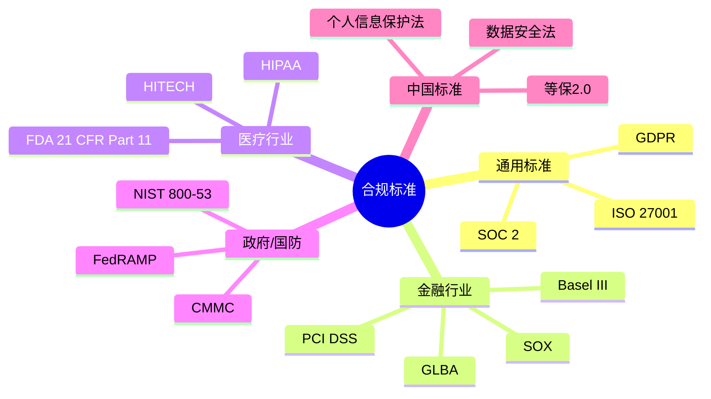
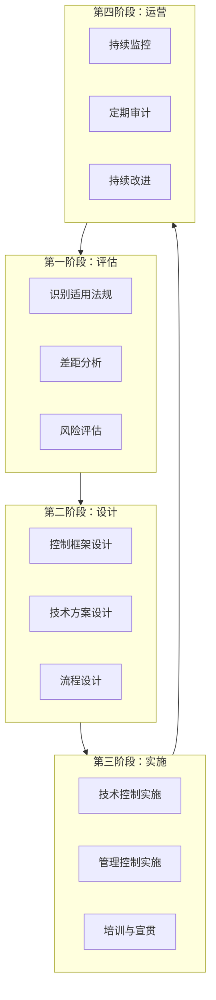

# 第25.7章：合规审计详细指南

在金融、医疗、政府等受监管行业使用 Claude Code，必须满足严格的合规要求。本章将详细介绍针对特定行业的合规审计指南，帮助企业在享受 AI 辅助编程效率的同时，确保满足监管要求。

## 25.7.1 合规框架概述

### 主要合规标准



### 合规责任矩阵

| 合规领域 | Anthropic 责任 | 企业责任 | 共同责任 |
|---------|---------------|---------|---------|
| API 基础设施安全 | ✓ | | |
| 数据传输加密 | ✓ | | |
| 模型安全性 | ✓ | | |
| API Key 管理 | | ✓ | |
| 敏感数据过滤 | | ✓ | |
| 访问控制 | | ✓ | |
| 审计日志 | | ✓ | |
| 合规性评估 | | ✓ | |
| 数据处理协议 | | | ✓ |
| 安全事件响应 | | | ✓ |

## 25.7.2 金融行业合规指南

### PCI DSS 合规

PCI DSS（支付卡行业数据安全标准）适用于处理信用卡数据的组织。

```yaml
# pci-dss-compliance.yaml
pci_dss_requirements:
  requirement_3:
    title: "保护存储的持卡人数据"
    claude_code_controls:
      - control: "禁止在提示词中包含完整卡号"
        implementation: |
          # 敏感数据过滤 Hook
          hooks:
            PreToolUse:
              - matcher: ".*"
                hooks:
                  - command: "scripts/pci-filter.sh"
                    timeout: 5000
        
      - control: "自动检测和屏蔽 PAN 数据"
        implementation: |
          # pci-filter.sh
          #!/bin/bash
          # 检测信用卡号模式
          if echo "$CLAUDE_INPUT" | grep -qE '\b[0-9]{13,19}\b'; then
            echo "ERROR: 检测到可能的信用卡号，已阻止"
            exit 1
          fi

  requirement_7:
    title: "按业务需要限制对持卡人数据的访问"
    claude_code_controls:
      - control: "基于角色的访问控制"
        implementation: |
          # 用户角色配置
          access_control:
            roles:
              developer:
                allowed_projects:
                  - "non-pci-*"
                denied_patterns:
                  - "**/payment/**"
                  - "**/card/**"
              pci_developer:
                allowed_projects:
                  - "*"
                requires_approval: true
                audit_level: "detailed"

  requirement_10:
    title: "跟踪和监控对网络资源和持卡人数据的所有访问"
    claude_code_controls:
      - control: "完整审计日志"
        implementation: |
          # 审计日志配置
          audit:
            enabled: true
            log_level: "detailed"
            retention_days: 365
            fields:
              - timestamp
              - user_id
              - session_id
              - action
              - input_hash  # 不记录原文，只记录哈希
              - output_hash
              - files_accessed
              - commands_executed
```

### SOX 合规

SOX（萨班斯-奥克斯利法案）适用于上市公司的财务报告相关系统。

```yaml
# sox-compliance.yaml
sox_requirements:
  section_302:
    title: "公司对财务报告的责任"
    claude_code_controls:
      - control: "代码变更可追溯性"
        implementation: |
          # 强制代码变更关联工单
          hooks:
            PreCommit:
              - command: |
                  #!/bin/bash
                  # 检查提交信息是否包含工单号
                  if ! echo "$COMMIT_MSG" | grep -qE '\[(JIRA|TICKET)-[0-9]+\]'; then
                    echo "ERROR: 提交必须关联工单号"
                    exit 1
                  fi

      - control: "双人审核要求"
        implementation: |
          # 财务系统代码变更需要双人审核
          code_review:
            financial_systems:
              paths:
                - "src/finance/**"
                - "src/accounting/**"
                - "src/reporting/**"
              requirements:
                min_reviewers: 2
                required_roles:
                  - "senior_developer"
                  - "finance_lead"

  section_404:
    title: "管理层对内部控制的评估"
    claude_code_controls:
      - control: "自动化控制测试"
        implementation: |
          # 定期控制测试脚本
          control_tests:
            schedule: "weekly"
            tests:
              - name: "访问控制验证"
                script: "tests/sox/access-control-test.sh"
              - name: "变更管理验证"
                script: "tests/sox/change-management-test.sh"
              - name: "审计日志完整性"
                script: "tests/sox/audit-log-integrity.sh"
```

### 金融行业 CLAUDE.md 模板

```markdown
# CLAUDE.md - 金融行业配置模板

## 项目概述
本项目为金融交易系统，需遵守 PCI DSS、SOX 等合规要求。

## 安全要求

### 禁止操作
- ❌ 禁止在对话中包含任何信用卡号、CVV、PIN
- ❌ 禁止访问或修改生产数据库配置
- ❌ 禁止绕过代码审查流程
- ❌ 禁止在代码中硬编码任何凭证

### 敏感数据处理
- 所有包含 PII 的代码必须使用数据脱敏
- 日志中禁止记录敏感字段
- 测试数据必须使用模拟数据

### 代码变更流程
1. 所有变更必须关联 JIRA 工单
2. 财务模块变更需要双人审核
3. 生产部署需要变更管理委员会批准

## 合规检查清单
在提交代码前，确保：
- [ ] 无硬编码凭证
- [ ] 敏感数据已脱敏
- [ ] 日志不包含 PII
- [ ] 单元测试覆盖率 > 80%
- [ ] 通过安全扫描

## 审计要求
- 所有 Claude Code 会话将被记录
- 日志保留期限：7 年
- 定期审计频率：季度
```

## 25.7.3 医疗行业合规指南

### HIPAA 合规

HIPAA（健康保险可携性和责任法案）保护患者健康信息（PHI）。

```yaml
# hipaa-compliance.yaml
hipaa_requirements:
  privacy_rule:
    title: "隐私规则"
    phi_categories:
      - "患者姓名"
      - "地址（比州更具体）"
      - "日期（出生日期、入院日期等）"
      - "电话号码"
      - "电子邮件"
      - "社会安全号"
      - "医疗记录号"
      - "健康计划受益人号"
      - "账户号"
      - "证书/执照号"
      - "车辆标识符"
      - "设备标识符"
      - "URL"
      - "IP 地址"
      - "生物识别标识符"
      - "全脸照片"
      - "其他唯一识别号"
    
    claude_code_controls:
      - control: "PHI 自动检测和过滤"
        implementation: |
          # phi-filter.py
          import re
          import sys
          
          PHI_PATTERNS = {
              'ssn': r'\b\d{3}-\d{2}-\d{4}\b',
              'phone': r'\b\d{3}[-.]?\d{3}[-.]?\d{4}\b',
              'email': r'\b[A-Za-z0-9._%+-]+@[A-Za-z0-9.-]+\.[A-Z|a-z]{2,}\b',
              'mrn': r'\bMRN[:\s]?\d{6,10}\b',
              'dob': r'\b(DOB|Date of Birth)[:\s]?\d{1,2}/\d{1,2}/\d{2,4}\b',
          }
          
          def check_phi(text):
              findings = []
              for phi_type, pattern in PHI_PATTERNS.items():
                  if re.search(pattern, text, re.IGNORECASE):
                      findings.append(phi_type)
              return findings
          
          if __name__ == "__main__":
              input_text = sys.stdin.read()
              findings = check_phi(input_text)
              if findings:
                  print(f"ERROR: 检测到 PHI 数据类型: {findings}")
                  sys.exit(1)

  security_rule:
    title: "安全规则"
    technical_safeguards:
      - safeguard: "访问控制"
        implementation: |
          # 基于角色的 PHI 访问控制
          access_control:
            phi_access:
              roles:
                - "physician"
                - "nurse"
                - "medical_records"
              requires:
                - "hipaa_training_completed"
                - "background_check_passed"
              audit: true
      
      - safeguard: "审计控制"
        implementation: |
          # HIPAA 审计日志
          audit:
            phi_access:
              log_fields:
                - timestamp
                - user_id
                - patient_id_hash
                - action
                - justification
              retention: "6 years"
              encryption: "AES-256"
      
      - safeguard: "传输安全"
        implementation: |
          # 强制 TLS 1.3
          network:
            tls_version: "1.3"
            cipher_suites:
              - "TLS_AES_256_GCM_SHA384"
              - "TLS_CHACHA20_POLY1305_SHA256"

  breach_notification:
    title: "违规通知规则"
    claude_code_controls:
      - control: "自动违规检测"
        implementation: |
          # 违规检测和告警
          breach_detection:
            monitors:
              - name: "PHI 外泄检测"
                trigger: "phi_detected_in_output"
                actions:
                  - "block_request"
                  - "alert_security_team"
                  - "log_incident"
              
              - name: "异常访问模式"
                trigger: "unusual_access_pattern"
                actions:
                  - "require_mfa"
                  - "alert_supervisor"
```

### FDA 21 CFR Part 11 合规

适用于电子记录和电子签名的医疗设备和制药行业。

```yaml
# fda-21cfr11-compliance.yaml
fda_requirements:
  electronic_records:
    title: "电子记录要求"
    controls:
      - control: "记录完整性"
        implementation: |
          # 代码变更记录完整性
          version_control:
            requirements:
              - "所有变更必须有完整的变更历史"
              - "禁止修改历史提交"
              - "每次变更必须包含原因说明"
            hooks:
              PreCommit:
                - command: |
                    # 验证提交完整性
                    if [ -z "$CHANGE_REASON" ]; then
                      echo "ERROR: 必须提供变更原因"
                      exit 1
                    fi
      
      - control: "记录保护"
        implementation: |
          # 防止未授权修改
          protection:
            signed_commits: required
            branch_protection:
              main:
                required_reviews: 2
                required_signatures: true
                dismiss_stale_reviews: true

  electronic_signatures:
    title: "电子签名要求"
    controls:
      - control: "签名绑定"
        implementation: |
          # 代码签名配置
          code_signing:
            required_for:
              - "release/*"
              - "main"
            signature_includes:
              - signer_name
              - signer_id
              - timestamp
              - reason
            verification: "mandatory"
      
      - control: "签名验证"
        implementation: |
          # 签名验证 Hook
          hooks:
            PreDeploy:
              - command: |
                  #!/bin/bash
                  # 验证所有提交签名
                  for commit in $(git log --format=%H origin/main..HEAD); do
                    if ! git verify-commit $commit 2>/dev/null; then
                      echo "ERROR: 提交 $commit 签名验证失败"
                      exit 1
                    fi
                  done

  validation:
    title: "系统验证要求"
    controls:
      - control: "验证文档"
        implementation: |
          # Claude Code 使用验证
          validation_protocol:
            iq: # 安装确认
              - "验证 Claude Code 正确安装"
              - "验证配置符合要求"
              - "验证网络连接安全"
            oq: # 操作确认
              - "验证权限控制有效"
              - "验证审计日志完整"
              - "验证敏感数据过滤"
            pq: # 性能确认
              - "验证在实际工作流中正常运行"
              - "验证与现有系统集成"
              - "验证用户培训完成"
```

### 医疗行业 CLAUDE.md 模板

```markdown
# CLAUDE.md - 医疗行业配置模板

## 项目概述
本项目为医疗信息系统，需遵守 HIPAA、FDA 21 CFR Part 11 等合规要求。

## PHI 保护要求

### 绝对禁止
- ❌ 禁止在对话中包含任何患者可识别信息
- ❌ 禁止访问生产环境患者数据
- ❌ 禁止将 PHI 数据用于测试
- ❌ 禁止在日志中记录 PHI

### PHI 数据类型（18 类标识符）
以下数据类型在任何情况下都不得出现在 Claude Code 交互中：
1. 姓名
2. 地理信息（小于州级别）
3. 日期（出生、入院、出院等）
4. 电话号码
5. 传真号码
6. 电子邮件地址
7. 社会安全号
8. 医疗记录号
9. 健康计划受益人号
10. 账户号
11. 证书/执照号
12. 车辆标识符和序列号
13. 设备标识符和序列号
14. URL
15. IP 地址
16. 生物识别标识符
17. 全脸照片
18. 其他唯一识别号

### 数据脱敏要求
如需讨论数据结构或逻辑，使用以下脱敏方法：
- 姓名 → "Patient_001"
- 日期 → "YYYY-MM-DD"
- 电话 → "XXX-XXX-XXXX"
- SSN → "XXX-XX-XXXX"

## 变更控制
- 所有代码变更需要签名提交
- 涉及 PHI 处理的变更需要额外审批
- 发布前需要完成验证协议

## 审计要求
- 所有会话记录保留 6 年
- 季度合规审计
- 年度 HIPAA 评估
```

## 25.7.4 政府与国防行业合规指南

### FedRAMP 合规

FedRAMP（联邦风险和授权管理计划）适用于为美国联邦政府提供云服务的组织。

```yaml
# fedramp-compliance.yaml
fedramp_requirements:
  access_control:
    family: "AC"
    controls:
      - id: "AC-2"
        title: "账户管理"
        implementation: |
          # 账户生命周期管理
          account_management:
            provisioning:
              requires_approval: true
              approvers:
                - "security_officer"
                - "project_manager"
            review:
              frequency: "quarterly"
              scope: "all_accounts"
            deprovisioning:
              trigger: "role_change_or_termination"
              timeline: "24_hours"
      
      - id: "AC-6"
        title: "最小权限"
        implementation: |
          # 最小权限配置
          least_privilege:
            default_permissions: "read_only"
            elevated_access:
              requires: "justification"
              duration: "time_limited"
              audit: true

  audit_accountability:
    family: "AU"
    controls:
      - id: "AU-2"
        title: "审计事件"
        implementation: |
          # 审计事件配置
          audit_events:
            mandatory:
              - "login_success"
              - "login_failure"
              - "privilege_escalation"
              - "data_access"
              - "configuration_change"
              - "security_event"
            claude_code_specific:
              - "session_start"
              - "session_end"
              - "tool_execution"
              - "file_access"
              - "command_execution"
      
      - id: "AU-9"
        title: "审计信息保护"
        implementation: |
          # 审计日志保护
          audit_protection:
            encryption: "AES-256"
            integrity: "SHA-256"
            access_control: "security_team_only"
            backup:
              frequency: "daily"
              retention: "7_years"
              offsite: true

  configuration_management:
    family: "CM"
    controls:
      - id: "CM-2"
        title: "基线配置"
        implementation: |
          # Claude Code 基线配置
          baseline_configuration:
            version: "1.0"
            approved_date: "2024-01-01"
            components:
              claude_code:
                version: "latest_stable"
                settings:
                  permissions: "restricted"
                  audit: "enabled"
                  hooks: "security_hooks_enabled"
              mcp_servers:
                allowed:
                  - "internal_approved_only"
                denied:
                  - "external_*"
```

### 等保 2.0 合规（中国）

网络安全等级保护 2.0 适用于中国境内的信息系统。

```yaml
# mlps-compliance.yaml
mlps_requirements:
  level_3:  # 三级等保
    security_computing_environment:
      - control: "身份鉴别"
        requirements:
          - "双因素认证"
          - "登录失败处理"
          - "会话超时"
        implementation: |
          # 身份鉴别配置
          authentication:
            mfa: required
            login_attempts:
              max: 5
              lockout_duration: "30_minutes"
            session:
              timeout: "30_minutes"
              idle_timeout: "15_minutes"
      
      - control: "访问控制"
        requirements:
          - "基于角色的访问控制"
          - "最小权限原则"
          - "敏感标记"
        implementation: |
          # 访问控制配置
          access_control:
            model: "RBAC"
            sensitivity_labels:
              - "公开"
              - "内部"
              - "秘密"
              - "机密"
            claude_code_access:
              default_label: "内部"
              restricted_labels:
                - "秘密"
                - "机密"
      
      - control: "安全审计"
        requirements:
          - "审计记录生成"
          - "审计记录保护"
          - "审计记录分析"
        implementation: |
          # 安全审计配置
          audit:
            generation:
              events:
                - "用户登录登出"
                - "重要操作"
                - "安全事件"
            protection:
              encryption: true
              tamper_proof: true
              backup: true
            analysis:
              real_time_alert: true
              periodic_review: "weekly"

    security_management_center:
      - control: "集中管控"
        requirements:
          - "统一身份管理"
          - "统一安全策略"
          - "统一审计管理"
        implementation: |
          # 集中管控配置
          centralized_management:
            identity:
              provider: "enterprise_sso"
              sync: "real_time"
            policy:
              distribution: "centralized"
              enforcement: "mandatory"
            audit:
              collection: "centralized"
              storage: "secure_siem"
```

### 政府行业 CLAUDE.md 模板

```markdown
# CLAUDE.md - 政府行业配置模板

## 项目概述
本项目为政府信息系统，需遵守 FedRAMP/等保 2.0 等合规要求。

## 安全分类
- 系统安全级别：[高/中/低]
- 数据分类：[公开/内部/秘密/机密]

## 访问控制要求

### 身份认证
- 必须使用政府 SSO 登录
- 启用双因素认证
- 会话超时：30 分钟

### 权限管理
- 遵循最小权限原则
- 敏感操作需要审批
- 定期权限审查

## 数据处理要求

### 禁止处理的数据
- ❌ 机密级及以上数据
- ❌ 涉及国家安全的信息
- ❌ 公民个人敏感信息

### 数据脱敏
- 所有示例数据必须脱敏
- 禁止使用真实数据测试

## 审计要求
- 所有操作记录审计日志
- 日志保留期限：[根据等级确定]
- 定期安全审计

## 变更管理
- 所有变更需要审批
- 遵循变更管理流程
- 保留完整变更记录

## 应急响应
- 发现安全事件立即上报
- 联系安全团队：[联系方式]
```

## 25.7.5 审计实施指南

### 审计准备清单

```yaml
# audit-preparation.yaml
audit_preparation:
  documentation:
    - category: "策略文档"
      items:
        - "Claude Code 使用策略"
        - "数据分类和处理策略"
        - "访问控制策略"
        - "安全事件响应计划"
    
    - category: "技术文档"
      items:
        - "系统架构图"
        - "数据流图"
        - "网络拓扑图"
        - "集成配置文档"
    
    - category: "操作文档"
      items:
        - "用户手册"
        - "管理员指南"
        - "培训记录"
        - "变更日志"

  evidence_collection:
    - category: "访问控制证据"
      items:
        - "用户账户清单"
        - "权限分配记录"
        - "访问审批记录"
        - "账户审查记录"
    
    - category: "审计日志证据"
      items:
        - "系统访问日志"
        - "操作审计日志"
        - "安全事件日志"
        - "日志完整性验证"
    
    - category: "配置证据"
      items:
        - "当前配置快照"
        - "基线配置对比"
        - "变更管理记录"
        - "安全扫描报告"

  interview_preparation:
    - role: "系统管理员"
      topics:
        - "日常运维流程"
        - "账户管理流程"
        - "事件响应流程"
    
    - role: "开发人员"
      topics:
        - "Claude Code 使用方式"
        - "代码审查流程"
        - "安全编码实践"
    
    - role: "安全人员"
      topics:
        - "安全监控流程"
        - "漏洞管理流程"
        - "合规检查流程"
```

### 审计日志要求

```typescript
// audit-log-schema.ts
interface ClaudeCodeAuditLog {
  // 基本信息
  logId: string;
  timestamp: Date;
  timezone: string;
  
  // 用户信息
  userId: string;
  userName: string;
  userRole: string;
  userDepartment: string;
  
  // 会话信息
  sessionId: string;
  sessionStart: Date;
  sessionEnd?: Date;
  clientIp: string;
  clientDevice: string;
  
  // 操作信息
  action: AuditAction;
  actionCategory: 'authentication' | 'authorization' | 'data_access' | 
                   'configuration' | 'execution' | 'security';
  actionResult: 'success' | 'failure' | 'blocked';
  
  // 详细信息
  details: {
    // 输入/输出哈希（不存储原文）
    inputHash?: string;
    outputHash?: string;
    
    // 访问的资源
    filesAccessed?: string[];
    commandsExecuted?: string[];
    toolsUsed?: string[];
    
    // 敏感操作
    sensitiveDataAccessed?: boolean;
    privilegedAction?: boolean;
    
    // 错误信息
    errorCode?: string;
    errorMessage?: string;
  };
  
  // 合规标记
  compliance: {
    dataClassification: string;
    requiresReview: boolean;
    retentionPeriod: string;
  };
}

type AuditAction = 
  | 'session_start'
  | 'session_end'
  | 'prompt_submitted'
  | 'response_generated'
  | 'file_read'
  | 'file_write'
  | 'command_execute'
  | 'tool_invoke'
  | 'config_change'
  | 'permission_change'
  | 'security_alert';
```

### 审计报告模板

```markdown
# Claude Code 合规审计报告

## 报告信息
- **审计周期**：[开始日期] 至 [结束日期]
- **审计范围**：[系统/团队/项目]
- **审计标准**：[PCI DSS / HIPAA / FedRAMP / 等保2.0]
- **审计人员**：[姓名/团队]
- **报告日期**：[日期]

---

## 执行摘要

### 总体评估
[合规/部分合规/不合规]

### 关键发现
1. [发现1简述]
2. [发现2简述]
3. [发现3简述]

### 风险评级
- 高风险发现：[数量]
- 中风险发现：[数量]
- 低风险发现：[数量]

---

## 详细发现

### 发现 1：[标题]
- **控制点**：[相关控制点编号和名称]
- **风险等级**：[高/中/低]
- **发现描述**：[详细描述]
- **证据**：[支持证据]
- **影响**：[潜在影响]
- **建议**：[改进建议]
- **管理层响应**：[管理层回应]
- **计划完成日期**：[日期]

### 发现 2：[标题]
...

---

## 控制点测试结果

| 控制点 | 描述 | 测试方法 | 结果 | 备注 |
|--------|------|----------|------|------|
| AC-1 | 访问控制策略 | 文档审查 | 通过 | |
| AC-2 | 账户管理 | 配置检查 | 部分通过 | 见发现1 |
| AU-2 | 审计事件 | 日志审查 | 通过 | |
| ... | ... | ... | ... | ... |

---

## 改进计划跟踪

| 发现编号 | 风险等级 | 责任人 | 计划完成日期 | 状态 |
|----------|----------|--------|--------------|------|
| F-001 | 高 | [姓名] | [日期] | 进行中 |
| F-002 | 中 | [姓名] | [日期] | 待开始 |
| ... | ... | ... | ... | ... |

---

## 附录

### A. 审计范围详情
### B. 测试程序
### C. 访谈记录
### D. 证据清单
```

## 25.7.6 持续合规监控

### 自动化合规检查

```yaml
# continuous-compliance.yaml
continuous_compliance:
  automated_checks:
    daily:
      - name: "访问控制验证"
        script: "scripts/check-access-control.sh"
        alert_on_failure: true
      
      - name: "审计日志完整性"
        script: "scripts/check-audit-integrity.sh"
        alert_on_failure: true
      
      - name: "敏感数据扫描"
        script: "scripts/scan-sensitive-data.sh"
        alert_on_failure: true

    weekly:
      - name: "配置基线对比"
        script: "scripts/compare-baseline.sh"
        report_to: "security_team"
      
      - name: "权限审查"
        script: "scripts/review-permissions.sh"
        report_to: "compliance_team"
      
      - name: "漏洞扫描"
        script: "scripts/vulnerability-scan.sh"
        report_to: "security_team"

    monthly:
      - name: "完整合规评估"
        script: "scripts/full-compliance-assessment.sh"
        report_to: "management"
      
      - name: "培训完成度检查"
        script: "scripts/check-training-completion.sh"
        report_to: "hr_team"

  alerting:
    channels:
      - type: "email"
        recipients: ["security@company.com"]
        severity: ["high", "critical"]
      
      - type: "slack"
        channel: "#security-alerts"
        severity: ["medium", "high", "critical"]
      
      - type: "pagerduty"
        service: "compliance-alerts"
        severity: ["critical"]

  dashboards:
    - name: "合规状态总览"
      widgets:
        - "控制点通过率"
        - "开放发现数量"
        - "风险趋势"
        - "审计日志统计"
    
    - name: "访问控制监控"
      widgets:
        - "活跃用户数"
        - "权限变更"
        - "异常访问"
        - "失败登录"
```

### 合规仪表板

```typescript
// compliance-dashboard.ts
const complianceDashboard = {
  title: "Claude Code 合规监控仪表板",
  
  sections: [
    {
      name: "合规状态概览",
      widgets: [
        {
          type: "gauge",
          title: "整体合规评分",
          query: "compliance_score",
          thresholds: {
            red: 70,
            yellow: 85,
            green: 95
          }
        },
        {
          type: "metric",
          title: "控制点通过率",
          query: "passed_controls / total_controls * 100",
          format: "percentage"
        },
        {
          type: "metric",
          title: "开放发现",
          query: "count(findings) where status = 'open'",
          breakdown: "by severity"
        }
      ]
    },
    {
      name: "访问控制",
      widgets: [
        {
          type: "trend",
          title: "登录活动",
          query: "count(*) group by hour where event_type = 'login'"
        },
        {
          type: "table",
          title: "失败登录",
          query: "select * where login_result = 'failure' order by timestamp desc limit 10"
        },
        {
          type: "pie",
          title: "用户角色分布",
          query: "count(*) group by role"
        }
      ]
    },
    {
      name: "审计日志",
      widgets: [
        {
          type: "metric",
          title: "今日日志量",
          query: "count(*) where date = today"
        },
        {
          type: "trend",
          title: "日志趋势",
          query: "count(*) group by day"
        },
        {
          type: "alert",
          title: "异常事件",
          query: "select * where severity >= 'high' order by timestamp desc limit 5"
        }
      ]
    },
    {
      name: "数据保护",
      widgets: [
        {
          type: "metric",
          title: "敏感数据检测",
          query: "count(*) where sensitive_data_detected = true"
        },
        {
          type: "table",
          title: "数据访问记录",
          query: "select * where data_classification in ('confidential', 'restricted') limit 10"
        }
      ]
    }
  ]
};
```

## 25.7.7 最佳实践总结

### 合规实施路线图



### 行业合规要点速查

| 行业 | 主要法规 | 核心要求 | Claude Code 重点控制 |
|------|---------|---------|---------------------|
| 金融 | PCI DSS, SOX | 卡数据保护、内控 | 敏感数据过滤、审计追溯 |
| 医疗 | HIPAA, FDA | PHI 保护、验证 | PHI 检测、签名验证 |
| 政府 | FedRAMP, 等保 | 访问控制、审计 | 集中管控、完整审计 |
| 通用 | GDPR, ISO27001 | 隐私保护、安全管理 | 数据最小化、安全配置 |

### 关键成功因素

```yaml
success_factors:
  governance:
    - "建立清晰的合规责任矩阵"
    - "获得管理层支持和资源"
    - "定期合规状态汇报"

  technical:
    - "实施自动化合规检查"
    - "建立完整的审计日志"
    - "配置敏感数据保护"

  operational:
    - "制定详细的操作流程"
    - "定期培训和意识提升"
    - "建立事件响应机制"

  continuous:
    - "持续监控合规状态"
    - "定期内部审计"
    - "及时响应法规变化"
```

---

通过系统的合规框架、详细的行业指南、完善的审计机制和持续的监控体系，企业可以在使用 Claude Code 提升开发效率的同时，确保满足各类监管要求，实现合规与效率的平衡。
