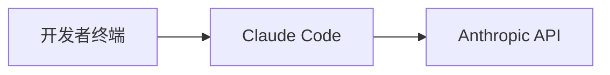
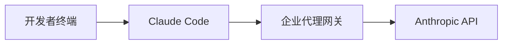

# 第25章：企业级部署方案

随着 Claude Code 在开发团队中的广泛应用，企业级部署成为一个重要议题。本章将探讨如何在企业环境中安全、高效地部署和管理 Claude Code，包括权限管理、合规性考量、多团队协作等方面。

## 25.1 企业部署架构

### 25.1.1 部署模式选择

企业部署 Claude Code 通常有以下几种模式：

**模式一：直接 API 访问**

- 优点：简单直接，无需额外基础设施
- 缺点：难以统一管理，API Key 分散

**模式二：代理网关模式**

- 优点：统一管理、监控、计费
- 缺点：需要维护代理服务

**模式三：私有化部署（未来）**

- 优点：数据不出企业网络
- 缺点：成本高，需要专业运维

### 25.1.2 企业代理网关设计

```bash
claude "请设计一个企业级 Claude API 代理网关，功能包括：
1. API Key 统一管理
2. 请求限流
3. 使用量统计
4. 敏感信息过滤
5. 审计日志"
```

代理网关架构：

```
┌─────────────────────────────────────────────────────────────┐
│                    企业代理网关                              │
├─────────────────────────────────────────────────────────────┤
│  ┌─────────────┐  ┌─────────────┐  ┌─────────────┐         │
│  │   认证层    │  │   限流层    │  │   过滤层    │         │
│  │ Auth Layer  │  │ Rate Limit  │  │  Filter     │         │
│  └──────┬──────┘  └──────┬──────┘  └──────┬──────┘         │
│         │                │                │                 │
│         ▼                ▼                ▼                 │
│  ┌─────────────────────────────────────────────────┐       │
│  │              请求处理管道                        │       │
│  │         Request Processing Pipeline              │       │
│  └─────────────────────┬───────────────────────────┘       │
│                        │                                    │
│  ┌─────────────┐  ┌────┴────┐  ┌─────────────┐             │
│  │  审计日志   │  │ 路由器  │  │  使用统计   │             │
│  │ Audit Log   │  │ Router  │  │  Metrics    │             │
│  └─────────────┘  └────┬────┘  └─────────────┘             │
└────────────────────────┼────────────────────────────────────┘
                         │
                         ▼
                  Anthropic API
```

代理网关实现示例：

```typescript
// gateway/src/server.ts
import express from 'express';
import rateLimit from 'express-rate-limit';
import { createProxyMiddleware } from 'http-proxy-middleware';

const app = express();

// 认证中间件
const authMiddleware = async (req, res, next) => {
    const apiKey = req.headers['x-enterprise-key'];
    const user = await validateEnterpriseKey(apiKey);
    
    if (!user) {
        return res.status(401).json({ error: 'Invalid API key' });
    }
    
    req.user = user;
    next();
};

// 限流配置
const limiter = rateLimit({
    windowMs: 60 * 1000, // 1 分钟
    max: async (req) => {
        // 根据用户等级设置不同限制
        const tier = req.user?.tier || 'basic';
        const limits = { basic: 10, pro: 50, enterprise: 200 };
        return limits[tier];
    },
    message: { error: 'Rate limit exceeded' },
});

// 敏感信息过滤
const sensitiveFilter = (req, res, next) => {
    if (req.body?.messages) {
        req.body.messages = req.body.messages.map(msg => ({
            ...msg,
            content: filterSensitiveData(msg.content),
        }));
    }
    next();
};

// 审计日志
const auditLogger = (req, res, next) => {
    const startTime = Date.now();
    
    res.on('finish', () => {
        logAuditEvent({
            userId: req.user?.id,
            endpoint: req.path,
            method: req.method,
            statusCode: res.statusCode,
            duration: Date.now() - startTime,
            timestamp: new Date().toISOString(),
        });
    });
    
    next();
};

// 代理到 Anthropic API
const anthropicProxy = createProxyMiddleware({
    target: 'https://api.anthropic.com',
    changeOrigin: true,
    pathRewrite: { '^/api': '' },
    onProxyReq: (proxyReq, req) => {
        // 替换为企业统一 API Key
        proxyReq.setHeader('x-api-key', process.env.ANTHROPIC_API_KEY);
        proxyReq.setHeader('anthropic-version', '2024-01-01');
    },
});

app.use('/api', authMiddleware, limiter, sensitiveFilter, auditLogger, anthropicProxy);

app.listen(3000);
```

## 25.2 权限与访问控制

### 25.2.1 基于角色的访问控制（RBAC）

```bash
claude "请设计 Claude Code 企业部署的 RBAC 权限模型，包含：
1. 角色定义
2. 权限矩阵
3. 资源访问控制"
```

权限模型设计：

```yaml
# 角色定义
roles:
  admin:
    description: 系统管理员
    permissions:
      - manage_users
      - manage_teams
      - view_all_usage
      - configure_policies
      - manage_api_keys
  
  team_lead:
    description: 团队负责人
    permissions:
      - manage_team_members
      - view_team_usage
      - configure_team_policies
      - create_shared_skills
  
  developer:
    description: 开发人员
    permissions:
      - use_claude_cli
      - create_personal_skills
      - view_personal_usage
  
  viewer:
    description: 只读用户
    permissions:
      - view_shared_resources

# 权限矩阵
permission_matrix:
  claude_cli:
    - role: developer
      actions: [execute, configure]
      resources: [personal_workspace]
    - role: team_lead
      actions: [execute, configure, share]
      resources: [team_workspace, personal_workspace]
    - role: admin
      actions: [*]
      resources: [*]
  
  skills:
    - role: developer
      actions: [create, read, update, delete]
      resources: [personal_skills]
    - role: team_lead
      actions: [create, read, update, delete, share]
      resources: [team_skills, personal_skills]
  
  usage_reports:
    - role: developer
      actions: [read]
      resources: [personal_usage]
    - role: team_lead
      actions: [read]
      resources: [team_usage]
    - role: admin
      actions: [read, export]
      resources: [all_usage]
```

### 25.2.2 API Key 管理策略

```typescript
// 企业 API Key 管理服务
interface EnterpriseApiKey {
    id: string;
    name: string;
    userId: string;
    teamId?: string;
    permissions: string[];
    rateLimit: number;
    expiresAt: Date;
    lastUsedAt?: Date;
    createdAt: Date;
}

class ApiKeyManager {
    // 创建 API Key
    async createKey(params: CreateKeyParams): Promise<EnterpriseApiKey> {
        const key = await this.generateSecureKey();
        const hashedKey = await this.hashKey(key);
        
        const apiKey = await this.db.apiKeys.create({
            data: {
                id: generateId(),
                hashedKey,
                name: params.name,
                userId: params.userId,
                teamId: params.teamId,
                permissions: params.permissions,
                rateLimit: params.rateLimit || 100,
                expiresAt: params.expiresAt || this.defaultExpiry(),
            },
        });
        
        // 只返回一次明文 Key
        return { ...apiKey, key };
    }
    
    // 轮换 API Key
    async rotateKey(keyId: string): Promise<EnterpriseApiKey> {
        const oldKey = await this.db.apiKeys.findUnique({ where: { id: keyId } });
        
        // 创建新 Key
        const newKey = await this.createKey({
            name: oldKey.name,
            userId: oldKey.userId,
            teamId: oldKey.teamId,
            permissions: oldKey.permissions,
            rateLimit: oldKey.rateLimit,
        });
        
        // 设置旧 Key 宽限期（7天后失效）
        await this.db.apiKeys.update({
            where: { id: keyId },
            data: { expiresAt: new Date(Date.now() + 7 * 24 * 60 * 60 * 1000) },
        });
        
        return newKey;
    }
    
    // 撤销 API Key
    async revokeKey(keyId: string): Promise<void> {
        await this.db.apiKeys.update({
            where: { id: keyId },
            data: { revokedAt: new Date() },
        });
        
        // 记录审计日志
        await this.auditLog.log({
            action: 'API_KEY_REVOKED',
            keyId,
            timestamp: new Date(),
        });
    }
}
```

## 25.3 合规性与安全

### 25.3.1 数据安全策略

```bash
claude "请设计 Claude Code 企业部署的数据安全策略，考虑：
1. 敏感数据识别与过滤
2. 数据传输加密
3. 数据存储安全
4. 数据保留策略"
```

敏感数据过滤实现：

```typescript
// 敏感数据过滤器
class SensitiveDataFilter {
    private patterns: RegExp[] = [
        // 信用卡号
        /\b(?:\d{4}[-\s]?){3}\d{4}\b/g,
        // 身份证号
        /\b\d{17}[\dXx]\b/g,
        // 手机号
        /\b1[3-9]\d{9}\b/g,
        // 邮箱（可选过滤）
        /\b[\w.-]+@[\w.-]+\.\w+\b/g,
        // API Key 模式
        /\b(sk-|api[_-]?key[_-]?)[a-zA-Z0-9]{20,}\b/gi,
        // 密码字段
        /(password|passwd|pwd|secret)[\s]*[=:]\s*['"]?[^\s'"]+['"]?/gi,
    ];
    
    private customPatterns: RegExp[] = [];
    
    // 添加自定义模式
    addPattern(pattern: RegExp): void {
        this.customPatterns.push(pattern);
    }
    
    // 过滤敏感数据
    filter(text: string): string {
        let filtered = text;
        
        const allPatterns = [...this.patterns, ...this.customPatterns];
        
        for (const pattern of allPatterns) {
            filtered = filtered.replace(pattern, '[REDACTED]');
        }
        
        return filtered;
    }
    
    // 检测是否包含敏感数据
    containsSensitiveData(text: string): boolean {
        const allPatterns = [...this.patterns, ...this.customPatterns];
        return allPatterns.some(pattern => pattern.test(text));
    }
}
```

### 25.3.2 审计与合规报告

```typescript
// 审计日志服务
interface AuditEvent {
    id: string;
    timestamp: Date;
    userId: string;
    action: string;
    resource: string;
    details: Record<string, any>;
    ipAddress: string;
    userAgent: string;
    result: 'success' | 'failure';
    errorMessage?: string;
}

class AuditService {
    async log(event: Omit<AuditEvent, 'id' | 'timestamp'>): Promise<void> {
        const auditEvent: AuditEvent = {
            id: generateId(),
            timestamp: new Date(),
            ...event,
        };
        
        // 写入审计日志存储
        await this.storage.write(auditEvent);
        
        // 实时告警检查
        await this.checkAlerts(auditEvent);
    }
    
    // 生成合规报告
    async generateComplianceReport(params: ReportParams): Promise<ComplianceReport> {
        const events = await this.storage.query({
            startDate: params.startDate,
            endDate: params.endDate,
            filters: params.filters,
        });
        
        return {
            period: { start: params.startDate, end: params.endDate },
            summary: {
                totalRequests: events.length,
                uniqueUsers: new Set(events.map(e => e.userId)).size,
                successRate: events.filter(e => e.result === 'success').length / events.length,
                topActions: this.getTopActions(events),
            },
            securityEvents: events.filter(e => this.isSecurityEvent(e)),
            dataAccessLog: events.filter(e => e.action.startsWith('DATA_')),
        };
    }
}
```

## 25.4 多团队协作

### 25.4.1 团队工作空间管理

```bash
claude "请设计多团队共享 Claude Code 资源的方案，包括：
1. 团队工作空间隔离
2. 共享资源管理
3. 配额分配"
```

团队管理模型：

```typescript
// 团队工作空间
interface TeamWorkspace {
    id: string;
    name: string;
    ownerId: string;
    members: TeamMember[];
    settings: TeamSettings;
    quota: TeamQuota;
    sharedResources: SharedResource[];
}

interface TeamSettings {
    defaultModel: string;
    allowedTools: string[];
    blockedTools: string[];
    maxContextLength: number;
    customInstructions: string;
}

interface TeamQuota {
    monthlyTokenLimit: number;
    dailyRequestLimit: number;
    concurrentRequestLimit: number;
    usedTokens: number;
    usedRequests: number;
}

// 团队管理服务
class TeamService {
    // 创建团队
    async createTeam(params: CreateTeamParams): Promise<TeamWorkspace> {
        const team = await this.db.teams.create({
            data: {
                name: params.name,
                ownerId: params.ownerId,
                settings: this.getDefaultSettings(),
                quota: this.allocateQuota(params.tier),
            },
        });
        
        // 添加创建者为管理员
        await this.addMember(team.id, params.ownerId, 'admin');
        
        return team;
    }
    
    // 共享资源到团队
    async shareResource(params: ShareParams): Promise<void> {
        await this.db.sharedResources.create({
            data: {
                teamId: params.teamId,
                resourceType: params.resourceType,
                resourceId: params.resourceId,
                sharedBy: params.userId,
                permissions: params.permissions,
            },
        });
    }
    
    // 检查配额
    async checkQuota(teamId: string, estimatedTokens: number): Promise<boolean> {
        const team = await this.db.teams.findUnique({ where: { id: teamId } });
        return team.quota.usedTokens + estimatedTokens <= team.quota.monthlyTokenLimit;
    }
}
```

### 25.4.2 共享 Skills 和配置

```yaml
# 团队共享 Skills 配置
# .claude/team-skills/code-review.yaml
name: team-code-review
description: 团队统一的代码审查规范
version: 1.0.0
author: team-lead
visibility: team  # team | organization | public

trigger:
  keywords: ["review", "审查", "检查代码"]

instructions: |
  作为团队代码审查助手，请按照以下标准进行审查：
  
  ## 审查清单
  1. 代码规范符合度（参考 team-style-guide）
  2. 安全性检查（SQL注入、XSS、敏感信息）
  3. 性能考量
  4. 测试覆盖
  5. 文档完整性
  
  ## 输出格式
  - 严重问题：必须修复
  - 一般问题：建议修复
  - 改进建议：可选优化

settings:
  model: claude-3-opus
  maxTokens: 4000
```

## 25.5 监控与运维

### 25.5.1 使用量监控

```typescript
// 监控指标收集
class MetricsCollector {
    private metrics: Map<string, number[]> = new Map();
    
    // 记录请求指标
    recordRequest(params: RequestMetrics): void {
        this.increment('total_requests');
        this.increment(`requests_by_user_${params.userId}`);
        this.increment(`requests_by_team_${params.teamId}`);
        this.record('request_duration', params.duration);
        this.record('tokens_used', params.tokensUsed);
        
        if (params.error) {
            this.increment('error_count');
            this.increment(`errors_by_type_${params.errorType}`);
        }
    }
    
    // 生成仪表板数据
    async getDashboardData(timeRange: TimeRange): Promise<DashboardData> {
        return {
            overview: {
                totalRequests: await this.getSum('total_requests', timeRange),
                totalTokens: await this.getSum('tokens_used', timeRange),
                avgLatency: await this.getAverage('request_duration', timeRange),
                errorRate: await this.getErrorRate(timeRange),
            },
            trends: {
                requestsOverTime: await this.getTimeSeries('total_requests', timeRange),
                tokensOverTime: await this.getTimeSeries('tokens_used', timeRange),
            },
            topUsers: await this.getTopUsers(timeRange, 10),
            topTeams: await this.getTopTeams(timeRange, 10),
        };
    }
}
```

### 25.5.2 告警配置

```yaml
# 告警规则配置
alerts:
  - name: high_error_rate
    condition: error_rate > 0.05
    duration: 5m
    severity: critical
    channels: [slack, email]
    message: "Claude Code 错误率超过 5%"
  
  - name: quota_warning
    condition: quota_usage > 0.8
    severity: warning
    channels: [slack]
    message: "团队 {{team_name}} 配额使用超过 80%"
  
  - name: unusual_activity
    condition: requests_per_minute > baseline * 3
    severity: warning
    channels: [slack, security]
    message: "检测到异常活动：用户 {{user_id}} 请求量异常"
```

## 25.6 本章小结

本章详细介绍了 Claude Code 的企业级部署方案：

1. **部署架构**：选择合适的部署模式，设计代理网关
2. **权限控制**：实现 RBAC 权限模型，管理 API Key
3. **安全合规**：敏感数据过滤，审计日志，合规报告
4. **多团队协作**：团队工作空间，资源共享，配额管理
5. **监控运维**：使用量监控，告警配置，运维仪表板

企业部署的关键考量：
- 安全性：数据保护、访问控制、审计追踪
- 可管理性：统一配置、集中监控、自动化运维
- 可扩展性：支持团队增长、灵活的配额管理
- 合规性：满足行业法规要求、保留审计记录
