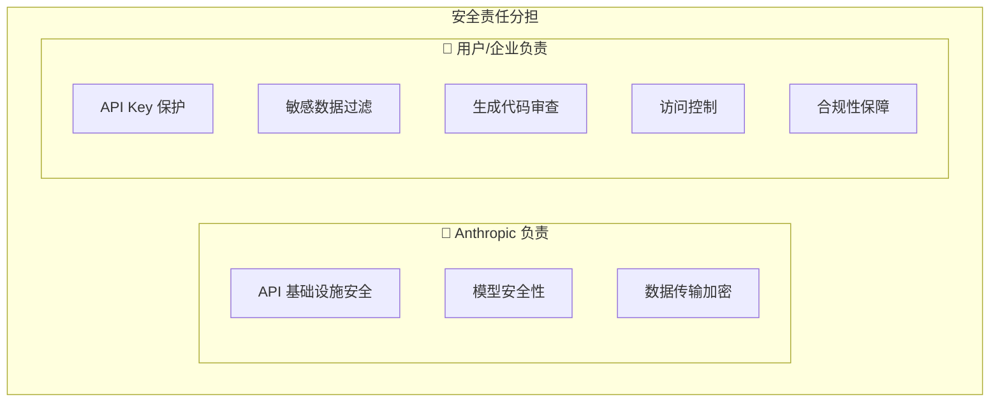

# 第28章：安全最佳实践

在使用 Claude Code 进行开发时，安全性是不可忽视的重要考量。本章将探讨使用 Claude Code 过程中的安全风险，以及如何采取措施保护代码、数据和系统安全。

## 28.1 安全风险概述

### 28.1.1 主要安全风险

使用 Claude Code 时面临的主要安全风险：

| 风险类别 | 具体风险 | 影响程度 |
|---------|---------|---------|
| 数据泄露 | 敏感代码/数据发送到外部 API | 高 |
| 凭证暴露 | API Key、密码等泄露 | 高 |
| 代码注入 | 生成的代码包含安全漏洞 | 中 |
| 供应链攻击 | 恶意依赖或配置 | 中 |
| 权限滥用 | 工具执行超出预期的操作 | 中 |

### 28.1.2 安全责任模型



## 28.2 凭证安全

### 28.2.1 API Key 保护

```bash
# 错误做法：硬编码 API Key
export ANTHROPIC_API_KEY="sk-ant-xxxxx"  # 不要这样做！

# 正确做法：使用安全的密钥管理
# 方法1：使用环境变量文件（不提交到版本控制）
echo "ANTHROPIC_API_KEY=sk-ant-xxxxx" >> ~/.claude-env
source ~/.claude-env

# 方法2：使用系统密钥链（macOS）
security add-generic-password -a "$USER" -s "anthropic-api-key" -w "sk-ant-xxxxx"

# 方法3：使用密钥管理服务
aws secretsmanager get-secret-value --secret-id anthropic-api-key
```

### 28.2.2 密钥轮换策略

```typescript
// API Key 轮换管理
class ApiKeyRotation {
    private readonly ROTATION_INTERVAL = 30 * 24 * 60 * 60 * 1000; // 30天
    
    async checkAndRotate(): Promise<void> {
        const keyInfo = await this.getKeyInfo();
        
        if (this.shouldRotate(keyInfo)) {
            await this.rotateKey();
        }
    }
    
    private shouldRotate(keyInfo: KeyInfo): boolean {
        const age = Date.now() - keyInfo.createdAt.getTime();
        return age > this.ROTATION_INTERVAL;
    }
    
    private async rotateKey(): Promise<void> {
        // 1. 创建新密钥
        const newKey = await this.createNewKey();
        
        // 2. 更新配置
        await this.updateConfiguration(newKey);
        
        // 3. 验证新密钥
        await this.validateKey(newKey);
        
        // 4. 废弃旧密钥（设置宽限期）
        await this.scheduleOldKeyDeletion();
        
        // 5. 记录审计日志
        await this.logRotation();
    }
}
```

## 28.3 数据安全

### 28.3.1 敏感数据识别

```typescript
// 敏感数据检测器
class SensitiveDataDetector {
    private patterns: Map<string, RegExp> = new Map([
        ['credit_card', /\b(?:\d{4}[-\s]?){3}\d{4}\b/g],
        ['ssn', /\b\d{3}-\d{2}-\d{4}\b/g],
        ['api_key', /\b(sk-|api[_-]?key|secret)[a-zA-Z0-9_-]{20,}\b/gi],
        ['password', /(password|passwd|pwd)\s*[=:]\s*['"][^'"]+['"]/gi],
        ['private_key', /-----BEGIN (RSA |EC |)PRIVATE KEY-----/g],
        ['jwt', /eyJ[a-zA-Z0-9_-]*\.eyJ[a-zA-Z0-9_-]*\.[a-zA-Z0-9_-]*/g],
        ['email', /\b[A-Za-z0-9._%+-]+@[A-Za-z0-9.-]+\.[A-Z|a-z]{2,}\b/g],
        ['ip_address', /\b(?:\d{1,3}\.){3}\d{1,3}\b/g],
    ]);
    
    detect(text: string): DetectionResult[] {
        const results: DetectionResult[] = [];
        
        for (const [type, pattern] of this.patterns) {
            const matches = text.match(pattern);
            if (matches) {
                results.push({
                    type,
                    count: matches.length,
                    samples: matches.slice(0, 3).map(m => this.mask(m)),
                });
            }
        }
        
        return results;
    }
    
    private mask(value: string): string {
        if (value.length <= 8) {
            return '*'.repeat(value.length);
        }
        return value.slice(0, 4) + '*'.repeat(value.length - 8) + value.slice(-4);
    }
}
```

### 28.3.2 数据脱敏处理

```typescript
// 数据脱敏处理器
class DataSanitizer {
    sanitize(content: string): string {
        let sanitized = content;
        
        // 脱敏 API Keys
        sanitized = sanitized.replace(
            /\b(sk-|api[_-]?key|secret)[a-zA-Z0-9_-]{20,}\b/gi,
            '[REDACTED_API_KEY]'
        );
        
        // 脱敏密码
        sanitized = sanitized.replace(
            /(password|passwd|pwd)\s*[=:]\s*['"]?[^\s'"]+['"]?/gi,
            '$1=[REDACTED]'
        );
        
        // 脱敏私钥
        sanitized = sanitized.replace(
            /-----BEGIN[\s\S]*?-----END[^-]*-----/g,
            '[REDACTED_PRIVATE_KEY]'
        );
        
        // 脱敏环境变量中的敏感值
        sanitized = sanitized.replace(
            /^(export\s+)?([\w_]*(SECRET|KEY|TOKEN|PASSWORD|CREDENTIAL)[\w_]*)\s*=\s*.+$/gim,
            '$1$2=[REDACTED]'
        );
        
        return sanitized;
    }
}
```

### 28.3.3 .gitignore 和 .claudeignore

```gitignore
# .claudeignore - 排除敏感文件不发送给 Claude

# 环境配置
.env
.env.*
*.env

# 密钥文件
*.pem
*.key
*.p12
*.pfx
id_rsa*
*.keystore

# 配置文件中可能包含敏感信息
config/production.json
config/secrets.yaml
credentials.json

# 数据库文件
*.db
*.sqlite
*.sql

# 日志文件
logs/
*.log

# 缓存和临时文件
.cache/
tmp/
temp/
```

## 28.4 代码安全

### 28.4.1 生成代码审查

使用 Claude Code 生成的代码应该经过安全审查：

```bash
# 生成代码后进行安全检查
claude "请审查刚才生成的代码，检查以下安全问题：
1. SQL 注入风险
2. XSS 漏洞
3. 不安全的反序列化
4. 硬编码凭证
5. 不安全的随机数生成
6. 路径遍历漏洞"
```

### 28.4.2 安全编码规范

```markdown
# CLAUDE.md 安全配置

## 安全编码要求

### 必须遵守
1. 所有数据库查询使用参数化查询
2. 用户输入必须验证和清理
3. 敏感数据必须加密存储
4. 使用安全的密码哈希算法（bcrypt/argon2）
5. 实现适当的访问控制

### 禁止行为
1. 不得硬编码任何凭证
2. 不得使用 eval() 或类似危险函数
3. 不得禁用安全检查
4. 不得使用已知不安全的加密算法

### 安全库推荐
- 密码哈希：bcrypt, argon2
- 加密：crypto (Node.js 内置)
- 输入验证：joi, zod
- SQL：使用 ORM 或参数化查询
```

### 28.4.3 依赖安全检查

```bash
# 在生成代码后检查依赖安全
claude "请检查项目的 package.json，识别可能存在安全漏洞的依赖，
并建议更安全的替代方案"

# 使用安全扫描工具
npm audit
npx snyk test
```

## 28.5 工具权限控制

### 28.5.1 权限配置

```json
// settings.json - 工具权限配置
{
    "permissions": {
        "allowedTools": [
            "Read",
            "Write",
            "Edit",
            "MultiEdit",
            "Glob",
            "Grep",
            "LS"
        ],
        "blockedTools": [
            "Bash"  // 禁用命令执行
        ],
        "fileAccess": {
            "allowedPaths": [
                "./src/**",
                "./tests/**"
            ],
            "blockedPaths": [
                "./.env*",
                "./secrets/**",
                "./config/production.*"
            ]
        }
    }
}
```

### 28.5.2 命令执行安全

```typescript
// 安全的命令执行包装器
class SecureCommandExecutor {
    private readonly ALLOWED_COMMANDS = new Set([
        'npm', 'npx', 'node', 'git', 'ls', 'cat', 'grep',
    ]);
    
    private readonly BLOCKED_PATTERNS = [
        /rm\s+-rf/,
        />\s*\/dev\//,
        /curl.*\|.*sh/,
        /wget.*\|.*bash/,
        /eval\s*\(/,
    ];
    
    async execute(command: string): Promise<ExecutionResult> {
        // 检查命令是否允许
        const baseCommand = command.split(/\s+/)[0];
        if (!this.ALLOWED_COMMANDS.has(baseCommand)) {
            throw new SecurityError(`Command not allowed: ${baseCommand}`);
        }
        
        // 检查危险模式
        for (const pattern of this.BLOCKED_PATTERNS) {
            if (pattern.test(command)) {
                throw new SecurityError(`Dangerous command pattern detected`);
            }
        }
        
        // 在沙箱中执行
        return this.executeInSandbox(command);
    }
}
```

## 28.6 安全审计

### 28.6.1 审计日志

```typescript
// 安全审计日志
interface SecurityAuditEvent {
    timestamp: Date;
    eventType: string;
    userId: string;
    action: string;
    resource: string;
    result: 'allowed' | 'blocked';
    details: Record<string, any>;
    riskLevel: 'low' | 'medium' | 'high' | 'critical';
}

class SecurityAuditor {
    async logEvent(event: SecurityAuditEvent): Promise<void> {
        // 记录到安全日志
        await this.securityLog.write(event);
        
        // 高风险事件实时告警
        if (event.riskLevel === 'high' || event.riskLevel === 'critical') {
            await this.alertService.send({
                severity: event.riskLevel,
                message: `Security event: ${event.eventType}`,
                details: event,
            });
        }
    }
}
```

### 28.6.2 定期安全检查

```bash
# 安全检查脚本
#!/bin/bash

echo "=== Claude Code 安全检查 ==="

# 1. 检查 API Key 暴露
echo "检查代码中的 API Key..."
grep -r "sk-ant-" --include="*.{js,ts,py,json}" . && echo "警告：发现硬编码的 API Key！"

# 2. 检查敏感文件
echo "检查敏感文件..."
find . -name "*.pem" -o -name "*.key" -o -name ".env" | head -20

# 3. 检查权限配置
echo "检查 Claude Code 权限配置..."
cat ~/.claude/settings.json | jq '.permissions'

# 4. 检查最近的安全事件
echo "检查最近的安全事件..."
grep -i "security\|blocked\|denied" ~/.claude/logs/*.log | tail -20
```

## 28.7 本章小结

本章详细介绍了 Claude Code 的安全最佳实践：

1. **凭证安全**：API Key 保护、密钥轮换
2. **数据安全**：敏感数据识别、脱敏处理
3. **代码安全**：生成代码审查、安全编码规范
4. **权限控制**：工具权限配置、命令执行安全
5. **安全审计**：审计日志、定期检查

安全的核心原则：
- 最小权限原则
- 纵深防御
- 持续监控
- 及时响应
